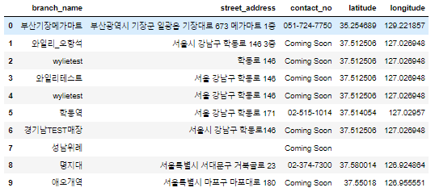

## 서브웨이 매장정보 크롤링

> 서브웨이 주문을 할 때, 매장 위치를 지도에 표현하기 위해 매장정보를 크롤링 했다.

<br>

> 참고자료

- [Naver Maps API 이용법](https://m.blog.naver.com/rising_n_falling/221596375078)

- [서브웨이 매장정보 크롤링 방법](https://da-nika.tistory.com/101)

<br>

> 코드

```python
import urllib
from bs4 import BeautifulSoup as bs
import json
import pandas as pd
import import_ipynb
import naver_secret 
```

```python
def make_subway_list():
    url = 'https://www-dev.subway.co.kr/storeSearch?page=' # 현재 서브웨이 사이트가 개발중임
    page_num = 1
    subway_store_names = []
    subway_addresses = []
    subway_phone_numbers = []
    
    for i in range(1,40): # 한 페이지에 10개씩*39페이지 390개 매장 존재
        sourcecode = urllib.request.urlopen(url+str(i)).read()
        soup = bs(sourcecode, 'html.parser')
        
        for j in soup.tbody.find_all('tr'): # 매장정보가 표에 들어가있음 => 행(tr)별로 파싱
            cnt = 1
            for k in j.find_all('td'): # 2,3,5번째가 매장명, 매장주소, 전화번호임
                if cnt == 2: 
                    subway_store_names.append(k.get_text().replace('\r', '').strip())
                elif cnt == 3:
                    subway_addresses.append(k.get_text().replace('\r', '').strip()) # 텍스트만 추출
                elif cnt == 5:
                    subway_phone_numbers.append(k.get_text().replace('\r', '').strip())
                cnt += 1
        
    return subway_store_names, subway_addresses, subway_phone_numbers
```

```python
subway_store_names, subway_addresses, subway_phone_numbers = make_subway_list()
print(len(subway_store_names), len(subway_addresses), len(subway_phone_numbers))
```

```python
def search_map(search_text):
    client_id = naver_secret.client_id
    client_secret = naver_secret.client_secret
    encText = urllib.parse.quote(search_text)
    url = 'https://naveropenapi.apigw.ntruss.com/map-geocode/v2/geocode?query='+encText
    request = urllib.request.Request(url)
    request.add_header('X-NCP-APIGW-API-KEY-ID', client_id)
    request.add_header('X-NCP-APIGW-API-KEY', client_secret)
    response = urllib.request.urlopen(request)
    rescode = response.getcode()
    if(rescode==200):
        response_body = response.read()
#         print(response_body.decode('utf-8'))
        return response_body.decode('utf-8')
    else:
        print("Error Code:"+rescode)
```

```python
def make_location(subway_list):
    x = []
    y = []
    for subway_location in subway_list:
        if subway_location == '':
            x.append('')
            y.append('')
            continue
        temp_map = search_map(subway_location)
        temp_map = json.loads(temp_map)
        try:
            temp_map = temp_map['addresses'][0]
            x.append(float(temp_map['x']))
            y.append(float(temp_map['y']))
        except IndexError: # '주소가 잘못된 매장'
            x.append('')
            y.append('')
            pass
    return x,y
```

```python
x,y = make_location(subway_addresses)
```

```python
df = pd.DataFrame((zip(subway_store_names, subway_addresses,subway_phone_numbers,y,x)), columns = ['branch_name','street_address','contact_no','latitude','longitude'])
```

```python
df.head(n=10)
```



```python
df.to_csv('C:\\Users\\donghwan\\Desktop\\df.csv',sep=',',na_rep='NaN') 
```

