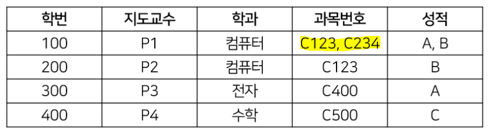
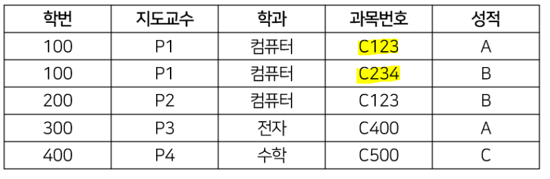
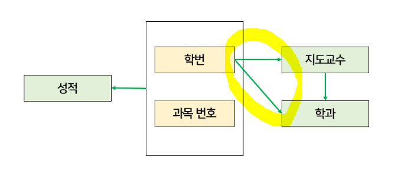
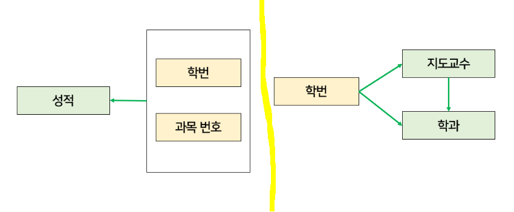
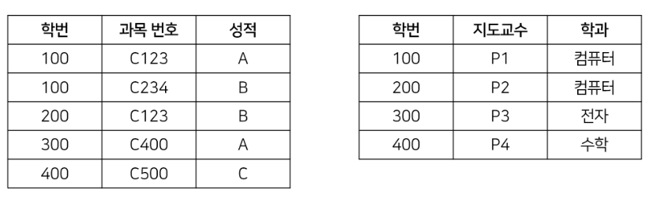
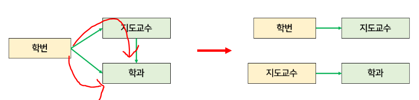
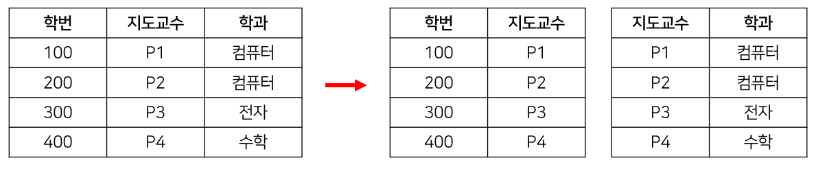
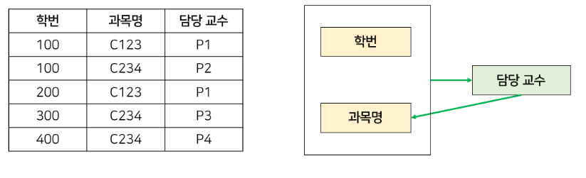
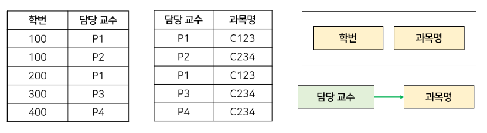

## DataBase

> B-tree, B+-tree

> 인메모리 데이터 베이스란

> 클러스터드 인덱스란

> Composite Index

### :bookmark_tabs: [정규화](https://rebro.kr/160)

> 배경

- 중복된 데이터로 인해 `갱신 이상`이 발생해서 **중복을 최소화**하기 위해 
  - 삽입 이상, 삭제 이상, 수정 이상

> 목적

- 불만족스러운 릴레이션의 애트리뷰트들을 나우어서 작은 릴레이션으로 분해하는 작업

> 정규형

- 정규화 과정을 거친것 	
  - 제 n 정규화 완료 => 제 n 정규형

> 나쁜 릴레이션이란

- 애트리뷰터 간 함수적 종속성을 판단
  - 함수적 종속성이란?
    - X, Y 애트리뷰트 집합이 있고 X의 값이 Y의 값을 유일하게 결정한다면 "X는 Y를 함수적으로 결정한다"라고 함.

#### 제 1 정규형

- 애트리뷰트의 도메인이 오직 `원자값`만을 포함해야함

> 제 1 정규화 후

> 제1 정규형 이상 현상

- 삽입 이상: 학생이 새 과목을 수강 신청할 때 반드시 학생의 학과와 지도교수를 알아야 한다. (불필요)
- 삭제 이상: 300번 학생이 C400 과목을 취소하면, 해당 과목에 대한 정보도 같이 사라진다.
- 갱신 이상: 100번 학생이 지도교수를 변경할 때, P1인 행을 모두 찾아서 변경해주어야 한다.

> 문제점

- 기본키가 아닌 속성들이 기본키에 완전 함수 종속되지 못하고 부분 함수 종속되어 있기 때문
  - 부분함수종속: 기본키가 복합키일 경우 기본키를 구성하는 속성 중 일부에게 종속된 경우

- 학번+과목번호 기본키인데, 지도교수와 학과가 학번에만 종속되어 있다. => 부분함수종속

 

#### 제 2 정규형

- 제 1 정규형이면서, 기본키에 속하지 않은 속성 모두가 기본키에 완전 함수 종속인 정규형

- 부분 함수 종속이었던 관계만 따로 분리해서 모두 완전 함수 종속이 되도록 릴레이션 분리

> 제 2 정규형 이상 현상

- 삽입 이상: 지도교수가 학과에 소속되어 있음을 추가할 때 반드시 지도 학생이 있어야 한다. (불필요한 정보)
- 삭제 이상: 300번 학생이 자퇴하는 경우 P3 교수의 학과 정보가 사라진다.
- 갱신 이상: 지도교수의 학과가 변경되는 경우 모두 찾아서 변경시켜주어야 한다. (지도교수가 동일한 학생이 여러명 있는 경우)

> 문제점

- `이행적 함수 종속성` 때문 , 속성이 A=>B, B=>C이면서 A=>C의 관계에 있는 것
  - 학번=>지도교수, 지도교수=>학과 이면서 학번=>학과의 관계가 존재
  - 지도교수의 학과를 추가하기 위해서 지도 학생까지 필요하고, 학생이 자퇴하였는데 지도교수의 학과 정보가 사라지는 문제점이 발생

 

#### 제 3 정규형

- 제 2 정규형이면서, 이행적 함수 종속성을 제거한 정규형

 

#### BCNF, Boyce and Codd Normal Form

- 제 3 정규형을 조금 더 강화시킨 개념

> 제 3 정규형 이상 현상

- 삽입 이상: 새로운 교수가 특정 과목을 담당한다는 새로운 정보를 추가할 수 없다. 적어도 한 명 이상의 수강생이 필요
- 삭제 이상: 학번 100이 C234과목을 취소하면, P2가 C234 과목을 담당한다는 정보도 삭제
- 갱신 이상: P1의 과목이 변경되면 P1인 행을 모두 찾아 변경시켜주어야 한다.

> 문제점

- 결정자가 후보키로 취급되고 있지 않기 때문
  - 후보키: 슈퍼키 중에서 최소성을 갖는 키
  - 슈퍼키: 유일성만 만족하면 됨
- 여기서 후보키는 (학번, 과목명) or (학번, 담당교수)
  - 후보키가 아님에도 과목명을 결정할 수 있기 때문에 담당 교수는 결정자

> 해결

- 모든 결정자는 항상 후보키가 되도록 릴레이션을 분해하면 BCNF

#### 정규화 단점

- 테이블이 늘어나므로 JOIN연산이 많이 일어나고 그로 인해 응답 속도가 느려질 수 있다.

> 해결법 => 반정규화

- 테이블끼리의 경로가 너무 멀어 조인으로 인한 성능 저하가 예상되거나 조회에 대한 처리성능이 중요하다고 판단될 때 

 

### :lock_with_ink_pen: 트랜잭션

- 트랜잭션은 작업의 **완전성**을 보장해주는 것.
  - 논리적인 작업 셋을 모두 완벽하게 처리하거나 처리하지 못할 경우에는 원 상태로 복구해서 작업의 일부만 적용되는 현상이 발생하지 않게 만들어주는 기능

#### 트랜잭션의 특성(ACID)

> 원자성(Atomicity)

- 아무런 문제가 발생되지 않았을 경우에만 모든 작업이 수행되어야 한다.
  - 전부 다 수행되거나 전부 다 수행되지 않거나

> 일관성(Consistency)

- 트랜잭션이 완료된 다음에도 데이터의 일관성 보장

> 고립성(Isolation)

- 각각의 트랜잭션은 서로 간섭없이 독립적으로 수행

> 지속성(Durability)

- 트랜잭션이 정상적으로 종료되면 영구적으로 결과가 저장되어야함