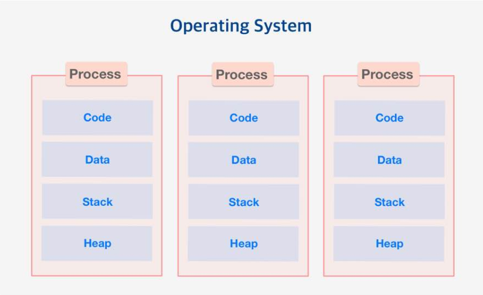
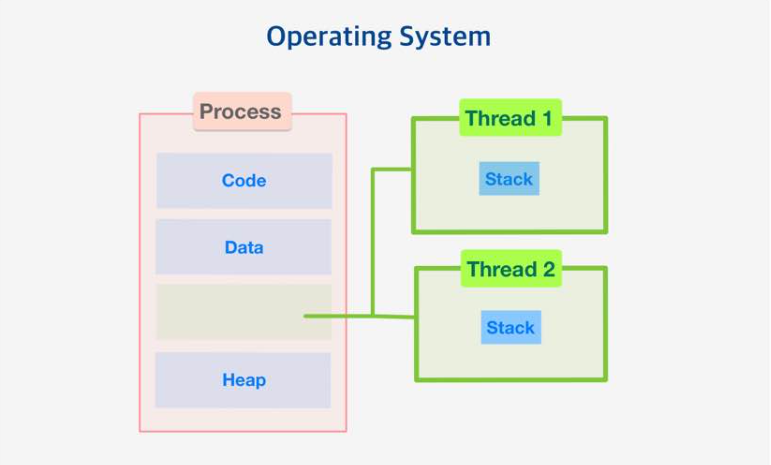

## DataStructure

### 1. Priority Queue

- 높은 우선순위를 먼저 처리하는 Queue
  - heap이라는 자료 구조를 통해 구현 가능

> Heap이란

- `완전 이진트리`(complete)로 부모 노드 값이 항상 자식 노드 값보다 높은 우선순위를 가짐
  - `Max Heap`과 `Min Heap` 존재
  - `완전 이진트리` : 위에서부터 아래로, 왼쪽부터 오른쪽 순서대로 노드를 채워나갈 때, 중간에 비어있지 않으면 됨
    - **`포화이진트리`랑 헷갈리지말것** : 포화이진트리는 모든 레벨에 노드가 꽉 차 있는 것
    - 포화이진트리는 완전이진트리이지만, 완전이진트리는 포화이진트리가 아닐수도있다

> 연산 종류

- push : 하나의 원소를 추가하는 함수
  - 구현 방법 : 맨 끝 위치에 값을 저장한 뒤, 부모 노드와 비교하며 우선순위 조건이 맞을 때까지 자리 교체
    - ex) Max Heap에서 제일 큰값이 push된다면, 일단 맨 끝 위치에 추가하고 root까지 부모 노드와 계속 자리바꾸면서 올라감
- pop : 가장 높은 우선순위를 가진 원소를 큐에서 제거하고 반환
  - 우선 순위가 가장 높은 값, 즉 root를 pop한 뒤, 빈 root 자리에 맨 끝의 노드를 가져옴. 위치를 만족할 때까지, 자식 노드와 위치를 변경하며 이동

#### 1.1 Priority Queue와 Heapq의 차이

> [Priority Queue 와 Heapq의 차이](https://slowsure.tistory.com/130)

- Priority Queue는 **Thread-Safe** 하고 heapq는 **Non-safe**
  - heapq가 더 빠름
  - [stackoverflow](https://stackoverflow.com/questions/36991716/whats-the-difference-between-heapq-and-priorityqueue-in-python)

> Thread-Safe란

- 멀티 스레드 프로그래밍에서 일반적으로 어떤 함수나 변수, 혹은 객체가 여러 스레드로부터 동시에 접근이 이루어져도 프로그램 실행에 문제가 없는 것. 하나의 함수가 한 스레드로부터 호출되어 실행중일때 다른 스레드가 그 함수를 호출하여 동시에 실행되더라도 각 스레드에서의 함수 수행 결과가 올바르게 나오는 것....
  - *이해 못한 부분: Priority Queue는 Thread-Safe하므로 한 Thread가 자원에 접근할 때 다른 Thread의 접근을 막아서 느린건가, 반면 Non-safe는 동시 접근 가능?*

> Thread-Safe를 지키기 위한 방법

1. Re-entrancy

- 어떤 함수가 한 스레드에 의해 호출되어 실행 중일 때, 다른 스레드가 그 함수를 호출하더라도 그 결과가 각각에게 올바르게 주어져야함

2. Thread-local storage

- 공유 자원의 사용을 최대한 줄여 각각의 스레드에서만 접근 가능한 저장소들을 사용함으로써 동시 접근을 막는다.

3. Mutual exclusion

- Thread에 lock이나 semaphore를 걸어서 공유자원에는 하나의 thread만 접근 가능하게 한다.

4. Atomic operations

- 데이터 변경시 atomic 하게 데이터에 접근하도록 만듦
  - atomic하다는 것은.. 도중에 다른 명령이 끼어들 수 없다는 느낌인 듯
    - 데이터의 변경이 이루어지고 있는 순간에는 접근이 불가하다는 의미

5. Immutable Object

- 불변객체는 항상 Thread-safe하다는 의미인가
  - [참고](https://devonce.tistory.com/26)

#### 1-2. semaphore와 mutex

> semaphore란
>
> 공유된 자원의 데이터 혹은 critical section 등에 여러 process 혹은 Thread가 접근하는 것을 막아줌
>
> **간단한 실행 과정) 변수의 초기값을 설정하고 S = 1 위험지역에 들어갈때 S=0으로 바꿔놓고 들어감, 그러면 아무도 못들어옴. 나올때 S=1로 바꿔놓고 나옴**

- 특정 데이터를 공유하게 될 때 발생하는 문제를 해결하기 위한 기법

- critical section이란?
  - 다중 프로그래밍 운영체제에서 여러 프로세스가 데이터를 공유하면서 수행될 때, **각 프로세스에서 공유 데이터를 접근하는 프로그램 코드 부분**
  - 성능 향상을 위해 최소화하는 설계를 해야함

> mutex란

- Critical Section을 가진 쓰레드들의 Running Time이 서로 겹치지 않게 각각 단독으로 실행되게 하는 기술
- Key를 만들고 해당 Key를 가진 프로세스/스레드만 공유자원에 접근 가능

#### 1-3. program, process, thread

- [참고](https://velog.io/@gparkkii/ProgramProcessThread)

> 프로그램이란 

- 컴퓨터에서 어떤 작업을 위해 실행할 수 있는 **정적인 상태**의 파일
  - ex) exe파일

> 프로세스란

- 프로그램이 실행돼서 돌아가고 있는상태, **동적인 상태**
- **실행중인 프로그램**이다. 프로그램을 실행하면 운영체제로 부터 자원을 할당받아 프로세스가 된다.

> 프로세스가 할당받는 시스템 자원

- CPU시간
- 주소 공간
- Code, Data, Stack, Heap의 구조로 되어있는 독립된 메모리 영역

- 다른 프로세스 자원에 접근하려면 프로세스간 통신, IPC를 사용해야함
- 프로세스는 최소 하나 이상의 스레드 포함

> 동시성이란

- 프로세서(CPU)는 한번에 하나의 프로세스만 실행 가능
  - 그래서 동시성이란 프로세서 하나가 프로그램 1,2,3 을 돌아가며 일부분씩 수행
  - 이렇게 작업을 바꾸는걸 Context Switching이라고 함, 매우 빠른 속도로 이루어지기 때문에 동시에 진행되는 것처럼 보임

> 쓰레드 = 프로세스의 실행 단위
>
> 프로세스 내에서 프로세스의 자원을 이용해서 실제로 작업을 수행하는 일꾼

- 브라우저 하나(=프로세스 하나)가 실행중일때도 게임 다운, 웹서핑, 노래 듣기 등 여러 작업이 이루어짐 => 여러가지 작업을 각각 수행하는 것을 쓰레드라고함

- 각 쓰레드는 독자적인 스택 메모리를 갖는다
- Code, Data, Heap은 공유
- 쓰레드는 메모리를 고융하기 때문에 동기화, 데드락 등의 문제가 발생할 수 있다.

> [멀티 프로세싱, 멀티 프로그래밍, 멀티 태스킹, 멀티 스레딩](https://sorjfkrh5078.tistory.com/56)

> [멀티 프로그래밍과 멀티 태스킹 차이](https://luv-n-interest.tistory.com/430)

> 멀티 태스킹 스케줄링 방식 종류