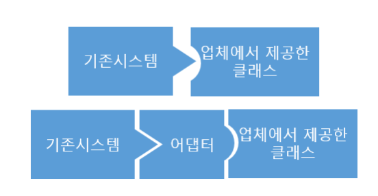

### :electric_plug: 어댑터 패턴, Adapter Pattern

- 클래스를 바로 사용할 수 없는 경우에 중간에서 변환 역할을 해주는 패턴



- Turkey, Duck 예시

> Duck을 생성할때 TurkeyAdapter를 이용해서 **생성자에 turkey**를 받고 
> duck 함수를 **turkey 함수로 override**

```java
// Duck
package Adapter;

public interface Duck {
    void quack();
    void fly();
}

// Turkey
package Adapter;

public interface Turkey {
    void gobble();
    void fly();
}

// WildTurkey
package Adapter;

public class WildTurkey implements Turkey{
    @Override
    public void gobble() {
        System.out.println("Gobble");
    }

    @Override
    public void fly() {
        System.out.println("fly");
    }
}


// TurkeyAdapter
package Adapter;

public class TurkeyAdapter implements Duck{

    Turkey turkey;

    public TurkeyAdapter(Turkey turkey) {
        this.turkey = turkey;
    }

    @Override
    public void quack() {
        turkey.gobble();
    }

    @Override
    public void fly() {
        turkey.fly();
    }
}

// DuckTest
package Adapter;

public class DuckTest {
    public static void main(String[] args) {
        WildTurkey turkey = new WildTurkey();
        Duck turkeyAdapter = new TurkeyAdapter(turkey);

        testDuck(turkeyAdapter);
    }

    public static void testDuck(Duck duck) {
        duck.quack();
        duck.fly();
    }
}

```


#### :label: 참고

- https://gyoogle.dev/blog/design-pattern/Adapter%20Pattern.html