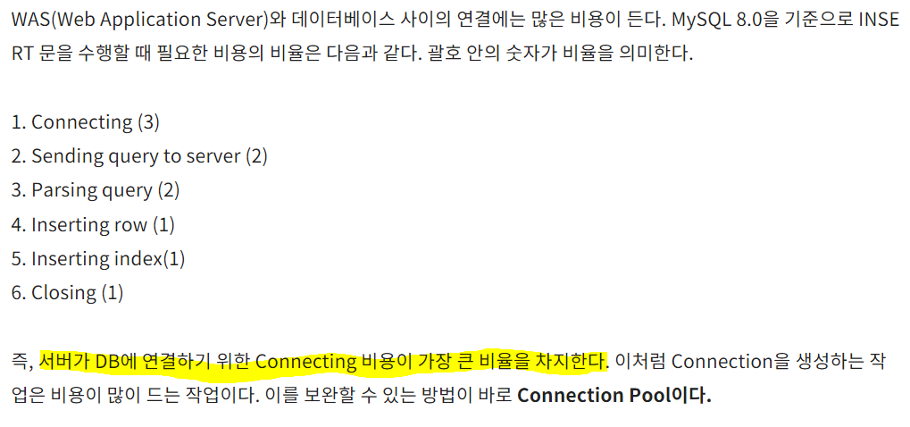

### :man_singer: 싱글톤 패턴, Sigleton pattern

- 어플리케이션이 시작될 때, 어떤 클래스가 최초 한 번만 메모리를 할당(static)하고 해당 메모리에 인스턴스를 만들어 사용하는 패턴
- `하나`의 인스턴스만 생성하여 사용하는 디자인 패턴 
  - 인스턴스가 필요할 때, 같은 인스턴스를 만들지 않고 기존의 인스턴스를 활용
- 쓰는 이유: 객체를 따로 계속 생성하면 메모리 낭비가 심함
  - 싱글톤 인스턴스는 '전역'이므로 다른 클래스의 인스턴스들이 데이터를 공유하는 것이 가능
  - DB에서 커넥션풀, 스레드풀, 캐시, 로그 기록 객체에 사용

> 커넥션 풀을 싱글톤으로 쓰는 이유




> 단점

- 싱글톤 인스턴스가 너무 많은 일을 하면 클래스간 결합도가 높아질 수 있고, 유지보수 및 테스트가 힘들어질수 있음


> 코드

```java
package Singleton;

public class Singleton {
    private Singleton() {}
    
    private static class LazyHolder {
        public static final Singleton INSTANCE = new Singleton();
    }
    
    public static Singleton getInstance() {
        return LazyHolder.INSTANCE;
    }
}
```

- LazyHolder에 static을 붙여 클래스 로딩 시점에 한번만 호출, final로 재할당 불가.
- 멀티스레드 환경에서 `synchronized`를 사용할 수도 있지만 성능저하를 발생시킴


#### :label: 참고

- https://gyoogle.dev/blog/design-pattern/Singleton%20Pattern.html

- https://code-lab1.tistory.com/209