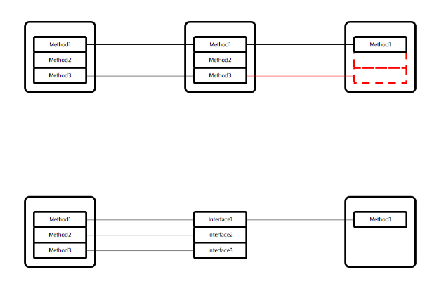

### :page_facing_up: SOLID (객체지향 설계 원칙)

> Single Responsibility Principle

- 하나의 클래스는 하나의 역할만 해야함
  - 역할이 많아질수록 해당 객체의 변경이 미치는 영향과 범위가 커짐

> Open-Close Principle

- 확장에는 열려있고 수정에는 닫혀 있어야 함
  - 상속을 하는 경우가 많은데 상위 클래스에 수정이 일어나면 하위 클래스에 끼치는 영향이 매우 큼

> LisKov Substitution Principle

- 자식이 부모의 자리에 항상 교체될 수 있어야 함

  - 직사각형 => 정사각형(X), 사각형 => 정사각형, 직사각형(O)

    ```java
    public class Rectangle
    {
        protected int width;
        protected int height;
        
        public int getWidth() { return width; }
        public int getHeight() { return height; }
        public void setWidth(int width) { this.width = width; }
        public void setHeight(int height) { this.height = height; }
        public int getArea() { return width * height; }
    }
    
    public class Square extends Rectangle
    {
        @Override
        public void setWidth(int width) {
            super.setWidth(width);
            super.setHeight(getWidth());
        }
        
        @Override
        public void setHeight(int height) {
            super.setHeight(height);
            super.setWidth(getHeight());
        }
    }
    
    // 넓이가 50이 아닌 25가 나옴
    public class Main
    {
        public static void main(String[] args)
        {
            Rectangle rectangle = new Square();
            rectangle.setWidth(10);
            rectangle.setHeight(5);
            
            System.out.println(rectangle.getArea());
        }
    }
    ```

    - 자식(Square)이 부모(Rectangle)을 대체할 수 없다. => 상속관계가 될 수 없다.

> Interface Segregation Principle

- 인터페이스가 잘 분리되어서, 클래스가 꼭 필요한 인터페이스만 구현해도록 해야함

  - 필요없는 메소드까지 들고가지 않도록 구현 => 필요없는 메소드를 구현하면 개발 편의성 저하

    

> Dependency Inversion Property

- 상위 모듈이 하위 모듈에 의존하면 안됨. 둘다 추상화에 의존하며, 추상화는 세부 사항에 의존하면 안됨.


#### :label: 참고

- https://gyoogle.dev/blog/design-pattern/Overview.html
- https://blog.itcode.dev/


