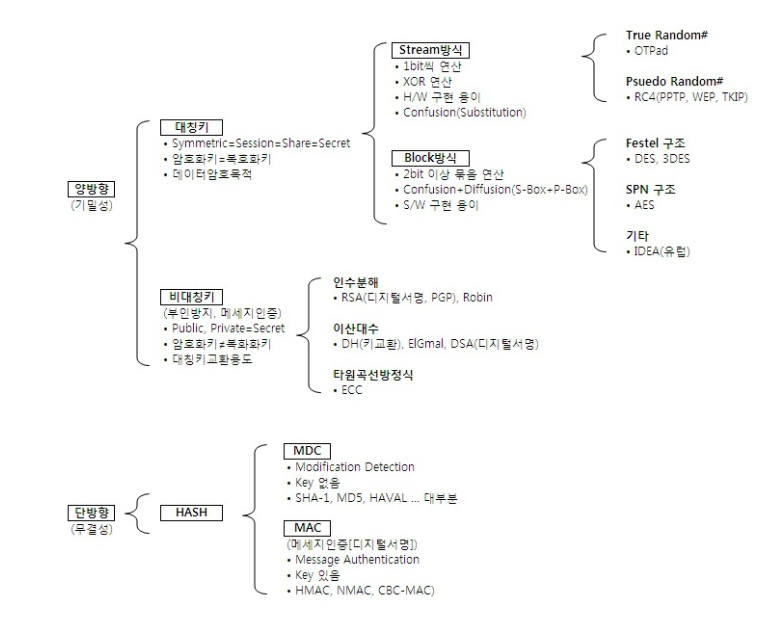

### 암호화

- 전자서명
  - 송신자의 Private Key로 메시지를 서명하여 전달
  - 수신자측에서는 송신자의 Public Key를 이용하여 서명값을 검증
  - 애초에 키(Private)와 자물쇠(Public) 관계임
- 양방향 암호화 (대칭/비대칭)
  - 암호화와 복호화과정을 통해 송수신간 주고받는 메세지를 안전하게 암복호화
- 단방향 암호화
  - 해싱을 이용한 암호화 방식으로 복호화 불가능