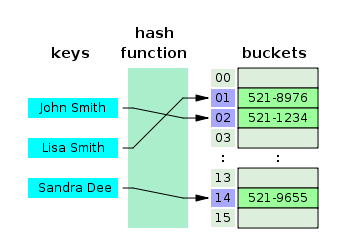
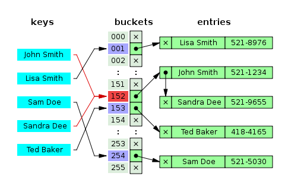
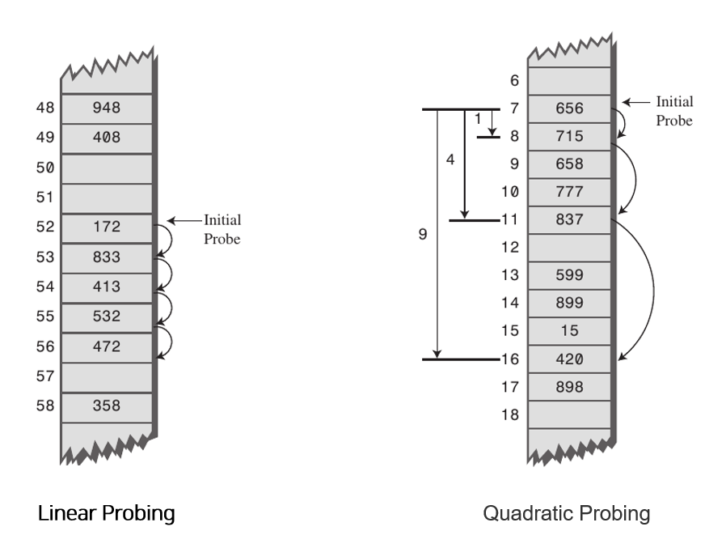

#### Hash

> Hash Table이란

- 해시 테이블은 Key,Value 형태로 데이터를 저장하는 자료구조
  - 각각의 Key값에 해시함수를 적용해 배열의 고유한 index를 생성하고, 해당 index를 활용해 값을 저장하거나 검색함. 여기서 실제값이 저장되는 장소를 버킷 또는 슬롯이라고 함

> 저장 과정

- Key, Value = John Smith, 521-1234 라고 가정
  - index를 먼저 생성 : index = hash_function(John Smith)
  - array에 저장: array[index] = 521-1234

> 시간 복잡도

- O(n) : key값으로 해시함수 한번 수행해서 나온 index값으로 접근하면 되니까

> 고려할 것

- 어떻게 하면 고유한 인덱스 값을 나오게끔 해쉬함수를 만들까
  - Divsion Method: 테이블의 크기를 소수로 정하고 2의 제곱수와 먼 값을 사용해야 효과가 좋다고 알려져 있다.. 왜..?
  - Digit Folding
  - Multiplication Method
  - Univeral Hashing

#### 해시 충돌

- 서로 다른 두 Key의 해시 값이 같아서 충돌나는 경우

1. 분리 연결법, Separate chaining

   - 동일한 버킷의 데이터에 대해 자료구조를 활용해 추가 메모리를 사용하여 다음 데이터의 주소를 저장

     

2. 개방 주소법

   - 비어있는 해시 테이블의 공간을 활용하는 방법
   - 어떤 비어있는 공간?
     1. Linear Probing: 현재의 버킷 index로 부터 고정폭 만큼씩 이동하며 탐색
     2. Quadratic Probing: 해시의 저장순서 폭을 제곱으로 저장하는 방식 => 1, 4, 9 ...
     3. Double Hashing Probing: 해시된 값을 한번더 해싱

