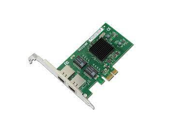
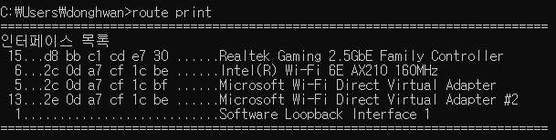
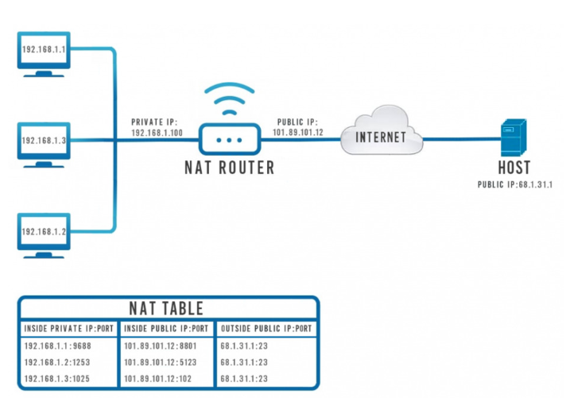

### NIC (Network Interface Card)

- 네트워크 인터페이스 카드

  

- 하드웨어 구성요소
- 이더넷이나 Wi-Fi 같은 데이터 링크 계층 표준과 통신하는 데 필요한 물리 계층 회로를 구현
- NIC는 OSI 모델을 사용하여 물리 계층에서 신호를 보내고 네트워크 계층에서 데이터 패킷을 전송하며 TCP/IP 계층에서 인터페이스로 작동

> 네트워크 카드는 컴퓨터와 데이터 네트워크 사이의 중개자 역할.
>
> 예를 들어, 사용자가 웹페이지를 요청하면 컴퓨터는 요청을 네트워크 카드로 전달하여 전기 충격으로 변환. 인터넷의 웹 서버는 충격을 수신하고 웹 페이지를 전기 신호로 네트워크 카드에 다시 전송하여 응답합니다. 카드는 이러한 신호를 받아 컴퓨터가 표시하는 데이터로 변환.


> 네트워크 인터페이스 카드의 구성 요소

- 속도
  - 모든 NIC는 충분한 대역폭을 가진 컴퓨터 네트워크에서 구현될 때 카드의 일반적인 성능을 나타내는 Mbps의 관점에서 속도 등급을 가지고 있습니다. 평균 이더넷 NIC는 10Mbps, 100Mbps, 1000Mbps 및 1Gbps 종류로 제공
- 드라이버
  - 컴퓨터 운영체제와 NIC 간에 데이터를 전달하는 필수 소프트웨어.
- MAC 주소
  - 물리적 네트워크 주소라고도 하는 고유하고 변경할 수 없는 MAC 주소가 NIC에 할당. 이들은 이더넷 패킷을 컴퓨터에 전달하는 데 사용됨.




```shell
$ ipconfig /all
```

- 연결 LED 
  - 대부분의 커넥터에 통합된 LED 표시기가 있어 네트워크가 연결되고 데이터가 전송되는 시기를 사용자에게 알림
- 라우터
  - 라우터는 때때로 컴퓨터와 다른 장치 간의 통신을 가능하게 하기 위해 필요함.


### NAT(Network Address Translation)

[생활코딩 NAT](https://www.youtube.com/watch?v=ctY8VtRd7cc)

- 사설 IP를 공인 IP로 변경에 필요한 주소 변환 서비스
- 라우터 등의 장비를 사용하여 다수의 private IP를 하나의 public Ip로 변환하는 기술

- NAT는 다수의 주소 변환 정보에 대해 IP주소와 Port 번호로 구성된 NAT Forwarding Table을 보관하고 있고 이에 맞게 변환 서비스를 제공

  

> NAT TABLE 특징

- 내부 네트워크에 위치한 호스트들의 사설 IP와 포트 번호에 대한 정보를 가지고 있음
- 외부로 나갈 때의 동일한 공인 IP와 각기 다른 포트 번호를 가지고 있음
- 목적지 주소의 공인 IP와 서비스에 사용된 동일한 서비스 포트 번호를 가지고 있음


> 접속 시나리오
>
> 첫번째 호스트(192.168.1.1:9688) => 외부 호스트(68.1.31.1:23)

1) 사설 IP(192.168.1.1)을 사용하는 호스트가 68.1.31.1에 접속을 원한다.
2) 라우터는 NAT 기술을 사용하여 이 요청에 공인 IP - 101.89.101.12와 포트 번호 8801을 할당한다.
3) 요청은 인터넷을 통해 텔넷 서버 - 68.1.31.1.1에 도달한다.
4) 텔넷 서버는 요청의 클라이언트 IP를 공인 IP - 101.89.101.12, 포트 8801로 인식하고 응답한다.
5) 라우터는 사설 IP 192.68.1.1:9688 호스트에 할당된 포트임을 NAT테이블에서 찾아 응답을 돌려준다.


> NAT는 왜 필요한가

1. 공인 IP 주소 절약
   - 인터넷상의 공인 IP주소는 한정되어 있기 때문에 각각의 PC에 할당한다면 IPv4 상에서의 인터넷 주소로는 부족했을 것
2.  보안의 목적
   - 공개된 인터넷망은 외부에서 내부로의 해킹이나 침입의 위험이 있음. 따라서 내부망과 공개망 사이에 방화벽을 운영하여 외부 공격으로부터 내부 인터넷망을 지킴.


> Telnet이란

- 원격 접속 서비스로서 특정 사용자가 네트워크를 통해 다른 컴퓨터에 연결하여 그 컴퓨터에서 제공하는 서비스를 받을 수 있도록 하는 인터넷 표준 프로토콜
  - 단 보안문제로 사용률이 감소하고 SSH로 대체되는 추세