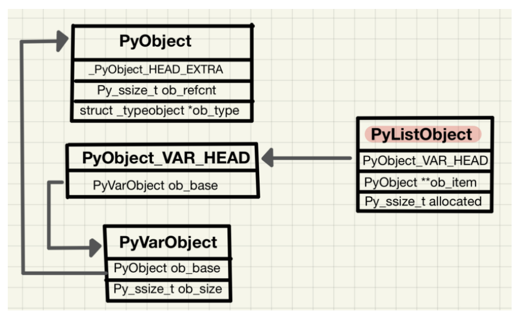
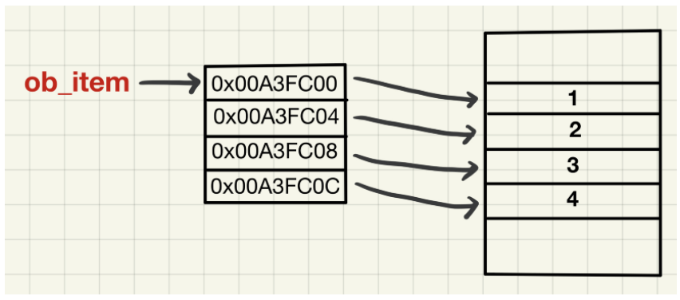
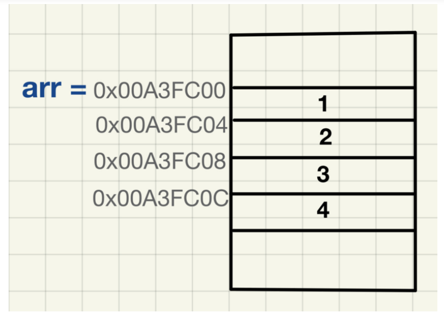

## Questions

> 대답을 하고도 부족했다고 생각하는 질문들과 대답하지 못한 질문들에 대한 정리
>
> 느낀점)
>
> 흔히 자주 사용하는 파이썬 sorted, list 등 한 번도 내부구조를 들어가서 볼 생각을 하지 않았다. 하지만 보지 않는다면, 파이썬 정렬은 어떤 정렬 방식을 사용하고, list는 인덱스를 이용해서 어떻게 바로 값에 접근할 수 있는지 대답하지 못한다..

 

### 해시충돌해결

> 질문1) equal 조회를 할 때 가장 빠른 자료구조는? 
>
> 파이썬에서는 딕셔너리라고 답함
>
> 질문2) 왜 가장 빠른가? 
>
> 딕셔너리는 해시테이블 구조인데 Key값을 해시함수를 이용하여 idx를 구한다음 배열에 해당 idx를 이용하여 저장한다. 그래서 조회할때도 Key값을 해시함수만 이용하여 idx를 구하고 바로 배열에 접근할수 있다고 했음, 예시를 들어서 설명했는데 '홍길동': 1234를 사용함.
>
> 질문3) 그렇다면 배열이 꽉찼을 때, 해결방법 ? 
>
> 여기서 이것이 해시충돌을 의미하는 것인지 헷갈려서 다시 질문함
>
> 질문4) 그러면 아까 예시 '홍길동'이라는 key값을 저장할때 hash함수 형태는 어떤것이 있는가?
>
> 잘모르겠어서 ascii 코드 이용하면 해시함수 결과값이 최대한 안겹치게 할 수 있을 것 같다고 답변
>
> 질문5) ascii코드를 어떻게 이용하면 최대한 충돌을 피할 수 있을까?
>
> 단순히 더하면 안될것 같다 라고만 하고 아무 답변을 못했음
>
> 정답이 아니어도 된다. 아무말이나 해도 된다고 하며 면접관이 유도를 해줬음 => ascii코드를 그냥 이어붙이는 방법도 있을 것이다라고 하심 => 그럼 스트링이 되지 않나요라고 되물었고 => 스트링이 아니라 그냥 숫자형태로 이어붙이는 것이라고 함
>
> 질문6) 그렇게 하면 문제가 뭘까?
>
> 숫자 자릿수가 너무 크고, 배열 낭비가 심할 것 같다, 예를 들어 cat만 해도 자릿수가 6자리가 넘어갈 것이다.
>
> 질문7) 그럼 어떻게 해결할까?
>
> 나머지 연산을 해줘야 할 것이다. 나누는 수는 배열의 크기
>
> 질문8) 그러면 어떤 문제가 있을까?
>
> 충돌이 발생하는 문제가 있다. 예를들어 111과 11을 10으로 나누었을 때, 둘다 1이어서 충돌이 발생한다.
>
> 질문9) 그러면 다시 돌아와서 이런 충돌을 어떻게 해결할 수 있을까?
>
> (결국 아까 질문3을 이해 못한 나에게 사이에 4-5개 질문으로 이해시켜준 느낌)
>
> 그러면 만약에 이미 숫자가 차 있는데 새로운 숫자가 들어온다면 해당 공간에 다시 배열을 만들어서 저장하면 될 것 같다.
>
> 질문10) 트리도 존재하는데 트리랑 딕셔너리랑 어떤 것이 더 적합할까?
>
> 속도는 딕셔너리가 더 빠르지만 해시 충돌까지 고려하면 트리가 충돌은 나지 않으니 적합할 것 같다.
>
> 질문11) 충돌이 났을 때 해당 노드를 트리로 연결할 수도 있겠죠라고 하심 ㅋㅋ.. 이게 정답이었던듯 

 

### [배열내부구조](https://seoyeonhwng.medium.com/%ED%8C%8C%EC%9D%B4%EC%8D%AC-%EB%A6%AC%EC%8A%A4%ED%8A%B8-%EB%82%B4%EB%B6%80-%EA%B5%AC%EC%A1%B0-f04847b58286)

> 질문1) 아까 배열에서 인덱스로 접근하면 바로 접근할 수 있다고 답변했는데 어떻게 바로 접근할 수 있을까?
>
> 인덱스로 바로 메모리 주소를 알아내서 값에 접근할 수 있을 것 같다.. 
>
> 질문2) 메모리 주소를 어떻게 알아낼 수 있을까, 중간에 인덱스와 주소를 매핑해놓은 배열이 있는건가?
>
> 힌트를 주신것 같은데.. 아닐 것 같다라고 답변함 ㅋㅋ.. hash함수 같은 것이 있어서 idx를 넣으면 메모리 주소를 리턴해줄 것 같다라고 함

#### 파이썬 리스트 특징

- 초기 선언시 크기를 지정하지 않아도 된다.
- 변수의 자료형 지정하지 않아도 된다.
- 서로 다른 자료형 데이터 저장 가능
- 파이썬 리스트 구조도

- 모든 파이썬 객체들은 **PyObject**라는 구조체의 확장판
- **PyListObject**
  - **PyObject_VAR_HEAD**는 인스턴스마다 길이가 변하는 객체를 선언할 때 사용
  - **ob_item : 이중 포인터 (리스트 원소들의 포인터 배열에 대한 포인터)
  - allocated : 리스트의 할당된 크기를 저장한다. 리스트에 담긴 원소의 수, 즉 리스트의 길이는 ob_size에 저장되므로 ob_size는 allocated보다 항상 작거나 같다.
- **파이썬 리스트는 리스트 원소들의 포인터를 저장하고 있다. ob_item이라는 이중 포인터를 사용해서 해당 배열의 주소값을 저장하고 있다.**

- **장점**: 이와 같이 파이썬의 리스트는 원소의 주소값을 저장하기 때문에 각 원소의 자료형이 무엇이든 상관없다. 따라서 초기 선언시 자료형을 지정하지 않아도 되고, 하나의 리스트 안에 서로 다른 자료형을 저장할 수 있는 것이다.
- **단점**: 하지만 이중 포인터를 사용하기 때문에 특정 값을 찾기 위해 두번의 탐색 과정을 거치게 되므로 C언어의 배열보다 속도가 느리다.

##### 메모리할당

- C언어의 배열과 달리 파이썬의 리스트는 동적 배열이기 때문에 초기 선언시 리스트의 크기를 지정하지 않아도 된다. 
- 동적 배열은 초깃값을 작게 잡아 배열을 생성하고, 리스트가 꽉 채워지면 크기를 늘려주는 방식(더블링)으로 동작함.
- 리스트의 할당된 크기를 늘려주는 경우에는 현재 리스트의 길이에 비례하여 0,4,8,16, ... 순으로 메모리를 추가적으로 할당한다.

#### C언어 배열

- 변수 arr은 배열의 시작주소를 가지고 있기 때문에 index를 통해 배열의 원소에 접근 가능

> 포인터란?

- **주소값 저장을 목적으로 선언되는 포인터 변수**
  - 변수가 선언되고, 값이 할당되면 메모리 공간에 저장되는데, 메모리 공산의 위치인 주소값을 통해 접근을 할 수 있다. 주소값을 저장하기 위한 변수가 포인터 변수이다.

 

### List & Linked List 시간복잡도

> 질문1) 배열과 linked list 차이점
>
> 이것도 컴퓨터 용어로 잘 설명못하겠어서 호텔을 비유로 설명함. 호텔에 고객을 배치하는 상황이라면 배열은 1층 1호부터 차례대로 배치하지만 linked list는 101호 => 301호 => 202호 이렇게 다음 호수를 지정해주면서 배치한다.
>
> 질문2) 배열에서 조회 시간복잡도로, linked list에서 조회 시간복잡도로
>
> idx로 바로 접근하기 때문에 배열은 O(1), 링크드 리스트는 나올 때까지 계속 다음 위치를 따라가야하기때문에 O(n)이라 생각한다. 
>
> 질문3) 배열에서 삭제 시간복잡도로, linked list에서 삭제 시간복잡도로
>
> 배열에서 가장 앞에것을 삭제한다고 가정했을 때, 하나씩 앞으로 자리를 땡겨야 하므로 O(n)
>
> linked list에서 101호 => 301호 => 202호에서 301호를 삭제한다고 하면 그냥 101호의 다음 위치를 202호로 하면 되니까 O(1)이라 생각한다.
>
> 질문 4) 그렇다면 리스트의 삭제 O(n)과 LinkedList의 조회 O(n)이 과연 실제로도 비슷한 시간이 걸릴까
>
> 달라서 질문을 하셨을 것 같은데 잘 모르겠다고 함. 

### 리스트 확장

> 질문1) 계속해서 저장이되는 리스트가 있는데 이건 어떻게 구현된 것일까? (질문이 잘 기억안남)
>
> 맨 처음 만약에 배열의 크기를 2라고 지정해놓고, 3번째 원소가 들어왔다고 가정하면 크기가 4인 배열을 먼저 만들고, 기존배열에 있던 앞에 2개를 복사, 그리고 3번째 원소를 추가하는 방식일 것 같다.
>
> 질문2) 시간복잡도는?
>
> 기존배열의 크기를 n이라고 하면 다 옮겨야 하니까 O(n)시간이라고 생각한다.

### 파이썬에서 iteration돌때 tuple? list?

> tuple일 것 같다라고 답함. list는 가변객체라서 중간에 예상치 못한 오류가 발생할 것 같다고함