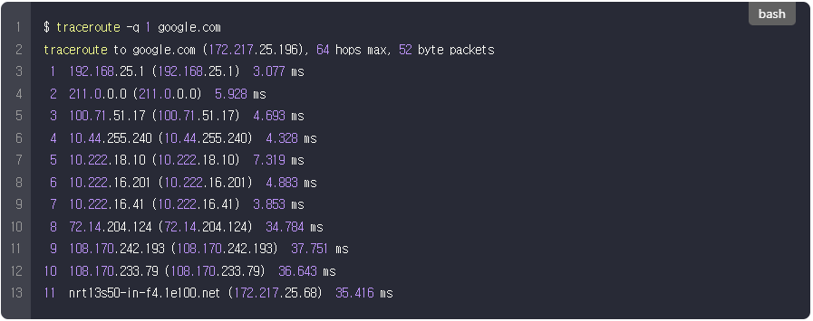
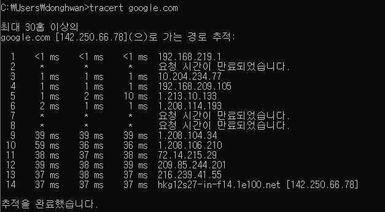
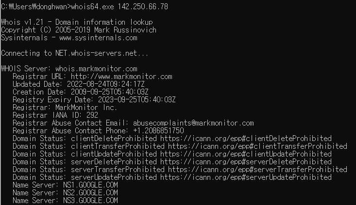
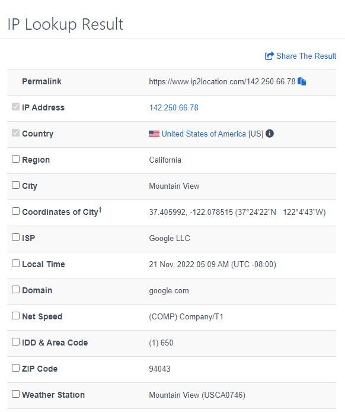
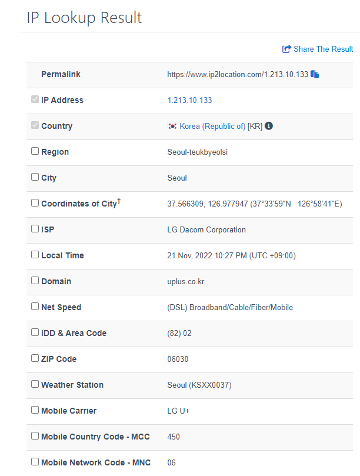
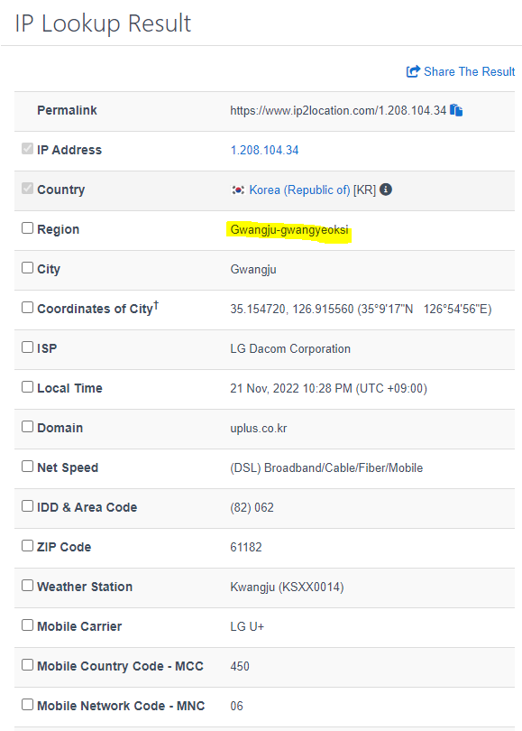
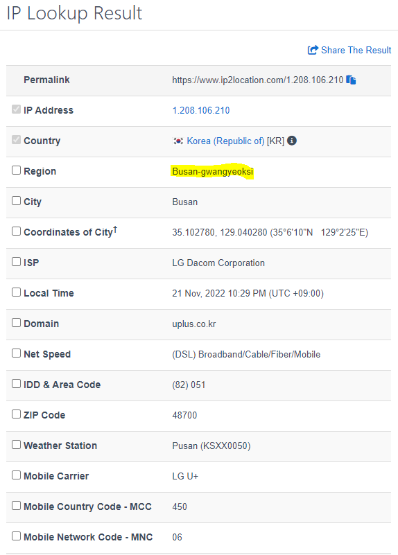
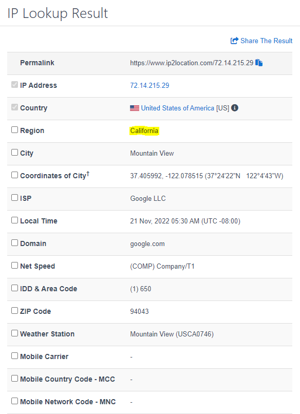
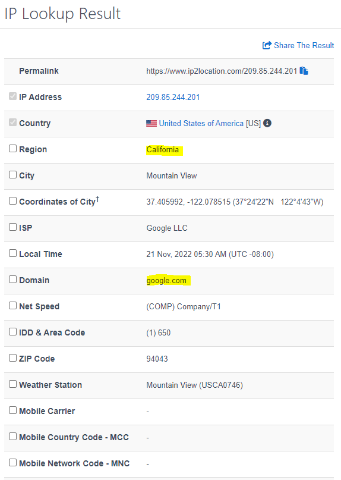

## [우리 집에서 구글까지 가는 길](https://evan-moon.github.io/2019/06/22/my-home-to-google/)

> 면접 단골 질문인 검색창에 www.naver.com을 치면 화면이 나타날때까지 어떤 과정을 거치는가를 알아보다가 한국에 있는 우리집에서 미국에 있는 구글 서버까지 어떻게 그렇게 빨리 갔다 오는지 뭔가 와닿지 않아서 찾아보게 된 글

- 인터넷에 연결되어 있는 모든 컴퓨터는 **실제로** 케이블을 통해 연결되어 있다

#### IP(Internet Protocol) : 우리 집 주소

- 일반적으로 접하는 `192.168.0.1`과 같은 형태는 `IPv4`이다
- 8비트로 구성된 4개의 필드로 구성되고 하나의 필드를 `옥탯`이라고 부른다. (하나의 옥탯은 0~255)

- 2^32 = 약 43억개 => 2011년 다 소진..

#### 웹 브라우저에 `google.com`을 입력하면..

- 위에는 MacOS 기준이고 아래는 비슷한 명령어를 구글링하여 구글까지의 경로를 알아보았다.
- 하나의 row를 `홉(Hop)`이라고 한다
  - 내 집에서부터 구글의 서버까지 패킷이 거쳐간 경로를 의미
  - 9번부터 홉 응답시간이 두자리수(39ms)로 올라갔는데, 국내를 벗어나 해외로 빠져나간 것이라고 한다.
- `Whois`를 통해 IP주소의 정보를 확인할 수 있다.

[Whois 명령어 실행법](https://c0mp.tistory.com/946)

- [IP2Location](https://www.ip2location.com/demo)을 통해서도 IP주소 정보를 알 수 있는데

#### 3번째 홉 , [10.204.234.77](https://www.ip2location.com/demo/10.204.234.77)

- A클래스 사설망이므로, 우리집에서 사용하는 LG유플러스 백본망 내부일 것
  - 백본망이란?
    - 백본은 척추, 뼈대라는 의미인데 => 거대 공유기 느낌
    - 자신에게 연결되어 있는 소형 회선들로부터 데이터를 모아 빠르게 전송할 수 있는 대규모 전송회선(ISP, 여기서는 LG 유플러스)

#### 5번째 홉, 서울

#### 9번째 홉 (39ms), 광주

- 해외는 아니었다(광주광역시로 뜸)

#### 10번째 홉 , 부산

#### 11번째홉, 캘리포니아(구글)

#### 12번째 홉, 캘리포니아(구글)

#### 궁금증

- **마지막 홉까지 다 구글인데 왜 구글 안에서 또 여러 홉을 거치는지는 잘 모르겠다.**

- 경로 추적할때 요청시간이 만료된 홉은 무슨 의미일까

#### 알아낸 점

- 다 더해도 약 250ms이고 14개의 홉 정도를 거쳐서 홈페이지가 보이는 것이었다.