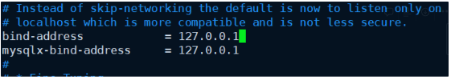
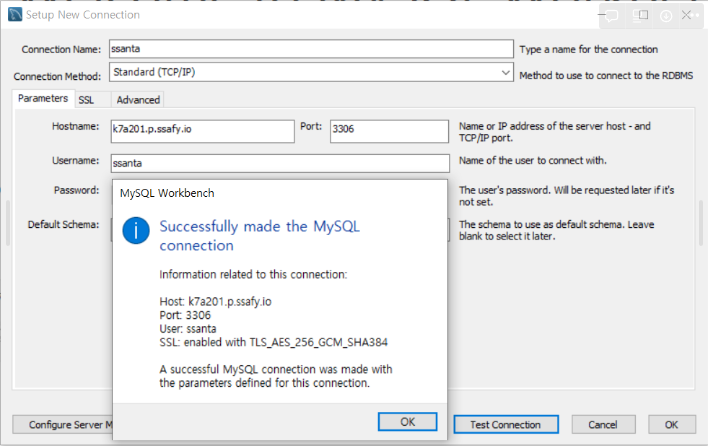

## MySQL배포

### 1. SSH접속 (VSCode)

[참고](https://bosungtea9416.tistory.com/entry/VScode%EB%A1%9C-%EC%84%9C%EB%B2%84%EC%97%90-SSH-%EC%9B%90%EA%B2%A9-%EC%A0%91%EC%86%8D%ED%95%98%EA%B8%B0)

### 2. 배포과정

```bash
sudo ufw allow ssh # SSH 포트 오픈
sudo ufw enable # Firewall is active and enabled on system startup, 방화벽 설정

# 초기 설정
sudo apt-get update # 패키지 매니저 업데이트
sudo apt-get install mysql-server # mysql 설치
sudo ufw allow mysql # 외부 접속 가능 설정(포트 3306 오픈)
sudo systemctl start mysql # mysql 실행
sudo systemctl enable mysql # mysql 서버 재시작 시 mysql 자동 재시작

# mysql 접속
sudo /usr/bin/mysql -u root -p
```

### 3. MySQL설정

- [참고](https://1mini2.tistory.com/87)

```sql
show databases;
use mysql;

mysql> select Host, User, authentication_string from user;

# 외부접속을 위한 user 생성, 권한 부여
# 비밀번호 설정, %는 모든 곳에서 허용한다는 의미
mysql> CREATE USER 'root'@'%' identified by 'password'; 
mysql> GRANT ALL PRIVILEGES ON *.* to 'root'@'%';
mysql> flush privileges;
mysql> exit
Bye
```

### 4. 외부 접속 허용을 위해 mysqld.cnf 파일 수정

```bash
sudo su # root 권한 부여
cd /etc/mysql/mysql.conf.d # mysqld.cnf 파일이 있는 디렉터리로 이동
vi mysqld.cnf # 파일 실행
# bind-address 부분을 찾아 0.0.0.0으로 변경
service mysql restart # mysql 서버 재실행
```



### 5. 접속 확인



#### 터미널에서 접속하기

```bash
mysql -h [ec2_ip_address] -P 3306 -u [user] -p
```

