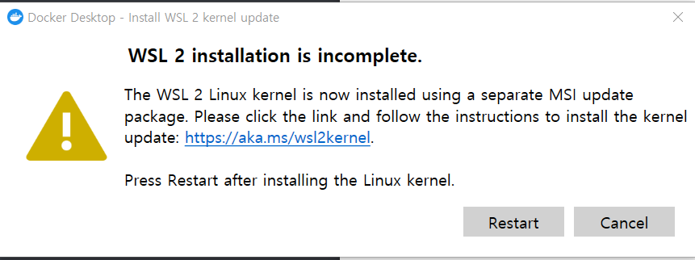
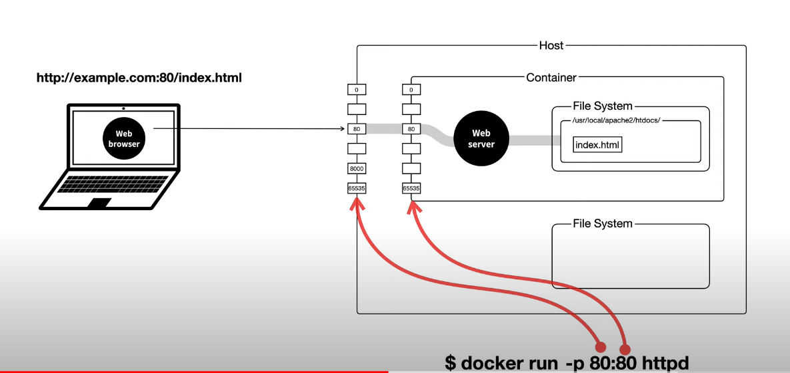

## 도커설치

> WSL2 설치



- [참고](https://gaesae.com/m/161)


### 이미지 다운로드

> [도커허브](https://hub.docker.com/) : 이미지 다운로드
>
> [도커명령어설명](https://docs.docker.com/reference/) : docker docs => Reference => Command-line reference

- pull : 이미지 다운로드

```shell
$ docker pull httpd # httpd(아파치서버) 다운로드 법
```

- run : 컨테이너 실행

```shell
$ docker run httpd # httpd 컨테이너 실행
$ docker run --name ws2 httpd # ws2라는 이름의 컨테이너 실행, 이름지정안하면 임의로생성됨
```

- ps : 상태 확인

```shell
$ docker ps # 실행되고 있는 컨테이너 확인
$ docker ps -a # 실행되고 있지 않은 컨테이너까지 확인
```

- logs : 컨테이너 로그 확인

```shell
$ docker logs ws2 # ws2라는 컨테이너의 로그 확인
$ docker logs -f ws2 # ws2 로그를 지속적으로 확인
```

- rm : 컨테이너 삭제  

```shell
$ docker rm ws2 # ws2 컨테이너 삭제, stop을 먼저 해야함
$ docker rm --force ws2 # 실행중인 컨테이너 강제 삭제
```

- rmi : 이미지 삭제

```shell
$ docker rmi httpd
```

- images : 현재 가지고 있는 도커 이미지들 리스트 확인

```shell
$ docker images
```


### 포트 설정



- docker run -p(포트설정) 80(Host포트):80(Container포트) httpd
  - Host의 80포트로 들어온 요청을 Container의 80포트로 연결 => Port Forwarding

```shell
# ws3라는 이름의 컨테이너를 실행하는데 호스트의 8081로 요청을 보내면 컨테이너의 80포트로 연결
$ docker run --name ws3 -p 8081:80 httpd 
```

- http://localhost:8080/index.html에 접속하면 불러와지는 것을 확인할 수 있음


### 컨테이너 내부 CLI

```shell
# pw2 컨테이너 내부에서 pwd라는 명령어 실행
$ docker exec pw2 pwd
# pw2 컨테이너 내부에서 계속적으로 명령어 입력할 수 있음
$ docker exec -it ws2 /bin/sh
$ docker exec -it ws2 /bin/bash # bash shell
```

### index.html 수정하기

```shell
$ docker exec -it ws2 /bin/bash # 커맨드 창 연결
$ cd htdocs/ # index.html 있는 위치로 이동
$ ls # index.html 있는지 확인
$ apt update
$ apt install nano # nano 설치 vim같이 편집할수있는 툴
$ nano index.html # vim창같은거 열리고 편집하면됨
```

> 참고 
>
> apt는 **Ubuntu, Debian 및 관련 Linux 배포에 deb 패키지를 설치, 업데이트, 제거 및 관리하기 위한 명령줄 유틸리티**

### HOST File과 Container File 연결

- HOST의 8888포트를 container 80포트로 보내주고 -v 명령어를 통해 local에 있는 index.html과 container의 index.html 연결 
  - 주의: local경로는 절대경로로 입력해야하며 \가 아닌 /

```shell
$ docker run -p 8888:80 -v C:/Users/SSAFY/Desktop/htdocs/:/usr/local/apache2/htdocs/ httpd
```

