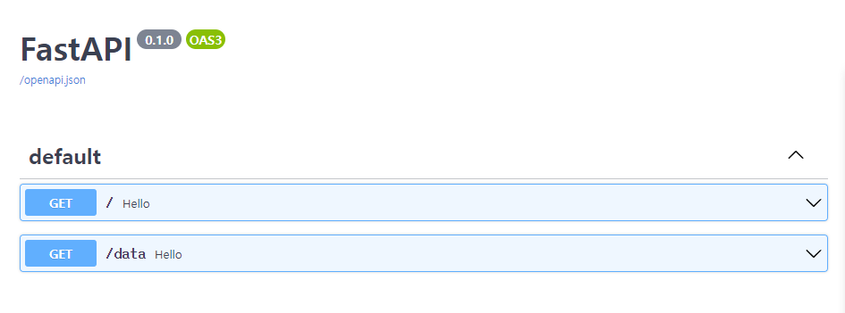
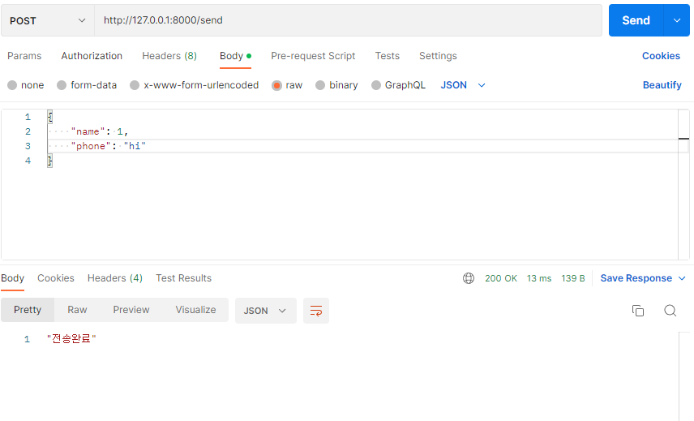

## FastAPI

### 0. 시작

```shell
$ pip install fastapi
$ pip install "uvicorn[standard]"
$ uvicorn main:app --reload # 실행
```

### 1. API 문서

> http://127.0.0.1:8000/docs 로 접속하면 자동으로 API 문서 만들어져 있음 (Swagger 느낌)
>
> http://127.0.0.1:8000/redoc => 다른 버전



### 2. HTML 

> index.html 만들고 아래와 같이 입력하면 `/home`으로 갔을 때 html 파일 나옴

```python
from fastapi.responses import FileResponse

@app.get("/home")
def hello():
    return FileResponse('index.html')
```


### 3. data 입력받기

> 1. data 타입 지정 가능

```python
from pydantic import BaseModel
class Model(BaseModel):
    name: int
    phone: str

@app.post("/send")
def test(data : Model):
    print(data)
    return '전송완료'
```

> postman으로 test

