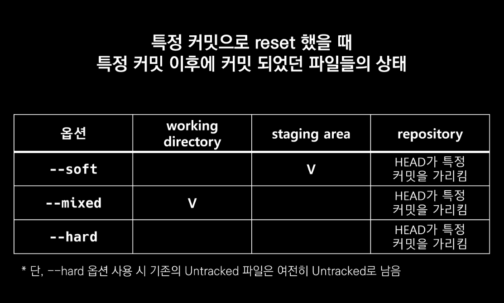

## Undoing

### 1. undoing things

#### 1.1. 파일 내용 수정 전으로 되돌리기

- modified 파일 되돌리기
  - 수정 전으로 되돌아감 => 한 번 restore를 통해 수정을 취소하면, 복원 불가

```bash
$ git restore test.md
```

#### 1.2. 파일 상태를 `Unstage`로 되돌리기

> git add를 통해서 Staging Area에 올린 파일(test.md)을 되돌리기

```bash
# 기존에 커밋이 없는 경우
$ git rm --cached test.md
# 기존에 커밋이 존재하는 경우
$ git restore --staged test.md
```

#### 1.3. 바로 직전 완료한 커밋 수정

1. 커밋 메세지만 수정

   ```bash
   $ git commit --amend
   # Vim 열리면 -> i 누르고 수정모드로 수정 한 뒤, esc 누르고 :wq로 나오기
   
   ```

2. 누락한 파일 추가

   ```bash
   # 누락된 파일을 staging area로 이동시키기
   $ git add bar.txt
   
   $ git commit --amend
   # Vim에서 자동으로 추가되어 있는거 확인하고
   
   # Changes to be committed:
   #       new file:   bar.txt
   #       new file:   foo.txt
   
   #:wq로 저장 후 종료하면 덮어 씌워짐
   ```

<br>

### 2. Reset & Revert

> 예전 상태로 되돌아가기

#### 2.1. Reset (Revert쓰는 것이 나음)

```bash
$ git reset [옵션] <커밋 ID>
```

**옵션**

- `옵션`은 아래와 같이 세 종류가 있으며, 생략 시 `--mixed`가 기본 값입니다.
  1. `--soft`
     - **돌아가려는 커밋으로 되돌아가고**,
     - 이후의 commit된 파일들을 `staging area`로 돌려놓음 (commit 하기 전 상태)
     - 즉, 다시 커밋할 수 있는 상태가 됨
  2. `--mixed`
     - **돌아가려는 커밋으로 되돌아가고**,
     - 이후의 commit된 파일들을 `working directory`로 돌려놓음 (add 하기 전 상태)
     - 즉, unstage 된 상태로 남아있음
     - 기본 값
  3. `--hard`
     - **돌아가려는 커밋으로 되돌아가고**,
     - 이후의 commit된 파일들(`tracked 파일들`)은 모두 working directory에서 삭제
     - 단, Untracked 파일은 그대로 Untracked로 남음



**[참고사항]**

혹시나 이미 삭제한 커밋으로 다시 돌아가고 싶다면? → `git reflog`를 사용합니다.

```shell
$ git reflog
1a410ef HEAD@{0}: reset: moving to 1a410ef
ab1afef HEAD@{1}: commit: modified repo.rb a bit
484a592 HEAD@{2}: commit: added repo.rb

$ git reset --hard <복구하고자 하는 커밋ID>

# git reflog 명령어는 HEAD가 이전에 가리켰던 모든 커밋을 보여줍니다.
# 따라서 --hard 옵션을 통해 지워진 커밋도, reflog로 조회하여 돌아갈 수 있습니다
```

<br>

#### 2.1. Revert 

```bash
$ git revert <커밋 ID> 
```

- `git reset`은 커밋 내역을 삭제하는 반면, `git revert`는 새로 커밋을 쌓는다는 차이가 있습니다.

1. 시작 전 커밋 확인

   ```shell
   $ git log --oneline
   20d320d third
   1eb059e second
   6baf32f first
   ```

2. second 커밋으로 revert => second 커밋을 없었던 일로 만드는 것

   ```shell
   $ git revert 1eb059
   ```

3. vim 편집기 나오면 저장 후 종료

   ```shell
   $ git log --oneline
   f0b5364 (HEAD -> master) Revert "second" # 새로 쌓인 커밋
   20d320d third
   1eb059e second # 히스토리는 남아있음
   6baf32f first
   ```

   

**[중요]**

`git reset`과 비슷하다는 이유로 다음 사항이 혼동될 수 있습니다.

- `git reset --hard 5sd2f42`라고 작성하면 5sd2f42라는 커밋`으로` 돌아간다는 뜻입니다.
- `git revert 5sd2f42`라고 작성하면 5sd2f42라는 커밋`을` 되돌린다는 뜻입니다.

**[참고사항]**

```shell
# 공백을 통해 여러 커밋을 한꺼번에 되돌리기 가능
$ git revert 7f6c24c 006dc87 3551584

# 범위 지정을 통해 여러 커밋을 한꺼번에 되돌리기 가능
$ git revert 3551584..7f6c24c

# 커밋 메시지 작성을 위한 편집기를 열지 않음 (자동으로 커밋 완료)
$ git revert --no-edit 7f6c24c

# 자동으로 커밋하지 않고, Staging Area에만 올림 (이후, git commit으로 수동 커밋)
# 이 옵션은 여러 커밋을 revert 할 때 하나의 커밋으로 묶는게 가능
$ git revert --no-commit 7f6c24c
```

