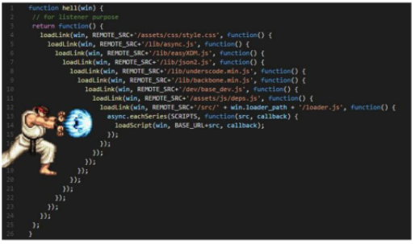

## AJAX

> Asynchronous JavaScript And XML (비동기식 JS와 XML)

- 서버와 통신하기 위해 XMLHttpRequest 객체를 활용
- JSON, XML, HTML 그리고 일반 텍스트 형식 등을 포함한 다양한 포맷을 주고 받을 수 있음
- AJAX의 X가 XML을 의미하긴 하지만, 요즘은 JSON을 더 많이 사용

> AJAX 특징

- 페이지 전체를 새로고침을 하지 않고서도 수행되는 '비동기성'
  - 서버의 응답에 따라 전체 페이지가 아닌 일부분만을 업데이트 할 수 있음
- AJAX의 주요 2가지 특징은 아래 작업을 할 수 있게 해줌
  - 페이지 새로 고침 없이 서버에 요청
  - 서버로부터 데이터를 받고 작업을 수행

> XMLHttpRequest 객체

- 서버와 상호작용하기 위해 사용되며 전체 페이지의 새로 고침 없이 데이터를 받아올 수 있음
- 이름과 달리 XML뿐만 아니라 모든 종류의 데이터를 받아올 수 있음
- 생성자: XMLHttpRequest()

<br>

### 1. 동기 & 비동기

- 동기 

  - 순차적, 직렬적 task 수행
  - 요청을 보낸 후 응답을 받아야만 다음 동작이 이루어짐

  - JS는 single threaded

- 비동기

  - 병렬적 task 수행
  - 요청을 보낸 후 응답을 기다리지 않고 다음 동작이 이루어짐

#### 1.1. 왜 비동기를 사용하는가?

- 동기식 코드라면 데이터를 모두 불러운 뒤 앱이 실행됨
  - 데이터를 모두 불러올 때까지는 앱이 모두 멈춘 것처럼 보임
- 비동기식 코드라면 데이터를 요청하고 응답 받는 동안, 앱 실행을 함께 진행함
  - 데이터를 불러오는 동안 지속적으로 응답하는 화면을 보여줌으로써 더욱 쾌적한 사용자 경험을 제공

> Threads

- 프로그램이 작업을 완료하기 위해 사용할 수 있는 단일 프로세스
  - 스레드는 한 번에 하나의 작업만 수행할 수 있음

#### 1.2. JavaScript는 single threaded 이다

- 컴퓨터가 여러 개의 CPU를 가지고 있어도 main thread라 불리는 단일 스레드에서만 작업 수행
- 즉 이벤트를 처리하는 Call stack이 하나인 언어라는 의미
- 이 문제를 해결하기 위해 JavaScript는
  - 즉시 처리하지 못하는 이벤트들을 다른곳(Web API)으로 보내서 처리하도록 하고
  - 처리된 이벤트들은 처리된 순서대로 대기실(Task queue)에 줄을 세워 놓고
  - Call Stack이 비면 담당자(Event Loop)가 대기 줄에서 가장 오래된 이벤트를 Call Stack으로 보냄

#### 1.3. Concurrency model

- Event loop을 기반으로 하는 동시성 모델

1. Call Stack : 요청이 들어올 때마다 해당 요청을 순차적을 처리하는 Stack 형태의 자료 구조
2. Web API : JavaScript 엔진이 아닌 브라우저 영역에서 제공하는 API
3. Task Queue : 비동기 처리된 callback 함수가 대기하는 Queue 형태의 자료구조
4. Event Loop : Call Stack이 비어있는 경우 Task Queue에서 대기중인 callback 함수를 push

<br>

### 2. 순차적인 비동기 처리하기

#### 2.1. Callback function

- 다른 함수에 인자로 전달된 함수
- 외부 함수 내에서 호출되어 일종의 루틴 또는 작업을 완료함
- 비동기 작업이 완료된 후 코드 실행을 계속하는 데 사용되는 경우를 비동기 콜백이라고 함

#### 2.2. Async callbacks

- 백그라운드에서 코드 실행을 시작할 함수를 호출할 때 인자로 지정된 함수
- callback 함수를 다른 함수의 인수로 전달할 때, 함수의 참조를 인수로 전달할 뿐, 즉시 실행 x, 함수의 body에서 called back 됨, 정의된 함수는 때가 되면 callback 함수를 실행하는 역할

- callback Hell

  - 해결 방법: Promise callbacks 

  

#### 2.3. Promise 

> chaining이 가능함 <= callback Hell 해결

- 비동기 작업의 최종 완료 또는 실패를 나타내는 객체
  - 미래의 완료 또는 실패와 그 결과 값을 나타냄
  - .then(callback) : 성공에 대한 약속
    - 이전 작업의 성공 결과를 인자로 전달 받음
  - .catch(callback) : 실패에 대한 약속
    - 이전 작업의 실패로 인해 생성된 error 객체 사용
  - .finally(callback)
    - 결과와 상관없이 무조건 지정된 callback 함수 실행
    - 어떠한 인자도 전달받지 않음

<br>

### 3. Axios

[Axios](https://axios-http.com/kr/docs/intro)

> 원래는 XHR이라는 브라우저 내장 객체를 활용해 AJAX 요청을 처리하는데, 이보다 편리한 AJAX 요청이 가능하도록 도와줌

```javascript
<script src="https://unpkg.com/axios/dist/axios.min.js"></script>

axios.get(URL)
	.then(..)
	.catch(..)
```

<br>

### 4. async & await

> 비동기 코드를 작성하는 새로운 방법

- promise 구조의 then chaining을 제거
- Syntactic sugar
  - 더 쉽게 읽고 표현할 수 있도록 설계된 프로그래밍 언어 내의 구문
  - 즉, 문법적 기능은 그대로 유지하되 사용자가 직관적으로 코드를 읽을 수 있게 만듦

- function 앞에 async, 비동기 처리 앞에 await