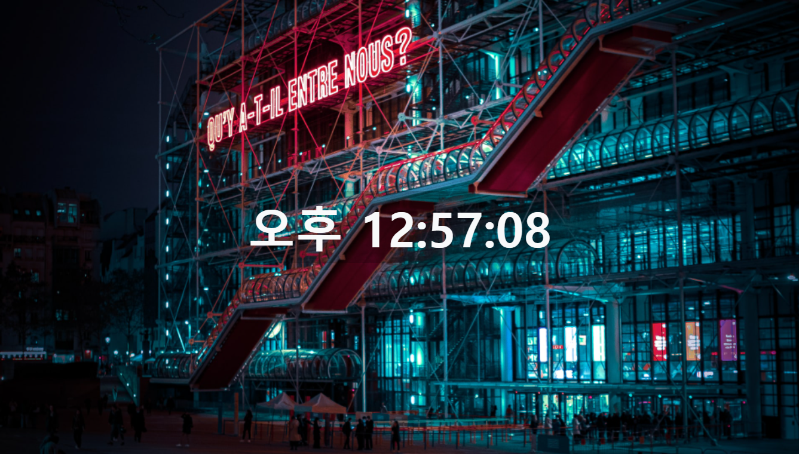

## 어려웠던 점

- get으로 시간,분,초를 가져오면 08초가 아닌 8초로 나타난다. 보통 시계는 한자리 수일 경우 앞에 0을 붙여주기 때문에 삼항 연산자로 구현했다. 어려웠던건 시간이었는데 오전 오후는 11-12를 기준으로 바뀌고 시간을 mod12로 표현하는 기준은 12-13이기 때문에 오전 오후는 결국 따로 조건문으로 만들었다.




```javascript
// 배경 이미지 랜덤(lodash 활용), 시계


    // 1. 배경 이미지
    document.body.style.backgroundImage = `url(images/${_.sample(_.range(1,7))}.jpg)`
    
	// 2. 시계
    const timeDiv = document.querySelector('#time')
    // 시계 customize
    timeDiv.style.textAlign = 'center'
    timeDiv.style.width = '50%'
    timeDiv.style.fontWeight = 'bold'

    const displayTime = function () {
      const now = new Date()
      let hour = now.getHours()
      let minute = now.getMinutes()
      let second = now.getSeconds()
      
      let noon 
      if (hour < 12) {
        noon = '오전'
      } else {
        noon = '오후'
      }
      timeDiv.innerText = `${hour <=12 ? `${noon} ${hour<10? `0${hour}`: hour}` : `${noon} ${hour%12 < 10? `0${hour%12}`: hour%12 }` }:${minute < 10? `0${minute}` : minute}:${second < 10? `0${second}` : second}`
    }

    // 1초에 한번 displayTime 함수 실행
    setInterval(displayTime, 1000)
```

