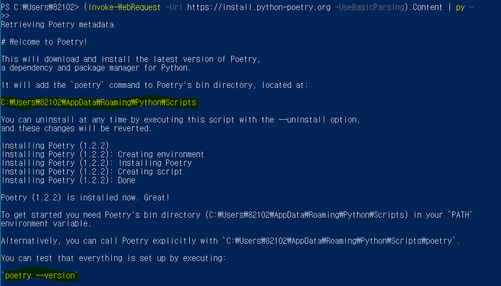
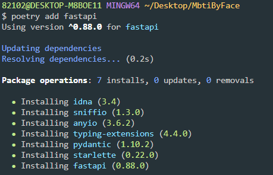

## Poetry

> python 의존성 관리 툴, npm 같은 것
>
> 이전에는 requirement.txt 만들고 freeze 일일이 해줬었는데 poetry는 자동으로 해줌. 가상환경도 필요없음. 한번 써봐야즤

### 0. 설치

> [공식문서](https://python-poetry.org/docs/#installing-with-the-official-installer) 보고 설치
>
> 1. cmd에서 `poetry --version`했을 때 버전 떠야함. 
>    - 안뜬다면 **하이라이트한 주소** 시스템 환경변수 설정



### 1. 시작

> 1. 프로젝트 폴더를 만들고 들어가서 bash 킨다. 
> 2. 아래 명령어를 입력한 뒤, enter 연타 (프로젝트 초기 정보 입력인데 나중에 다 수정할 수 있음)

```shell
$ poetry init
```

> 3. pyproject.toml 파일이 생성된 것을 확인

```python
[tool.poetry]
name = "mbtibyface"
version = "0.1.0"
description = ""
authors = ["donghwan <ldh793@naver.com>"]
readme = "README.md"

[tool.poetry.dependencies]
python = "^3.9"


[build-system]
requires = ["poetry-core"]
build-backend = "poetry.core.masonry.api"
```

> 4. fastapi 쓸거라서 설치 => poetry.lock 파일 생김, toml 의존성에 fastapi 생김
>    - 생성된 `.toml` 파일에는 프로젝트 dependency의 **메타데이터**가, `.lock` 파일에는 설치된 패키지들의 **version**, **hash**가 저장되어있습니다.

```shell
$ poetry add fastapi
```



> 5. 서버 구동해줌 uvicorn

```shell
$ poetry add uvicorn
$ poetry run uvicorn main:app # 서버 구동
```