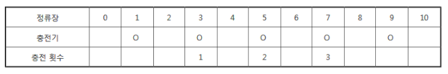

## List_1 문제풀이

### 삼성시의 버스 노선

> 삼성시에 있는 5,000개의 버스 정류장은 관리의 편의를 위해 1에서 5,000까지 번호가 붙어 있다.
>
> 그리고 버스 노선은 N개가 있는데, i번째 버스 노선은 번호가 Ai이상이고,
>
> Bi이하인 모든 정류장만을 다니는 버스 노선이다.
>
> P개의 버스 정류장에 대해 각 정류장에 몇 개의 버스 노선이 다니는지 구하는 프로그램을 작성하라.
>
> 
> **[입력]**
>
> 첫 번째 줄에 테스트 케이스의 수 T가 주어진다.
>
> 각 테스트 케이스의 첫 번째 줄에는 하나의 정수 N ( 1 ≤ N ≤ 500 )이 주어진다.
>
> 다음 N개의 줄의 i번째 줄에는 두 정수 Ai, Bi ( 1 ≤ Ai ≤ Bi ≤ 5,000 )가 공백 하나로 구분되어 주어진다.
>
> 다음 줄에는 하나의 정수 P ( 1 ≤ P ≤ 500 )가 주어진다.
>
> 다음 P개의 줄의 j번째 줄에는 하나의 정수 Cj ( 1 ≤ Cj ≤ 5,000 ) 가 주어진다.
>
> 
> **[출력]**
>
> 각 테스트 케이스마다 ‘#x’(x는 테스트케이스 번호를 의미하며 1부터 시작한다)를 출력하고 한 칸을 띄운 후,
>
> 한 줄에 P개의 정수를 공백 하나로 구분하여 출력한다.
>
> j번째 정수는 Cj번 버스 정류장을 지나는 버스 노선의 개수여야 한다.

```python
T = int(input())
for tc in range(1, T+1):
    N = int(input())
    bus = [0] * 5000 # 버스 노선

    # 버스 수 할당
    for i in range(N):
        A, B =map(int,input().split())
        for j in range(A-1, B):
            bus[j] += 1

    # 노선 순서대로 담기
    P = int(input())
    answer = []
    for i in range(P):
        c = int(input())
        answer.append(bus[c-1])

    print(f'#{tc}',*answer)

```


### 현주의 상자 바꾸기

> 현주는 1번부터 N번까지 N개의 상자를 가지고 있다. 각 상자에는 숫자를 새길 수 있는데 처음에는 모두 0으로 적혀있다.
>
> 숫자가 너무 단조로웠던 현주는 다음 Q회 동안 일정 범위의 연속한 상자를 동일한 숫자로 변경하려고 한다. 변경하는 방법은 다음과 같다.
>
>   · i (1 ≤ i ≤ Q)번째 작업에 대해 L번 상자부터 R번 상자까지의 값을 i로 변경
>
> 현주가 Q회 동안 위의 작업을 순서대로 한 다음 N개의 상자에 적혀있는 값들을 순서대로 출력하는 프로그램을 작성하라.
>
> 
>
> **[**입력**]**
>
> 첫 번째 줄에 테스트 케이스의 수 T가 주어진다.
>
> 각 테스트 케이스의 첫 번째 줄에는 두 정수 N, Q (1 ≤ N, Q ≤ 103)가 공백으로 구분되어 주어진다.
>
> 다음 Q개의 줄의 i번째 줄에는 Li, Ri (1 ≤ Li ≤ Ri ≤ N)이 주어진다.
>
>  
>
> **[**출력**]**
>
> 각 테스트 케이스마다 첫 번째 줄에는 ‘#x’(x는 테스트케이스 번호를 의미하며 1부터 시작한다)를 출력하고,
>
> 각 테스트 케이스마다 Q개의 작업을 수행한 다음 1번부터 N번까지의 상자에 적혀있는 값들을 순서대로 출력한다.

```python
T = int(input())
for tc in range(1, T+1):
    N, Q = map(int, input().split())
    boxes = [0] * N
    
    for i in range(1, Q+1):
        L, R = map(int, input().split())
        for j in range(L-1, R):
            boxes[j] = i
            
    print(f'#{tc}', *boxes)
```


### 간단한 소인수분해

>숫자 N은 아래와 같다.
>
>N=2a x 3b x 5c x 7d x 11e
>
>N이 주어질 때 a, b, c, d, e 를 출력하라.
>
>
>**[제약 사항]**
>
>N은 2 이상 10,000,000 이하이다.
>
>
>**[입력]**
>
>가장 첫 줄에는 테스트 케이스의 개수 T가 주어지고, 그 아래로 각 테스트 케이스가 주어진다.
>
>각 테스트 케이스의 첫 번째 줄에 N 이 주어진다.
>
>
>**[출력]**
>
>출력의 각 줄은 '#t'로 시작하고, 공백을 한 칸 둔 다음 정답을 출력한다.
>
>(t는 테스트 케이스의 번호를 의미하며 1부터 시작한다.)

```python
T = int(input())
for tc in range(1, T+1):
    N = int(input())
    prime = {2: 0,
             3: 0,
             5: 0,
             7: 0,
             11: 0,
             }

    for key in prime.keys():
        while N % key == 0:
            prime[key] += 1
            N /= key

    print(f'#{tc}', end=' ')
    print(*list(prime.values()))
```


### 숫자카드

```python
T = int(input())
for tc in range(1, T+1):
    N = input()
    ai = list(map(int, input()))
    cnts = [0] * 10 # 0-9 각각의 개수

    for i in range(len(ai)):
        cnts[ai[i]] += 1

    maxV = 0 # 가장 많은 카드의 숫자
    cnt = cnts[maxV] # 가장 많은 숫자의 장 수
    for i in range(1, 10):
        if cnt <= cnts[i]:
            maxV = i
            cnt = cnts[i]

    print(f'#{tc} {maxV} {cnt}')
```


### 구간합

> N개의 정수가 들어있는 배열에서 이웃한 M개의 합을 계산하는 것은 디지털 필터링의 기초연산이다.
>
> M개의 합이 가장 큰 경우와 가장 작은 경우의 차이를 출력하는 프로그램을 작성하시오.
>
> 다음은 N=5, M=3이고 5개의 숫자 1 2 3 4 5가 배열 v에 들어있는 경우이다. 
> 이웃한 M개의 합이 가장 작은 경우 1 + 2 + 3 = 6
> 이웃한 M개의 합이 가장 큰 경우 3 + 4 + 5 = 12
>
> 답은 12와 6의 차인 6을 출력한다.
>
> **[입력]**
>
> 첫 줄에 테스트 케이스 개수 T가 주어진다. ( 1 ≤ T ≤ 50 )
> 다음 줄부터 테스트케이스의 첫 줄에 정수의 개수 N과 구간의 개수 M 주어진다. ( 10 ≤ N ≤ 100, 2 ≤ M ＜ N )
> 다음 줄에 N개의 정수 ai가 주어진다. ( 1 ≤ a ≤ 10000 )
>
> **[출력]**
>
> 각 줄마다 "#T" (T는 테스트 케이스 번호)를 출력한 뒤, 답을 출력한다.

```python
T = int(input())
for tc in range(1, T+1):
    N, M = map(int, input().split())
    ai = list(map(int, input().split()))

    # 초기값 설정
    minV = maxV = 0
    for i in range(M):
        minV += ai[i]
        maxV += ai[i]

    # min max 갱신
    for i in range(1, N-M+1):
        subtotal = 0 # M개씩 끊어서 합
        for j in range(M):
            subtotal += ai[i+j]

        if minV > subtotal:
            minV = subtotal
        if maxV < subtotal:
            maxV = subtotal

    print(f'#{tc} {maxV-minV}')

```


### 전기버스

> A도시는 전기버스를 운행하려고 한다. 전기버스는 한번 충전으로 이동할 수 있는 정류장 수가 정해져 있어서, 중간에 충전기가 설치된 정류장을 만들기로 했다.
>
> 버스는 0번에서 출발해 종점인 N번 정류장까지 이동하고, 한번 충전으로 최대한 이동할 수 있는 정류장 수 K가 정해져 있다.
>
> 충전기가 설치된 M개의 정류장 번호가 주어질 때, 최소한 몇 번의 충전을 해야 종점에 도착할 수 있는지 출력하는 프로그램을 만드시오.
>
> 만약 충전기 설치가 잘못되어 종점에 도착할 수 없는 경우는 0을 출력한다. 출발지에는 항상 충전기가 설치되어 있지만 충전횟수에는 포함하지 않는다.
>  
>
>
> **[예시]**
>
> 
>
> 다음은 K = 3, N = 10, M = 5, 충전기가 설치된 정류장이 1, 3, 5, 7, 9인 경우의 예이다.
>
>  
>
> **[입력]**
>
> 첫 줄에 노선 수 T가 주어진다. ( 1 ≤ T ≤ 50 )
>
>
> 각 노선별로 K, N, M이 주어지고, 다음줄에 M개의 정류장 번호가 주어진다. ( 1 ≤ K, N, M ≤ 100 )
>
> **[출력]**
>
> \#과 노선번호, 빈칸에 이어 최소 충전횟수 또는 0을 출력한다.

```python
T = int(input())
for tc in range(1, T+1):
    K, N, M = map(int, input().split())
    number = list(map(int, input().split()))
    charge = [0] * (N+1) # 충전소 위치 있으면 1 없으면 0
    diff = [] # 충전소 사이 거리 리스트

    diff.append(number[0] - 0) # 첫 충전소까지 거리
    for i in range(M-1):
        diff.append(number[i+1] - number[i])
    diff.append(N - number[M-1]) # 마지막 충전소부터 목표지점까지 거리

    # 주유소 위치 1로 표시한 리스트 charge
    for num in number:
        charge[num] += 1

    cnt = 0 # 충전수
    i = 0 # 갱신할 위치
    while True:
        i += K # 보폭만큼 가면서
        if i >= N: # 목표지점 넘어가면 break
            break

        if charge[i] == 1: # 보폭만큼 갔는데 충전소 있으면 충전
            cnt += 1
            #print(i)

        else: #보폭만큼 갔는데 충전소 없으면
            for j in range(i, i-K, -1): # 뒤로 돌아가면서 충전소 찾고 위치 갱신
                if charge[j] == 1:
                    i = j
                    cnt += 1
                    break

    for dif in diff: # 만약에 충전소 사이 거리가 보폭보다 큰 게 있다면 무효 cnt=0
        if dif > K:
            cnt = 0
            break

    print(f'#{tc} {cnt}')
```