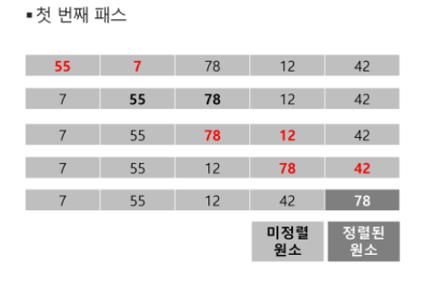
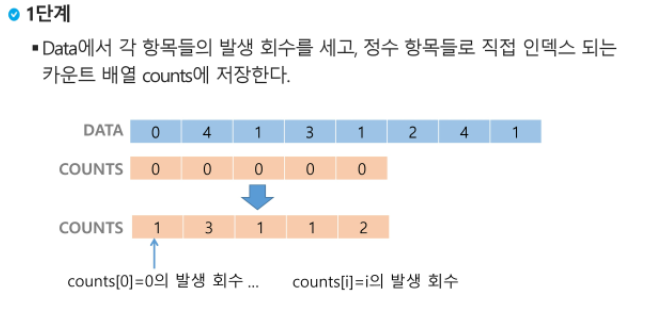
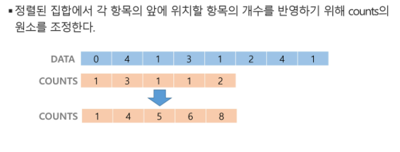
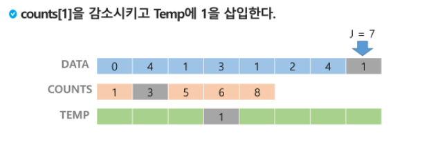
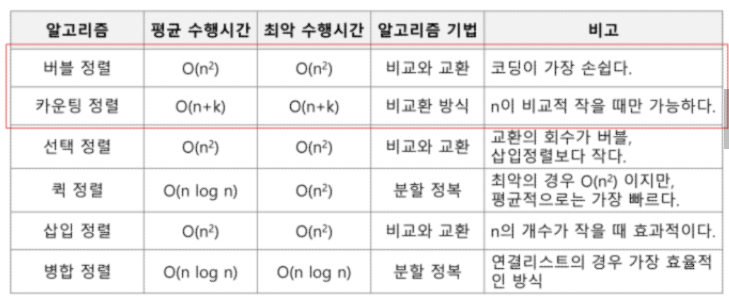

## 알고리즘

- 알고리즘 : 유한한 단계를 통해 문제를 해결하기 위한 절차나 방법. 


> 알고리즘 표현법

- 의사코드, 순서도


> 알고리즘 평가지표

- 정확성: 얼마나 정확하게 동작하는가
- 작업량: 얼마나 적은 연산으로 원하는 결과를 얻어내는가
- 메모리 사용량: 얼마나 적은 메모리를 사용하는가
- 단순성: 얼마나 단순한가
- 최적성: 더 이상 개선할 여지없이 최적화되었는가


> 시간 복잡도(Time Complexity)
>
> Big-Oh Notation

- 시간 복잡도 함수 중에서 가장 큰 영향력을 주는 n에 대한 항만을 표시
- 계수는 생략 ex) O(3n+2) = O(3n) = O(n)


> 배열이란
>
> 일정한 자료형의 변수들을 하나의 이름으로 열거하여 사용하는 자료구조

- 여러 개의 변수가 필요할 때 하나의 선언을 통해서 둘 이상의 변수를 선언 가능


> 정렬
>
> 2개 이상의 자료를 특정 기준에 의해 오름차순, 혹은 내림차순으로 재배열하는 것

- 키 : 자료를 정렬하는 기준이 되는 특정 값
- 대표적인 정렬 방식: 버블, 카운팅, 선택, 퀵, 삽입, 병합 


> 버블 소트 O(n^2)
>
> 인접한 두 개의 원소를 비교하며 자리를 계속 교환하는 방식

- 첫 번째 원소부터 인접한 원소끼리 계속 자리를 교환하면서 맨 마지막 자리까지 이동
- 한 단계가 끝나면 가장 큰 원소가 마지막 자리로 정렬됨



```python
def BubbleSort(a, N):
    '''
    a: 정렬할 list
    N: 원소 수
    '''
    for i in range(N-1, 0, -1):
        for j in range(0, i):
            if a[j] > a[j+1]:
                a[j], a[j+1] = a[j+1], a[j]
```


> 카운팅 소트 O(n + k) (n: 리스트 길이, k: 정수의 최대값)
>
> 항목들의 순서를 결정하기 위해 집합에 각 항목이 몇 개씩 있는지 세는 작업을 하여, 선형 시간에 정렬하는 효율적인 알고리즘







```python
def Counting_Sort(A, B, k):
    '''
    A: 입력 배열
    B: 정렬된 배열
    C: 카운트 배열
    '''
    C = [0] * (k+1)
    
    for i in range(0, len(A)):
        C[A[i]] += 1
    for i in range(1, len(C)):
        C[i] += C[i-1]
    for i in range(len(B)-1, -1, -1):
        C[A[i]] -= 1
        B[C[A[i]]] = A[i]
```


> 정렬에 따른 시간복잡도




> 완전 검색 Exaustive Search 
>
> 문제의 해법으로 생각할 수 있는 모든 경우의 수를 나열해보고 확인하는 기법

- Brute-force 혹은 generate-and-test 기법이라고도 불림


>탐욕 알고리즘 Greedy
>
>여러 경우 중 하나를 결정해야 할 때마다 그 순간에 최적이라고 생각되는 것을 선택해나가는 방식으로 진행하여 최종적인 해답을 구함