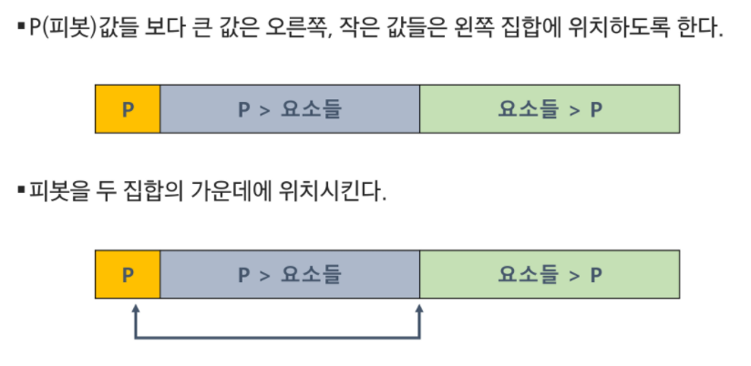
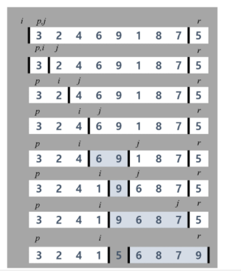
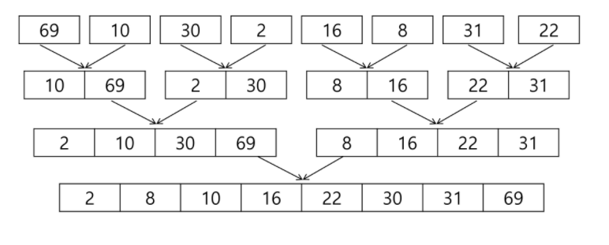

## 분할 정복 & 백트래킹

### 1. 분할정복

- 분할: 해결할 문제를 여러 개의 작은 부분으로 나눈다
- 정복: 나눈 작은 문제를 각각 해결한다
- 통합: 해결된 해답을 모은다 

#### 1.1 퀵 소트

> hoare 파티션



> lamuto 파티션



```python
'''
hoare
맨 왼쪽을 pivot으로 잡고 l,r이 엇갈릴때까지 왼쪽에는 pivot보다 작거나같은수 오른쪽에는 pivot보다 큰수 => 마지막에 pivot과 j를 바꿔주고 j리턴
''' 
def hoare(arr,l,r): # 이거는 맨 오른쪽을 pivot으로 잡았을 때
    p = r
    i,j = l,r-1
    while i<=j:
        while i<=j and arr[i]<=arr[p]:
            i += 1
        while i<=j and arr[j]>arr[p]:
            j -= 1
        if i<j:
            arr[i],arr[j] =arr[j],arr[i]
    arr[i], arr[r] = arr[r], arr[i]
    return i
'''
lamuto
i가 j를 따라가면서 pivot보다 큰 수가 나오면 격차를 벌린뒤 다시 작은 거 나오면 swap
=> 결과적으로 작은수는 왼쪽, 큰수는 오른쪽에 모임
=> 마지막에 i+1과 pivot(r) 바꾸고 i+1 리턴
'''
def lamuto(arr,l,r):
    i = l-1
    x = arr[r]
    for j in range(l,r):
        if arr[j] <= x:
            i += 1
            arr[i], arr[j] = arr[j], arr[i]
    arr[i+1],arr[r] = arr[r], arr[i+1]
    return i+1

def qsort(arr,l,r):
    if l<r:
        # p = hoare(arr,l,r)
        p = lamuto(arr, l, r)
        qsort(arr,l,p-1)
        qsort(arr,p+1,r)

T = int(input())
for tc in range(1, T+1):
    N = int(input())
    arr = list(map(int, input().split()))
    qsort(arr,0,N-1)
    print(f'#{tc}',arr)
```


<br>

#### 1.2 머지 소트



```python
def mergesort(arr): # 1개될 때까지 분해
    if len(arr) == 1:
        return arr
    left = []
    right = []
    m = len(arr) // 2
    for i in range(m):
        left.append(arr[i])
    for i in range(m, len(arr)):
        right.append(arr[i])
        
    left = mergesort(left)
    right = mergesort(right)

    return merge(left, right)

def merge(left, right): # 아랫단 부터 병합
    result = []
    L = len(left)
    R = len(right)
    while L > 0 or R > 0:
        L = len(left)
        R = len(right)
        if L > 0 and R > 0:
            if left[0] <= right[0]:
                result.append(left.pop(0))
            else:
                result.append(right.pop(0))
        elif L>0:
            result.append(left.pop(0))
        elif R>0:
            result.append(right.pop(0))
    return result

a= [0,4,1,7]
print(mergesort(a)) # [0,1,4,7]
```

