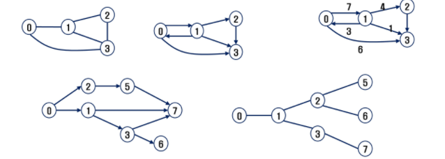
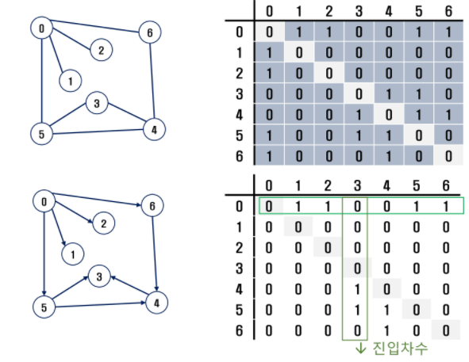
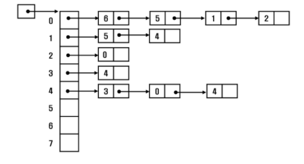
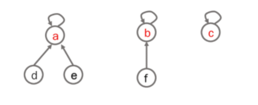
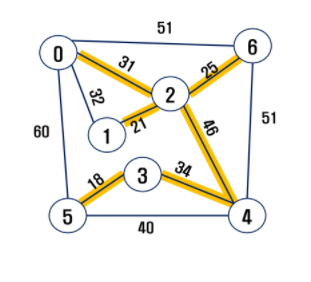
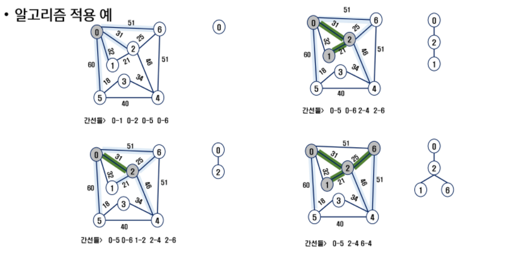
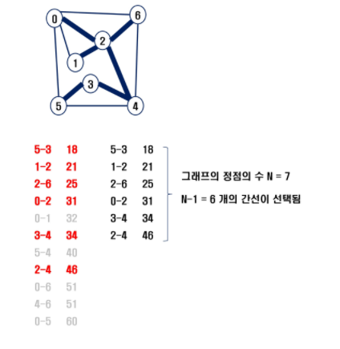

## 그래프

> 선형 자료구조나 트리 자료구조로 표현하기 어려운 N:N 관계를 가지는 원소들을 표현하기에 용이

- 그래프 유형
  - 무향 그래프
  - 유향 그래프
  - 가중치 그래프
  - 사이클 없는 방향 그래프



- 완전 그래프
  - 정점들에 대해 가능한 모든 간선들을 가진 그래프
- 부분 그래프
  - 원래 그래프에서 일부의 정점이나 간선을 제외한 그래프

<br>

### 1.1 그래프 표현

- 인접 행렬 : 2차원 배열을 이용해서 간선 정보를 저장



```python
# 입력 정보 행렬로 변환
arr = list(map(int, input().split())) # 입력정보: 0 1 0 2 ...
adjM=[[0]*N for _ range(N)]
for i in range(N): # 무방향 그래프
    n1, n2 = arr[2*i], arr[2*i+1]
    adjM[n1][n2] = 1
    adjM[n2][n1] = 1    
```


- 인접 리스트: 각 정점마다 해당 정점으로 나가는 간선의 정보를 저장



```python
# 입력 정보 인접 리스트로 변환
arr = list(map(int, input().split())) # 입력정보: 0 1 0 2 ...
adjL=[[0]*N for _ range(N)]
for i in range(N): # 무방향 그래프
    n1, n2 = arr[2*i], arr[2*i+1]
    adjL[n1].append(n2)
    adjL[n2].append(n1)
```

- 간선의 배열: 간선(시작,끝 정점)을 배열에 연속적으로 저장

<br>

### 1.2 그래프 순회

- 두 가지 방법: DFS, BFS

```python
visited = [0]*(V+1)
def dfs(i): # 인접행렬
    visited[i] = 1
    print(i, end=' ')
    for j in range(V+1): # i에 인접한 모든 노드에 대해
        if adjM[i][j] and visited[j] == 0: # 아직 방문하지 않은 곳이면(인접행렬사용)
            dfs(j)
            
def dfs2(v,V): # 인접리스트
    visitied[v] = 1
    print(v, end=' ')
    for w in adjL[v]:
        if visited[w] == 0:
        	dfs2(w,V) 
            
def bfs(s,V):
    q = []
    v = [0]*(V+1)
    q.append(s)
    v[s] = 1
    while q:
        v = q.pop(0)
        print(v)
        for w in range(1, V+1):
            if adjM[v][w] == 1 and v[w] == 0:
                q.append(w)
                v[w] = 1
```


### 2. 서로소 집합들

> 서로소 또는 상호배타 집합들은 서로 중복 포함된 원소가 없는 집합들. 교집합 X

- 대표자: 집합에 속한 하나의 특정 멤버를 통해 각 집합들을 구분

- 표현법: 연결 리스트, 트리

- 상호배타 집합 예
  - Make-Set(x) : x를 대표원소로 하는 집합을 만든다

    ```python
    def MakeSet(x):
        p[x] = x
    ```

  - Union(x,y) : x집합과 y집합을 합치고 x를 대표원소로 선택

    ```python
    def FindSet(x):
        if x == p[x]:
            return x
        else:
            return FindSet(p[x])
    ```

  - Find-Set(y) : y가 속한 원소의 대표원소를 반환

    ```python
    def Union(x,y):
        p[FindSet(y)] = FindSet(x)
    ```

    

- 트리 표현



<br>

### 3. 최소신장트리 MST

> 모든 정점을 연결하는 간선들의 가중치의 합이 최소가 되는 트리

- 신장 트리 : n 개의 정점으로 이루어진 무방향 그래프에서 n개의 정점과 n-1개의 간선으로 이루어진 트리
- 최소 신장 트리 Minimum Spanning Tree : 무방향 가중치 그래프에서 신장 트리를 구성하는 간선들의 가중치 합이 최소인 신장 트리



> MST를 찾는 방법

#### 3.1 prim 알고리즘

- 하나의 정점에서 연결된 간선들 중에 하나씩 선택하면서 MST를 만들어 가는 방식
  1) 임의 정점을 하나 선택해서 시작
  2)  선택한 정점과 인접하는 정점들 중 최소 비용의 간선이 존재하는 정점을 선택
  3) 모든 정점이 선택될 때까지 반복

- 서로소인 2개의 집합 정보를 유지
  - 트리 정점들 - MST를 만들기 위해 선택된 정점들
  - 비트리 정점들 - 선택 되지 않은 정점들



```python
# prim
def prim1(r,V):
    MST = [0]*(V+1)
    key = [10000]*(V+1)
    key[r] = 0 # 시작정점의 key 0
    for _ in range(V):
        u = 0
        minV = 10000
        # 최소인 간선 찾기
        for i in range(V+1):
            if MST[i] == 0 and key[i] < minV:
                u = i
                minV = key[i]
        MST[u] = 1 # 찾은 최소인 점 추가
        for v in range(V+1):
            if MST[v] == 0 and adjM[u][v] > 0:
                key[v] = min(key[v], adjM[u][v])
     return sum(key)

def prim2(r,V):
    MST = [0]*(V+1)
    MST[r] = 1
    s = 0
    for _ in range(V):
        u = 0
        minV = 10000 # 그냥 큰값 무한대라고 생각하면됨
        for i in range(V+1):
            if MST[i]==1:
                for j in range(V+1):
                    if 0<adjM[i][j]<minV and MST[j]==0:
                        u=j
                        minV=adjM[i][j]
        s+=minV
        MST[u]=1
    return s
```

<br>

#### 3.2 KRUSKAL 알고리즘

1) 간선을 가중치에 따라 오름차순 정렬
2) 가중치가 낮은 간선부터 선택하면서 트리를 증가시킴
3) n-1개의 간선이 선택될 때까지 반복



```python
# KRUSKAL
V, E = map(int, input().split())
edge = []
for _ in range(E):
    u,v,w = map(int, input().split())
    edge.append([w,u,v])
edge.sort()
rep = [i for i in range(V+1)]
N = V+1
cnt = 0
total = 0
for w,v,u in edge:
    if find_set(v) != find_set(u): #순환이 형성되면 안됨
        cnt += 1
        union(u,v)
        total += 1
        if cnt == N-1:
            break
print(total)
```

<br>

### 4. 최단 경로

> 간선의 가중치가 있는 그래프에서 두 정점 사이의 경로들 중에 간선의 가중치의 합이 최소인 경로

- 다익스트라 알고리즘 : 음의 가중치 허용 X
- 벨만-포드 알고리즘: 음의 가중치 허용

<br>

#### 4.1 Dijkstra 알고리즘

> 시작 정점에서 거리가 최소인 정점을 선택해 나가면서 최단 경로를 구하는 방식

```python
def dijkstra(s,V):
    U = [0]*(V+1)
    U[s] = 1
    for i in range(V+1):
        D[i] = adjM[s][i]
        
    for _ in range(V): # 남은 정점 비용 결정
        minV = INF
        w= 0
        for i in range(V+1):
            if U[i] == 0 and minV >D[i]:
                minV = D[i]
                w = i
        U[w] = 1
        for v in range(V+1):
            if 0< adjM[w][v] < INF:
                D[v] = min(D[v], D[w]+adjM[w][v])

```

