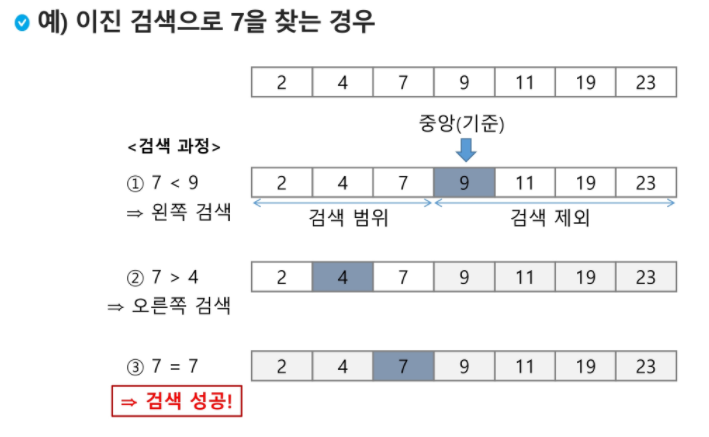

## APS2 

> Algorithm Problem Solving

> 2차원 배열의 선언

- 1차원 List를 묶어놓은 List
- 2차원 List의 선언: 세로길이(행의 개수), 가로길이(열의 개수)를 필요로 함

```python
'''
입력
3
1 2 3
4 5 6
7 8 9
'''
N = int(input()) # 배열의 크기
arr = [list(map(int, input().split())) for _ in range(N)]
'''
입력
3
123
456
789
'''
N = int(input()) # 배열의 크기
arr = [list(map(int, input())) for _ in range(N)]
```


> 배열 순회
>
> n x m 배열의 모든 원소를 빠짐없이 조사하는 방법

```python
for i in range(n):
    for j in range(m):
        Array[i][j]
```

> 지그재그 순회

```python
for i in range(n):
    for j in range(m):
        Array[i][j + (m-1-2*j)*(i%2)] #뒤에 인덱스가 i%2 때문에 홀수행에서만 살아남
        							  #짝수행일때는 j, 홀수행일때는 (m-1)-j:m-1에서 시작해서 역순
```

> 달팽이 순회

```python
arr = [[1, 2, 3], [4, 5, 6], [7, 8, 9]]

N = len(arr)  # 행렬크기
# 우 하 좌 상 => 달팽이 방향
di = [0, 1, 0, -1]
dj = [1, 0, -1, 0]
mode = 0 # 방향 설정
i = j = 0 # 초기 위치
trace = [(0, 0)] # 갔던곳 다시 안가게 발자국

print(arr[0][0])
for n in range(2, N * N + 1):
    i += di[mode]
    j += dj[mode]
    trace.append((i, j))
    print(arr[i][j])

    if 0 <= i + di[mode] < N and 0 <= j + dj[mode] < N and (i+di[mode], j+dj[mode]) not in trace:
        continue

    if mode != 3:
        mode += 1
    else:
        mode = 0

```

> 전치 행렬, transpose

```python
arr = [[1, 2, 3], [4, 5, 6], [7, 8, 9]]

for i in range(3):
    for j in range(3):
        if i > j :
            arr[i][j], arr[j][i] = arr[j][i], arr[i][j]
```


> 부분집합 생성법

```python
A = [1,2,3]
bit = [0]*3
for i in range(2):
    bit[0] = i
    for j in range(2):
        bit[1] = j
        for k in range(2):
            bit[2] = k
            for x in range(3):
                if bit[x]:
                    print(A[x], end='')
            print()
```


> 비트연산자

- `&` : 비트 단위로 AND 연산을 한다.
- `|` : 비트 단위로 OR 연산을 한다.
- `<<` : 피연산자의 비트 열을 왼쪽으로 이동시킨다.
- `>>` : 피연산자의 비트 열을 오른쪽으로 이동시킨다.


> 비트 연산자 이용 부분집합 생성

```python
arr = [1,2,3]
n = len(arr)

for i in range(1<<n): #부분 집합의 개수만큼
    print('[', end=' ')
    for j in range(n): # 원소의 수만큼 비트를 비교함
        if i & (1<<j): # i의 j번 비트가 1인 경우, ex)i=5이면 비트연산자에의해 i=101(2) 로 연산이됨
            print(arr[j], end=" ")
    print(']')
    
# 결과
[ ]
[ 1 ]
[ 2 ]
[ 1 2 ]
[ 3 ]
[ 1 3 ]
[ 2 3 ]
[ 1 2 3 ]
```


> 검색 (Search)  => 평균 시간복잡도 : O(n)
>
> 저장되어 있는 자료 중에서 원하는 항목을 찾는 작업

- 정렬된 경우와 그렇지 않은 경우
  - 정렬된 경우는 찾고자 하는 값보다 커지면 중단시키면서 시간단축효과가 있을 수 있음
  - 정렬되지 않은 경우는 무조건 끝까지 순회해야함


> 이진 검색 (Binary Search)
>
> 1. 자료의 가운데 있는 항목의 키 값과 비교하여 다음 검색의 위치를 결정하고 검색을 진행
> 2. 자료가 정렬되어 있어야함



```python
def Binary(a,N,key):
    '''
    :param a: 검색할 리스트
    :param N: 리스트 길이
    :param key: 찾을 값
    :return: True/False => 있는지 없는지
    '''
    start = 0
    end = N-1
    while start <= end:
        middle = (start + end)//2
        if a[middle] == key:
            return True
        elif a[middle] > key:
            end = middle - 1
        else:
            start = middle +1
    return False

a = [1,2,3,4,5]
N = len(a)
key = 2
print(Binary(a,N,key)) # True
```


> 선택 정렬 (Selection Sort) => O(n^2)
>
> 주어진 자료들 중 가장 작은 값의 원소부터 차례대로 선택하여 위치를 교환하는 방식

- 정렬 과정
  - 주어진 리스트 중에서 최소값을 찾는다.
  - 그 값을 리스트의 맨 앞에 위치한 값과 교환한다.
  - 맨 처음 위치를 제외한 나머지 리스트를 대상으로 위의 과정을 반복한다.

```python
def selectionSort(a, N):
    for i in range(N-1):
        min_idx = i
        for j in range(i+1,N):
            if a[min_idx] > a[j]:
                min_idx = j
        a[i], a[min_idx] =a[min_idx], a[i]
    return a

a = [4,3,5,2,1]
N = len(a)
print(selectionSort(a,N)) # [1, 2, 3, 4, 5]
```

