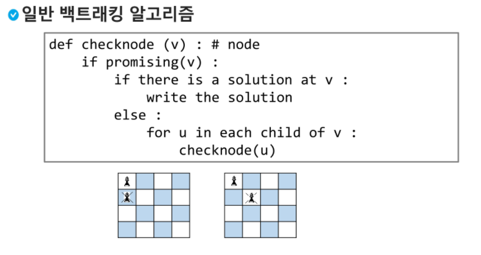

## stack2

출처 : https://edu.ssafy.com/edu/main/index.do#none;

### 1. DFS 깊이우선탐색

> 시작 정점의 한 방향으로 갈 수 있는 경로가 있는 곳까지 깊이 탐색해 가다가 더 이상 갈 곳이 엎게 되면, 가장 마지막에 만났떤 갈림길 간선이 있는 정점으로 되돌아와서 다른 방향의 정점으로 탐색을 계속 반복하여 결국모든 정점을 방문하는 순회방법

- 가장 마지막에 만났떤 갈림길의 정점으로 되돌아가서 다시 깊이 우선 탐색을 반복해야 하므로 후입선출 구조의 스택 사용

1) 시작 정점 v를 결정하여 방문한다.
2) 정점 v에 인접한 정점 중에서
   1)  방문하지 않은 정점 w가 있으면, 정점 v를 스택에 push하고 정점 w를 방문한다. 그리고 w를 v로 하여 다시 2)를 반복한다
   2)  방문하지 않은 정점이 없으면,  탐색의 방향을 바꾸기 위해서 스택을 pop하여 받은 가장 마지막 방문 정점을 v로 하여 다시 2)를 반복한다
3)  스택이 공백이 될 때까지 2)를 반복한다

> DFS version1

```python
def dfs(graph, start, visited=None):
   if visited is None:
       visited = set()
   visited.add(start)

   print(start)

   for next in graph[start] - visited:
       dfs(graph, next, visited)
   return visited


graph = {'0': set(['1', '2']),
        '1': set(['0', '3', '4']),
        '2': set(['0']),
        '3': set(['1']),
        '4': set(['2', '3'])}

dfs(graph, '0') 

>> 0 1 3 4 2 2
```

1. 처음에 start = 0이고 출력, visited = {0}  
2. 0의 value인 {1,2}중 1부터 방문(next=1), 1출력, visited = {0,1} 
3. 1의 value인 {0,3,4}중 visited를 뺀 {3,4} 중 3 방문 및 출력, visited = {0,1,3} 
4. 3의 value가 {1}인데 visited를 빼면 공집합이므로 pass (막다른 길)
5. 3으로 돌아가서 4를 방문 및 출력, visited ={0,1,3,4}
6. 4의 value가 {2,3}인데 visited 빼면 {2} 방문 및 출력 visited={0,1,3,4,2}
7. 2번 에서 아직 2를 방문 안했으므로 방문 및 출력하면 결과는 0 1 3 4 2 2 => 2가 두번 출력..;

> DFS version2

```python
graph = {
    'A': ['B'],
    'B': ['A', 'C', 'H'],
    'C': ['B', 'D'],
    'D': ['C', 'E', 'G'],
    'E': ['D', 'F'],
    'F': ['E'],
    'G': ['D'],
    'H': ['B', 'I', 'J', 'M'],
    'I': ['H'],
    'J': ['H', 'K'],
    'K': ['J', 'L'],
    'L': ['K'],
    'M': ['H']
}

def dfs(graph, start_node, visit=list()):
   visit.append(start_node)
   print(start_node, end=' ')
   
   for node in graph[start_node]:
       if node not in visit:
           dfs(graph, node, visit)

dfs(graph, 'A') 

>> A B C D E F G H I J K L M
```

- 과정

```python
def dfs(graph, start_node, visit=list()):
    visit.append(start_node)
    # print(start_node, end=' ')
    i = 0
    for node in graph[start_node]:
        i += 1
        print(f'i:{i} node:{node} visited:{visit}')
        if node not in visit:
            dfs(graph, node, visit)
graph = {
    'A': ['B'],
    'B': ['A', 'C', 'H'],
    'C': ['B', 'D'],
    'D': ['C', 'E', 'G'],
    'E': ['D', 'F'],
    'F': ['E'],
    'G': ['D'],
    'H': ['B', 'I', 'J', 'M'],
    'I': ['H'],
    'J': ['H', 'K'],
    'K': ['J', 'L'],
    'L': ['K'],
    'M': ['H']
}

dfs(graph, 'A')
>>
i:1 node:B visited:['A']
i:1 node:A visited:['A', 'B']
i:2 node:C visited:['A', 'B']
i:1 node:B visited:['A', 'B', 'C']
i:2 node:D visited:['A', 'B', 'C']
i:1 node:C visited:['A', 'B', 'C', 'D']
i:2 node:E visited:['A', 'B', 'C', 'D']
i:1 node:D visited:['A', 'B', 'C', 'D', 'E']
i:2 node:F visited:['A', 'B', 'C', 'D', 'E']
i:1 node:E visited:['A', 'B', 'C', 'D', 'E', 'F']
i:3 node:G visited:['A', 'B', 'C', 'D', 'E', 'F']
i:1 node:D visited:['A', 'B', 'C', 'D', 'E', 'F', 'G']
i:3 node:H visited:['A', 'B', 'C', 'D', 'E', 'F', 'G']
i:1 node:B visited:['A', 'B', 'C', 'D', 'E', 'F', 'G', 'H']
i:2 node:I visited:['A', 'B', 'C', 'D', 'E', 'F', 'G', 'H']
i:1 node:H visited:['A', 'B', 'C', 'D', 'E', 'F', 'G', 'H', 'I']
i:3 node:J visited:['A', 'B', 'C', 'D', 'E', 'F', 'G', 'H', 'I']
i:1 node:H visited:['A', 'B', 'C', 'D', 'E', 'F', 'G', 'H', 'I', 'J']
i:2 node:K visited:['A', 'B', 'C', 'D', 'E', 'F', 'G', 'H', 'I', 'J']
i:1 node:J visited:['A', 'B', 'C', 'D', 'E', 'F', 'G', 'H', 'I', 'J', 'K']
i:2 node:L visited:['A', 'B', 'C', 'D', 'E', 'F', 'G', 'H', 'I', 'J', 'K']
i:1 node:K visited:['A', 'B', 'C', 'D', 'E', 'F', 'G', 'H', 'I', 'J', 'K', 'L']
i:4 node:M visited:['A', 'B', 'C', 'D', 'E', 'F', 'G', 'H', 'I', 'J', 'K', 'L']
i:1 node:H visited:['A', 'B', 'C', 'D', 'E', 'F', 'G', 'H', 'I', 'J', 'K', 'L', 'M']
```


### 2. 계산기

- 중위표기법(infix notation)
  - 연산자를 피연산자의 가운데 표기하는 방법 ex) A+B

- 후위표기법(postfix notation)
  - 연산자를 피연산자 뒤에 표기하는 방법 ex) AB+

> step1. 중위표기식의 후위표기식 변환

1. 수식의 각 연산자에 대해서 우선순위에 따라 괄호를 사용하여 다시 표현한다.
2. 각 연산자를 그에 대응하는 오른쪽 괄호의 뒤로 이동시킨다.
3. 괄호를 제거한다.

예) A*B-C/D

1단계 : ((A * B) - (C / D))

2단계 : ((A B) * (C D) / ) - 

3단계 : AB*CD/-


>  step1. 중위표기식의 후위표기식 변환 (python)

1. 입력 받은 중위 표기식에서 토큰을 읽는다
2. 토큰이 피연산자이면 토큰을 출력한다
3. 토큰이 연산자(괄호포함)일 때, 이 토큰이 스택의 top에 저장되어 있는 연산자보다 우선순위가 높으면 스택에 push하고,그렇지 않다면 스택 top의 연산자의 우선순위가 토큰의 우선순위보다 작을 때까지 스택에서 pop한 후 토큰의 연산자를 push한다. 만약 top에 연산자가 없으면 push한다.
4. 토큰이 오른쪽 괄호')'이면 스택 top에 왼쪽'('가 올 때까지 스택에 pop연산을 수행하고 pop한 연산자를 출력한다. 왼쪽 괄호를 만나면 pop만 하고 출력하지는 않는다.
5. 중위 표기식에 더 읽을 것이 없다면 중지하고, 더 읽을 것이 있다면 부터 다시 반복한다.
6. 스택에 남아 있는 연산자를 모두 pop하여 출력한다


```python
'''
icp : in-coming priority
isp : in-stack priority
'''
if (icp>isp) push()
else pop()
```


> step2. 후위 표기법의 수식을 스택을 이용하여 계산

1. 피연산자를 만나면 스택에 push한다.
2. 연산자를 만나면 필요한 만큼의 피연산자를 스택에서 pop하여 연산하고, 연산결과를 다시 스택에 push한다.
3. 수식이 끝나면, 마지막으로 스택을 pop하여 출력한다.


### 3. 백트래킹 Backtracking

- 백트래킹 기법은 해를 찾는 도중에 막히면 되돌아가서 다시 해를 찾아 가는 기법

- 최적화 문제와 결정 문제를 해결

> 백트래킹과 깊이우선탐색과의 차이

- 어떤 노드에서 출발하는 경로가 해결책으로 이어질 것 같지 않으면 더 이상 그 경로를 따라가지 않음으로써 시도의 횟수를 줄임 (prunning 가지치기)
- 깊이우선탐색이 모든 경로를 추적하는데 비해 백트래킹은 불필요한 경로를 조기에 차단
- 백트래킹 알고리즘을 적용하면 일반적으로 경우의 수가 줄어들지만 이 역시 최악의 경우에는 여전히 지수함수 시간을 요하므로 처리 불가능

> 백트래킹 기법

- 어떤 노드의 유망성을 점검한 후에 유망(promising)하지 않다고 결정되면 그 노드의 부모로 되돌아가(backtracking) 다음 자식 노드로 감




> 부분집합의 합

- 모든 경우

```python
def f(i, N, K):
    global cnt
    cnt += 1
    if i==N:    # 한 개의 부분집합이 완성된 경우
        # print(bit)
        s = 0   # 부분집합 원소의 합
        for j in range(N):
            if bit[j]:
                s += a[j]   # bit[j]가 1이면  a[j]가 부분집합에 포함
        if s==K:
            for j in range(N):
                if bit[j]:
                    print(a[j], end = ' ')
            print()
    else:
        bit[i] = 1
        f(i+1, N, K)
        bit[i] = 0
        f(i+1, N, K)
    return

N = 10
a = [x for x in range(1, N+1)]
bit = [0]*N
K = 5
cnt = 0
f(0, N, K)  # 합이 K인 부분집합을 찾는 함수
print(cnt)
```

- 가지치기로 개선 (조건을 만족할 가능성이 없는 경우에 대해 재귀를 중단함)

```python
def f(i, N, K, S):  # S i-1원소까지 고려한 합
    global cnt
    cnt += 1
    if K==S:
        for j in range(N):
            if bit[j]:
                print(a[j], end=' ')
        print()
    elif i==N:    # 한 개의 부분집합이 완성된 경우
        return
    elif S>K:
        return
    else:
        bit[i] = 1
        f(i+1, N, K, S+a[i])
        bit[i] = 0
        f(i+1, N, K, S)
    return

N = 10
a = [x for x in range(1, N+1)]
bit = [0]*N
K = 5
cnt = 0

f(0, N, K, 0)  # 합이 K인 부분집합을 찾는 함수
print(cnt)
```

- 발전 
  - 나머지를 다 더해도 목표값 미달인 경우 : S+rs <K

```python
def f(i, N, K, S, rs):  # S i-1원소까지 고려한 합
    global cnt
    cnt += 1
    if K==S:
        for j in range(N):
            if bit[j]:
                print(a[j], end=' ')
        print()
    elif i==N:    # 한 개의 부분집합이 완성된 경우
        return
    elif S>K:
        return
    elif S+rs < K:
        return
    else:
        bit[i] = 1
        f(i+1, N, K, S+a[i], rs-a[i])
        bit[i] = 0
        f(i+1, N, K, S, rs-a[i])
    return

N = 10
a = [x for x in range(1, N+1)]
bit = [0]*N
K = 5
cnt = 0

f(0, N, K, 0, sum(a))  # 합이 K인 부분집합을 찾는 함수
print(cnt)
```


> 순열 만들기

```python
def f(i, N):
    if i == N:
        print(p)
    else:
        for j in range(i,N):
            p[i], p[j] = p[j], p[i]
            f(i+1, N)
            p[i], p[j] = p[j], p[i]
            
N=3
p=[x for x in range(1, N+1)]
f(0,N)
>>
[1, 2, 3]
[1, 3, 2]
[2, 1, 3]
[2, 3, 1]
[3, 2, 1]
[3, 1, 2]
```


### 4. 분할정복

> 분할 : 해결할 문제를 여러개의 작은 부분으로 나눈다.
>
> 정복 : 나눈 작은 문제를 각각 해결한다.
>
> 통합: 해결된 해답을 모은다

- 거듭 제곱

```python
def Power(Base, Exponent):
    if Exponent == 0 or Base ==0:
        return 1
    if Exponent % 2 == 0:
        NewBase = Power(Base, Exponent/2)
        return NewBase * NewBase
    else: 
        NewBase = Power(Base, (Exponent-1)/2)
        return (NewBase * NewBase) * Base
```


> 퀵 정렬
>
> 주어진 배열을 두 개로 분할하고, 각각을 정렬한다.

- 합병정렬과 다른점
  - 합병정렬은 그냥 두 부분으로 나누는 반면에, 퀵정렬은 분할할 때, pivot 중심으로 이보다 작은 것은 왼편, 큰 것은 오른편에 위치시킴
  - 각 부분 정렬이 끝난 후, 합병정렬은 '합병'이란 후처리 작업이 필요하나, 퀵정렬은 필요로 하지 않는다.

```python
def quickSort(a, begin, end):
    if begin < end:
        p = partition(a, begin, end)
        quickSort(a, begin, p-1)
        quickSort(a, p+1, end)
        
def partiton(a, begin, end):
    pivot = (begin + end) // 2
    L = begin
    R = end
    while L < R:
        while(L<R and a[L] < a[pivot]): 
            L += 1
        while(L<R and a[R] >= a[pivot]):
            R -= 1
        if L < R:
            if L==pivot:
                pivot = R
            a[L], a[R] = a[R], a[L]
    a[pivot], a[R] = a[R], a[pivot]
    return R
```

