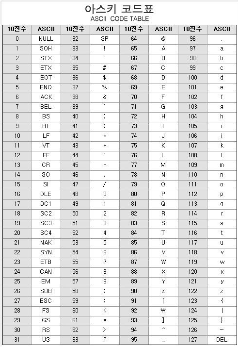
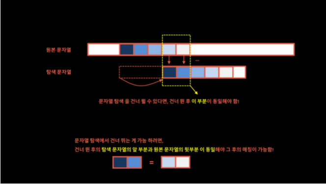

## 문자열(string)

> 컴퓨터에서의 문자표현

- 각 문자에 대해서 대응되는 숫자를 정해놓고 이것을 메모리에 저장하는 방법
  - 영어가 대소문자 합쳐서 52개이므로 6비트(64가지)면 모두 표현할 수 있고 이를 코드체계라고 한다.

- 네트워크가 발전되기 전 미국의 각 지역 별로 코드체계를 정했지만 네트워크가 발전하면서 서로 정보를 주고 받을 때 정보를 달리 해석한다는 문제가 발생

  => ASCII(American Standard Code for Infromation Interchange) 문자 인코딩 표준 제정

- ASCII는 7bit 인코딩으로 128문자를 표현하며 33개의 출력 불가능한 제어 문자들과 공백을 비롯한 95개의 출력 가능한 문자로 구성



- 확장 아스키는 표준 문자 이외의 악센트, 도형, 특수 문자 등 부가적인 문자를 128개 추가할 수 있게 하는 부호이다. (8bit)


> 유니코드

- 컴퓨터가 발전하면서 각 국가들은 자국의 코드체계를 만들어서 사용하였다.

  => 다국어 처리를 위해 표준을 마련했고 이를 유니코드라고 한다.

  => UTF: Unicode Transformation Format,  ex) UTF-8, 16, 32


> Python에서의 문자열 처리

- char 타입 없음
- 문자열은 시퀀스 자료형으로 분류되고, 시퀀스 자료형에서 사용할 수 있는 인덱싱, 슬라이싱 연산들을 사용할 수 있음
- 문자열은 튜플과 같이 요소값을 변경할 수 없음(immutable)


> 문자열 비교

```python
s1 = 'abc'
s2 = 'abc'
s3 = s1[:2] + 'c'

print(s1 == s2) # True
print(s1 is s2) # True
print(s1 == s3) # True
print(s1 is s3) # False => 참조하는 객체가 달라짐(id가 달라짐)
```


> 문자열 => 정수 함수 int()
>
> C언어에서는 atoi()

```python
def atoi(s):
    i = 0
    for x in s:
        i = i*10 + ord(x) - ord('0')
    return i
```


### 패턴 매칭

> 고지식한 알고리즘(Brute Force)
>
> 본문 문자열을 처음부터 끝까지 차례대로 순회하면서 패턴 내의 문자들을 일일이 비교하는 방식

```python
def BruteForce(p,t):
    '''
    p : 찾을 패턴
    t : 전체 텍스트
    '''
    M = len(p)
    N = len(t)
    i = 0
    j = 0
    while j < M and i < N:
        if t[i] != p[j]:
            i = i - j
            j = -1
        i = i + 1
        j = j + 1
    if j == M:
        return i - M # 찾은 위치
    else:
        return -1
```


> KMP 알고리즘
>
> 불일치가 발생한 텍스트 스트링의 앞부분에 어떤 문자가 있는지를 미리 알고있으므로, 불일치가 발생한 앞부분에 대하여 다시 비교하지 않고 매칭을 수행

