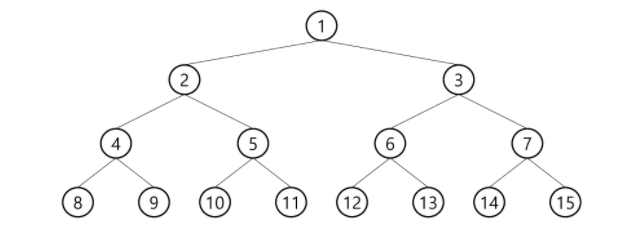
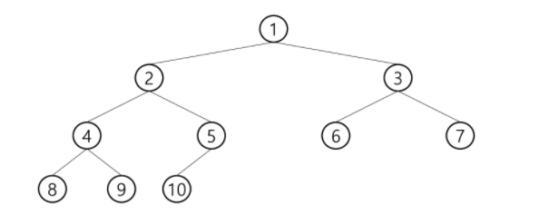
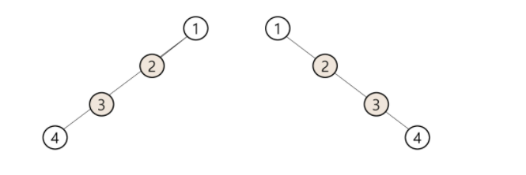
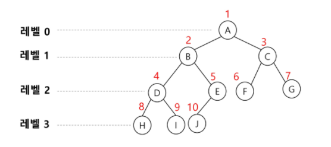

## Tree

- 비선형 구조 
- 원소들 간에 1:n 관계를 가지는 자료구조
- 원소들 간에 계층관계를 가지는 계층형 자료구조

> 단어 정리

- 조상 노드 - 간선을 따라 루트 노드까지 이르는 경로에 있는 모든 노드들
- 서브트리 - 부모 노드와 연결된 간선을 끊었을 때 생성되는 트리
- 자손 노드 - 서브 트리에 있는 하위 레벨의 노드들
- 차수
  - 노드의 차수 : 노드에 연결된 자식 노드의 수
  - 트리의 차수 : 트리에 있는 노드의 차수 중에서 가장 큰 값
  - 단말 노드(리프) : 차수가 0인 노드, 자식 노드가 없는 노드
- 높이
  - 노드의 높이 : 루트에서 노드에 이르는 간선의 수. 노드의 레벨
  - 트리의 높이 : 트리에 있는 노드의 높이 중에서 가장 큰 값. 최대 레벨

<br>

### 1. 이진트리

- 모든 노드들이 2개의 서브트리를 갖는 특별한 형태의 트리
- 레벨 i에서 노드의 최대 개수는 2^i개
- 높이가 h인 이진 트리가 가질 수 있는 노드의 최소 개수는 2^h 최대 개수는 2^(h+1)-1개

<br>

> 포화 이진 트리

- 모든 레벨에 노드가 포화상태로 차 있는 이진 트리
  - 다음 줄이 생겼으면 끝까지 채워져 있어야함



> 완전 이진 트리

- 높이가 h이고 노드 수가 n개일 때, 포화 이진 트리의 노드 번호 1번부터 n번까지 빈 자리가 없는 트리
  - 다음 줄이 생겼을 때, 끝까지 채워질 필요는 없지만 중간에 빈 번호가 있으면 안됨



> 편향 이진 트리

- 높이 h에 대한 최소 개수의 노드를 가지면서 한쪽 방향의 자식 노드만을 가진 이진 트리



<br>

#### 1.1 순회

- 순회: 트리의 노드들을 체계적으로 방문하는 것
  - 전위순회(preorder) : 부모 => 좌 => 우
  - 중위순회(inorder) : 좌 => 부모 => 우
  - 후위순회(postorder) : 좌 => 우 => 부모

> 전위 순회

```python
# 수도 코드임
def preorder(T):
    if T: # T is not None
        print(T)
        preorder(T.left)
        preorder(T.right)
```

> 중위 순회

```python
def inorder(T):
    if T:
        inorder(T.left)
        print(T)
        inorder(T.right)
```

> 후위 순회

```python
def postorder(T):
    if T:
        postorder(T.left)
        postorder(T.right)
        print(T)
```


#### 1.2  배열을 이용한 이진트리의 표현

- 이진 트리에 각 노드 번호를 부여(루트:1)



- 노드 번호가 i인 노드의 부모 노드 번호 : i // 2

- 노드 번호가 i인 노드의 

  - 왼쪽 자식: 2 * i 

  - 오른쪽 자식: 2 * i + 1

  - 0으로 배열길이는 가능한 최대값으로 초기화 해놓고 채워야 할 듯 

    |  0   |  1   |  2   |  3   |  4   | 5    |  6   |  7   |  8   |  9   |  10  |  11  |  12  |  13  |  14  |
    | :--: | :--: | :--: | :--: | :--: | ---- | :--: | :--: | :--: | :--: | :--: | :--: | :--: | :--: | :--: |
    |  -   |  A   |  B   |  C   |  D   | E    |  F   |  G   |  H   |  I   |  J   |  -   |  -   |  -   |  -   |

    

> 부모 번호를 인덱스로 자식 번호를 저장

- 입력 예시
  - 간선의 개수: 4 (노드의 개수는 무조건 5)
  - 1 2 1 3 3 4 3 5 ( 부모 자식 부모 자식 반복)

| 부모(p)   | 0    | 1    | 2    | 3    | 4    | 5    |
| --------- | ---- | ---- | ---- | ---- | ---- | ---- |
| 자식1(c1) | 0    | 2    | 0    | 4    | 0    | 0    |
| 자식2(c2) | 0    | 3    | 0    | 5    | 0    | 0    |

```python
E = int(input())
arr = list(map(int, input().split()))

for i in range(E):
    p, c = arr[i*2], arr[i*2+1]
    if c1[p] == 0: # 자식이 아직 없으면 왼쪽 자식(c1)에 추가
        c1[p] = c
    else: # 자식이 이미 하나 있으면 오른쪽 자식(c2)에 추가
        c2[p] =c
```

