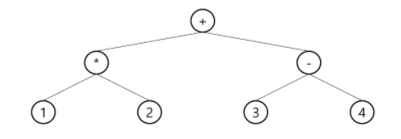
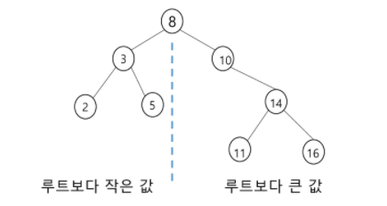

## Tree

- 비선형 구조 
- 원소들 간에 1:n 관계를 가지는 자료구조
- 원소들 간에 계층관계를 가지는 계층형 자료구조

> 단어 정리

- 조상 노드 - 간선을 따라 루트 노드까지 이르는 경로에 있는 모든 노드들
- 서브트리 - 부모 노드와 연결된 간선을 끊었을 때 생성되는 트리
- 자손 노드 - 서브 트리에 있는 하위 레벨의 노드들
- 차수
  - 노드의 차수 : 노드에 연결된 자식 노드의 수
  - 트리의 차수 : 트리에 있는 노드의 차수 중에서 가장 큰 값
  - 단말 노드(리프) : 차수가 0인 노드, 자식 노드가 없는 노드
- 높이
  - 노드의 높이 : 루트에서 노드에 이르는 간선의 수. 노드의 레벨
  - 트리의 높이 : 트리에 있는 노드의 높이 중에서 가장 큰 값. 최대 레벨

<br>

### 1. 이진트리

- 모든 노드들이 2개의 서브트리를 갖는 특별한 형태의 트리
- 레벨 i에서 노드의 최대 개수는 2^i개
- 높이가 h인 이진 트리가 가질 수 있는 노드의 최소 개수는 2^h 최대 개수는 2^(h+1)-1개

<br>

> 포화 이진 트리

- 모든 레벨에 노드가 포화상태로 차 있는 이진 트리
  - 다음 줄이 생겼으면 끝까지 채워져 있어야함


> 완전 이진 트리

- 높이가 h이고 노드 수가 n개일 때, 포화 이진 트리의 노드 번호 1번부터 n번까지 빈 자리가 없는 트리
  - 다음 줄이 생겼을 때, 끝까지 채워질 필요는 없지만 중간에 빈 번호가 있으면 안됨


> 편향 이진 트리

- 높이 h에 대한 최소 개수의 노드를 가지면서 한쪽 방향의 자식 노드만을 가진 이진 트리


<br>

#### 1.1 순회

- 순회: 트리의 노드들을 체계적으로 방문하는 것
  - 전위순회(preorder) : 부모 => 좌 => 우
  - 중위순회(inorder) : 좌 => 부모 => 우
  - 후위순회(postorder) : 좌 => 우 => 부모

> 전위 순회

```python
# 수도 코드임
def preorder(T):
    if T: # T is not None
        print(T)
        preorder(T.left)
        preorder(T.right)
```

> 중위 순회

```python
def inorder(T):
    if T:
        inorder(T.left)
        print(T)
        inorder(T.right)
```

> 후위 순회

```python
def postorder(T):
    if T:
        postorder(T.left)
        postorder(T.right)
        print(T)
```


#### 1.2  배열을 이용한 이진트리의 표현

- 이진 트리에 각 노드 번호를 부여(루트:1)


- 노드 번호가 i인 노드의 부모 노드 번호 : i // 2

- 노드 번호가 i인 노드의 

  - 왼쪽 자식: 2 * i 

  - 오른쪽 자식: 2 * i + 1

  - 0으로 배열길이는 가능한 최대값으로 초기화 해놓고 채워야 할 듯 

    |  0   |  1   |  2   |  3   |  4   | 5    |  6   |  7   |  8   |  9   |  10  |  11  |  12  |  13  |  14  |
    | :--: | :--: | :--: | :--: | :--: | ---- | :--: | :--: | :--: | :--: | :--: | :--: | :--: | :--: | :--: |
    |  -   |  A   |  B   |  C   |  D   | E    |  F   |  G   |  H   |  I   |  J   |  -   |  -   |  -   |  -   |

    

#### 1.3 부모 번호를 인덱스로 자식 번호를 저장

- 입력 예시
  - 간선의 개수: 4 (노드의 개수는 무조건 5)
  - 1 2 1 3 3 4 3 5 ( 부모 자식 부모 자식 반복)

| 부모(p)   | 0    | 1    | 2    | 3    | 4    | 5    |
| --------- | ---- | ---- | ---- | ---- | ---- | ---- |
| 자식1(c1) | 0    | 2    | 0    | 4    | 0    | 0    |
| 자식2(c2) | 0    | 3    | 0    | 5    | 0    | 0    |

```python
E = int(input())
arr = list(map(int, input().split()))

for i in range(E):
    p, c = arr[i*2], arr[i*2+1]
    if c1[p] == 0: # 자식이 아직 없으면 왼쪽 자식(c1)에 추가
        c1[p] = c
    else: # 자식이 이미 하나 있으면 오른쪽 자식(c2)에 추가
        c2[p] =c
```


#### 1.4 루트 찾기, 조상 찾기

```python
# 5번의 조상 찾기
# a는 자손이 index, 부모가 값인 배열
c = 5
anc = []
while a[c] != 0 : # 부모가 있다면
    c = a[c] # 갱신
    anc.append(c) # 조상 배열에 저장 => while문이 끝났을 때 배열을 print하면 조상 리스트
root = c
```


> 배열을 이용한 이진 트리 표현의 단점

- 편향 이진 트리의 경우 사용하지 않는 배열 원소에 대한 메모리 공간 낭비
- 트리의 중간에 새로운 노드를 삽입하거나 기존의 노드를 삭제할 경우 배열의 크기 변경 어려워 비효율적


#### 1.5 수식 트리

- 수식을 표현하는 이진 트리

- 연산자는 루트 노드이거나 가지 노드, 피연산자는 모두 잎 노드




#### 1.6 이진 탐색 트리

- 탐색작업을 효율적으로 하기 위한 자료구조
- L < ROOT < R
- 중위 순회하면 오름차순으로 정렬된 값을 얻을 수 있다.



<br>

### 2. 힙

1. 최대 힙
   - 키값이 가장 큰 노드를 찾기 위한 **완전 이진 트리**
2. 최소 힙
   - 키값이 가장 작은 노드를 찾기 위한 **완전 이진 트리**

> 삽입

1. 마지막 자리에 삽입
2. 루트 노드까지 부모노드와 비교하며 올라갈 수 있는 곳까지 자리바꾸면서 올라가기

```python
'''
100개의 원소가 들어온다고 가정
'''
heap = [0]*101
last = 0
def enq(n):
    global last
    last += 1 # 배열의 크기를 하나 증가
    heap[last] = n # 마지막 자리에 들어온 원소 할당
    c = last
    p = c // 2
    while p >= 1 and heap[p] < heap[c]: # 아직 루트까지 안왔고 부모노드보다 크면
        heap[p], heap[c] = heap[c], heap[p] # 자리를 바꾸고
        c = p
        p = c // 2 # 한 단계 위로
```

> 삭제

1. 루트 노드 따로 저장해놓기
2. 마지막 노드를 삭제하면서 루트 노드 자리로 옮기기
3. 옮겨진 마지막노드를 자식노드들과 비교하며 제자리 찾아가기

```python
def deq():
    global last
    tmp = heap[1] # 루트 노드 따로 저장
    heap[1] = heap[last] # 맨 마지막 원소 루트 노드로 올리고
    last -= 1 # 배열 크기 하나 줄이고
    p = 1
    c = p * 2
    while c <= last: # 자식이 있으면
        if c+1 <= last and heap[c+1] > heap[c]: # 오른쪽 자식도 있고 왼쪽보다 크면
            c += 1 #오른쪽 자식이 후보가 된다
        if heap[c] > heap[p]: # 자식이 부모보다 크면
            heap[p], heap[c] = heap[c], heap[p] # 자리를 바꾸고
            p = c # 부모노드 갱신
            c = p * 2 # 자식노드도 갱신
        else:
            return tmp
    return tmp # 맨처음에 저장해놨던 루트 노드 리턴
```

