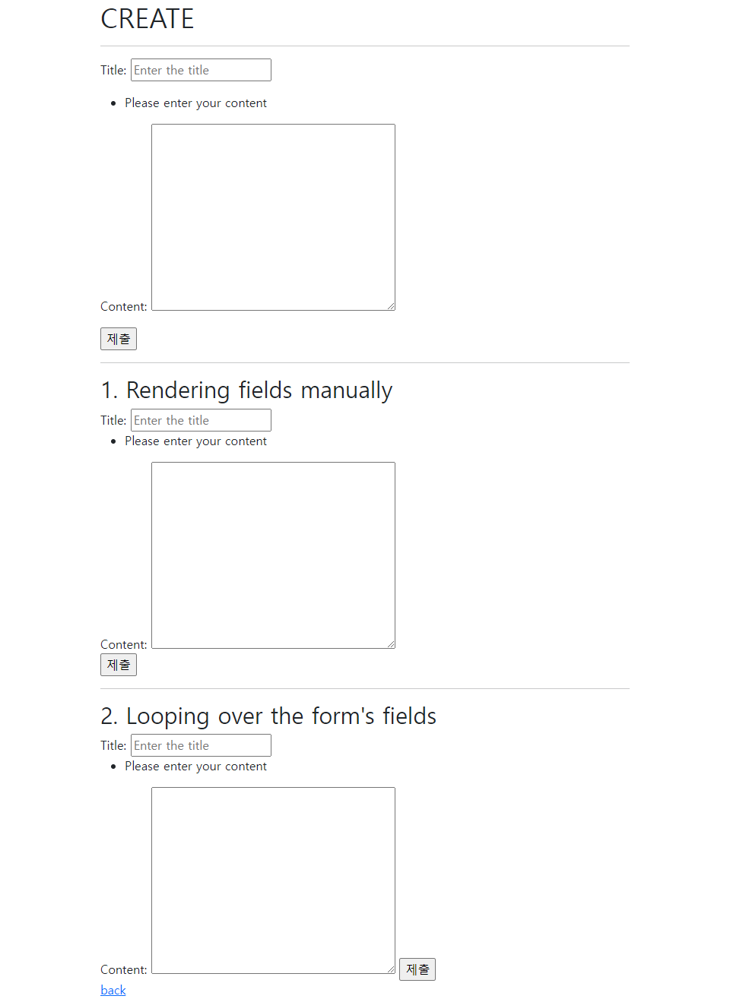

## Django Form

> 사용자가 입력한 데이터를 검증하는 것을 '유효성 검증'이라고 함
>
> Django Form이 유효성검사, 외부의 악의적 공격 방어 작업을 도와줌
>
> 1. 렌더링을 위한 데이터 준비 및 재구성
> 2. 데이터에 대한 HTML forms 생성
> 3. 클라이언트로부터 받은 데이터 수신 및 처리

<br>

### 1. Form Class

> Form 내 field, 디스플레이 widget, label, 초기값, 유효하지 않은 field에 관련된 에러 메세지 결정

#### 1.1. Form 선언

- forms.py 파일을 새로 만들기
- Model을 선언하는 것과 유사하며 같은 필드타입을 사용 
- forms 라이브러리에서 파생된 Form 클래스 상속받음

> articles/forms.py

```python
from django import forms

class ArticleForm(forms.Form):
    REGION_A = 'sl'
    REGION_B = 'dj'
    REGION_C = 'gj'
    REGION_CHOICES = [
        (REGION_A, '서울'),
        (REGION_B, '대전'),
        (REGION_C, '광주'),
    ]
    
    title = forms.CharField(max_length=10)
    content = forms.CharField(widget=forms.Textarea) # widget은 렌더링만 담당함, 유효성검사 x
    region = forms.ChoiceField(choices=REGION_CHOICES) # widget=forms.Select 생략, 디폴트임
```

> articles/views.py

```python
from .forms import ArticleForm

def new(request):
    form = ArticleForm()
    context = {
        'form': form,
    }
    return render(request, 'articles/new.html',context)
```

> new.html

- {{form.as_p}}로 대체하면 forms.py에 선언한 내용들이 html에 반영됨
- Form rendering options 출력 옵션
  - as_p : 각 필드가 `<p>`태그에 감싸져서 렌더링 됨
  - as_ul : 각 필드가 목록항목 `<li>`으로 감싸져서 렌더링 됨 
  - as_table : 각 필드가 테이블 `<tr>` 행으로 감싸져서 렌더링 됨

```django




  <h1>NEW</h1>
  <hr>
  <form action="" method="POST">
    
    {{form.as_p}}
    <input type="submit">
  </form>
  <a href="">back</a>

```

<br>

### 2. ModelForm

> 위 django form은 model필드를 재정의하는 행위가 중복될 수 있음 => 똑같은걸 타이핑 다시함
>
> ModelForm이 해결해줌

- ModelForm 클래스를 상속받음
- 정의한 클래스 안에 Meta 클래스를 선언하고, 어떤 모델을 기반으로 Form을 작성할 것인지에 대한 정보를 Meta 클래스에 지정 (fields와 exclude는 동시에 사용 x)

> articles/forms.py

```python
from django import forms
from .models import Article

class ArticleForm(forms.ModelForm):
    
    class Meta:
        model = Article
        fields = '__all__' # 모든 항목
        # exclude = ('title',) # title을 제외한 모든 항목
```

<br>

#### 2.1. create 수정

- is_valid() : 유효성 검사를 실행, 유효여부를 boolean으로 반환
- save() : 데이터베이스 객체를 만들고 저장
- new를 제거했으므로, 각 html에 있는 new 다 삭제 및 create로 변경

```python
def create(request):
    if request.method == 'POST':
        form = ArticleForm(request.POST)
        if form.is_valid():
            article=form.save()
            return redirect('articles:detail', article.pk)
    else:
        form = ArticleForm()
    context = {
        'form': form,
    }
    return render(request, 'articles/create.html',context)
```

#### 2.2. update 수정

```python
def update(request, pk):
    article = Article.objects.get(pk=pk)
    if request.method == 'POST':
        form = ArticleForm(request.POST, instance=article)
        if form.is_valid():
            article=form.save()
            return redirect('articles:detail', article.pk)   
    else:
        form = ArticleForm(instance=article)
    context = {
        'article': article,
        'form': form,
    }
    return render(request, 'articles/update.html', context)
```

<br>

### 3. Widget

> ModelForm Widgets 활용법

```python
from django import forms
from .models import Article

class ArticleForm(forms.ModelForm):
    title = forms.CharField(
        widget=forms.TextInput(
            attrs={ # 속성 추가
                'class': 'my-title', 
                'placeholder': 'Enter the title',
            }
        )
    )
    content = forms.CharField(
        widget=forms.Textarea(
            attrs={
                'class': 'my-content',   
            }
        ),
        error_messages={ # 에러 메세지 커스텀
            'required':'Please enter your content',
        }
    )
    
    class Meta:
        model = Article
        fields = '__all__'
```

<br>

### 4. Rendering fields manually



```django




  <h1>CREATE</h1>
  <hr>
  <form action="" method="POST">
    
    {{form.as_p}}
    <input type="submit">
  </form>
  <hr>

  <h2>1. Rendering fields manually</h2>
  <form action="" method="POST">
    
    <div>
      {{form.title.errors}}
      {{form.title.label_tag}}
      {{form.title}}
    </div>
    <div>
      {{form.content.errors}}
      {{form.content.label_tag}}
      {{form.content}}
    </div>
    <input type="submit">
  </form>
  <hr>

  <h2>2. Looping over the form's fields</h2>
  <form action="" method="POST">
    
    
    {{field.errors}}
    {{field.label_tag}}
    {{field}}
    
    <input type="submit">
  </form>

  <a href="">back</a>

```

