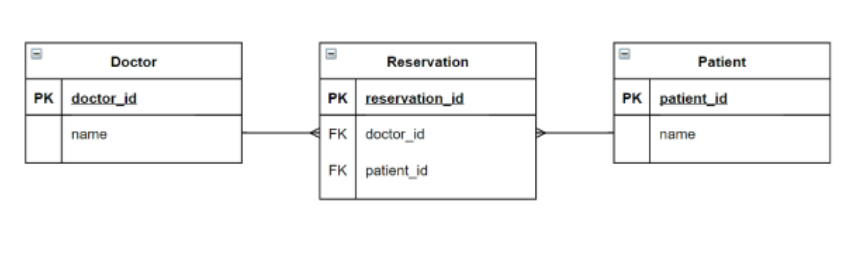

## M:N, `ManyToManyField`

### 1. 병원 진료 기록 시스템(환자 - 의사)

#### 1.1. 중개 모델



#### 1.2. ManyToManyField

> 자동으로 중개 테이블을 생성해준다. 
>
> 하지만 추가적인 속성 예를 들면, 병명 진료시각 등이 더 필요할 때는 중개 테이블을 결국  생성하긴 해야한다.

- 필드 작성 위치는 M 또는 N 모두 작성 가능

##### 1.2.1. Arguments

- related_name
  - target model(관계 필드를 가지지 않은 모델)이 source model(관계 필드를 가진 모델)을 참조(역참조)할 때는 `_set`을 이용해야 하므로 `related_name`으로 이름을 설정
    - 설정 후에는 기존 `_set`은 더이상 이용 불가
    - ex) related_name = 'patients'

- through
  - 중개 테이블을 직접 작성하는 경우, through 사용
    - ex) through='Reservation' <= class명(model명)

##### 1.2.2. Related Manager

- add()
  - 지정된 객체를 관련 객체 집합에 추가
  - ex) patient1.doctors.add(doctor1) 
    - patient1에 의사 목록에 doctor1 추가
    - 모델 인스턴스, 필드 값(PK)을 인자로 허용
- remove()
  - 관련 객체 집합에서 지정된 모델 객체 제거
  - ex) patient1.doctors.remove(doctor1)
    - 모델 인스턴스, 필드 값(PK)을 인자로 허용

> models.py

```python
class Doctor(models.Model):
    name = models.TextField()
    
class Patient(models.Model):
    doctors = models.ManyToManyFiedl(Doctor, through='Reservation')
    name = models.TextField()

class Reservation(models.Model):
    doctor = models.ForeignKey(Doctor, on_delete=models.CASCADE)
    patient = models.ForeignKey(Patiendt, on_delete=models.CASCADE)
    symptom = models.TextField()
    reserved_at = models.DateTimeField(auto_now_add=True)
```

- create

```python
# 방법 1
reservation1 = Reservation(doctor=doctor1, patient=patient1, symptom='headache')
# 방법 2
patient2.doctors.add(doctor1, through_defaults={'symptom':'flu'})
```

- delete

```python
doctor1.patient_set.remove(patient1)
```

<br>

### 2. Like, 좋아요

#### 2.1. model 작성

```python
class Article(models.Model):
    user = models.ForeignKey(settings.AUTH_USER_MODEL, on_delete=models.CASCADE)
    like_users = models.ManyToManyField(settings.AUTH_USER_MODEL, related_name='like_articles')
```

- like_users에 `related_name`을 지정해주지 않으면 오류가 생김
  - 역참조를 할 때, user와 like_users의 구분이 가지 않기 때문에 구분해야함
    - article.user - 게시글을 작성한 유저 1:N
    - article.like_users - 게시글을 좋아요한 유저 M:N
    - user.article_set - 유저가 작성한 게시글(역참조) 1:N
    - user.like_articles - 유저가 좋아요한 게시글(역참조) M:N

#### 2.2. url 

```python
urlpatterns = [
    path('<int:article_pk>/likes/', views.likes, name='likes'),
]
```

#### 2.3. views

- `@require_POST`, `request.user.is_authenticated`

```python
def likes(request, article_pk):
    article = get_object_or_404(Article, pk=article_pk)
    if article.like_users.filter(pk=request.user.pk).exists():
        article.like_users.remove(requset.user)
    else:
        article.like_users.add(request.user)
    return redirect('articles:index')
```

#### 2.4. html

- 좋아요 , 좋아요 취소 버튼 + 보이는 버튼 조건별 분기

```django

 취소버튼

 좋아요버튼

```


<br>

### 3. Profile Page

#### 3.1. url

```python
# 주의 : url 맨처음에 str으로 받는 것은 맨 아래로 내려주기 아니면 다 위에서 걸림
urlpatterns = [
    path('<username>/', views.profile, name='profile'),
]
```

#### 3.2. views

```python
def profile(request, username):
    person = get_object_or_404(get_user_model(), username=username)
    context ={
        'person': person,
    }
    return render(request, 'accounts/profile.html', context)
```

#### 3.3. profile.html

````django
{{person.username}}님의 프로필

{{person.username}}님의 게시글

	{{article.title}}


+ {{person.username}}님의 댓글
+ {{person.username}}님의 좋아요한 게시글
````

- base.html에 프로필 링크

<br>

### 4. Follow

#### 4.1. models

```python
class User(AbstractUser):
    followings = models.ManyToManyField('self', symmetrical=False, related_name='followers')
```

- symmetrical이 True이면 자동으로 맞팔로우됨

#### 4.2. url

```python
urlpatterns =[
    path('<int:user_pk>/follow/', views.follow, name='follow'),
]
```

#### 4.3. views

- +로그인 했을 때만, POST일때만

```python
def follow(request, user_pk):
    person = get_object_or_404(get_user_model(), pk=user.pk)
    if person != request.user: #자기 자신이 아니면
        if person.folloewrs.filter(pk=request.user.pk).exists():
            person.followers.remove(request.user)
        else:
            person.followers.add(request.user)
    return redirect('accounts:profile', person.username)
```

#### 4.4. html

- 팔로잉 수/ 팔로워 수 출력
  -  <= 자주 쓰이는 거 변수화

```django
팔로잉 : {{person.followings.all}}
팔로워 : {{pesron.followers.all}}
```

- 자기 자신을 팔로우 할 수 없음 (버튼 조건부 표시)

```django

```


