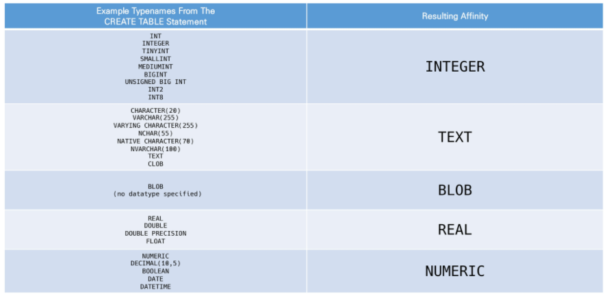

## SQL

> Structured Query Language
>
> 관계형 데이터베이스 관리시스템의 데이터 관리를 위해 설계된 특수 목적으로 프로그래밍 언어
>
> 생성, 수정, 검색, 관리 등등


### 1. 데이터베이스

- 데이터 베이스는 체계화된 데이터의 모임
- 몇 개의 자료 파일을 조직적으로 통합하여 자료 항목의 중복을 없애고 자료를 구조화하여 기억시켜 놓은 자료의 집합체

> 장점

- 데이터 중복 최소화
- 무결성, 일관성, 독립성, 표준화, 보안유지

<br>

#### 1-1. RDB 관계형 데이터베이스

> Relational Database

- 키와 값들의 간단한 관계를 표 형태로 정리한 데이터베이스

- 스키마: 데이터베이스에서 자료의 구조, 표현방법, 관계 등 전반적인 명세를 기술한 것
- 기본키(Primary key): 각 행의 고유 값
  - 반드시 설정해야 하며, 데이터베이스 관리 및 관계 설정 시 주요하게 활용 됨

> RDBMS

- MySQL, SQLite, PostgreSQL, ORACLE, MS SQL ...

> Sqlite Data Type

- NULL, INTEGER, REAL, TEXT, BLOB
  - BLOB : 입력된 그대로 정확히 저장된 데이터 (별다른 타입 없이 그대로 저장)

> Sqlite Type Affinity
>
> 특정 컬럼에 저장하도록 권장하는 데이터 타입

- INTEGER, TEXT, BLOB, REAL, NUMERIC



<br>

### 2. SQL

> SQL 분류

| 분류 |        개념         | 예시                         |
| :--: | :-----------------: | ---------------------------- |
| DDL  | 데이터 구조를 정의  | CREATE DROP ALTER            |
| DML  | 저장 조회 수정 삭제 | INSERT SELECT UPDATE DELETE  |
| DCL  | 사용자의 권한 제어  | GRANT REVOKE COMMIT ROLLBACK |

> 활용법

1. csv가 있는 폴더 내에서 vscode 실행 (sqlite 확장 프로그램 설치하기)

2. sqlite3 파일 만들기 

3. bash 창에서 sqlite3 실행 => bash 창에서 쿼리문 작성

   - [.mode 설명](https://itbellstone.tistory.com/90) => csv, ascii, column, html, insert, list, quote, tabs, tcl 등등

   ```bash
   $ sqlite3
   sqlite> .database # .의 의미는 sqlite 프로그램의 기능을 실행하는것
   sqlite> .mode csv # csv 출력모드 => ,로 구분하여 한 줄씩 출력
   sqlite> .import hellodb.csv examples # 만들어 놓은 examples.sqlite3에 기존 csv파일 들여오기
   sqlite> .tables # 현재 있는 테이블 보여줌
   sqlite> SELECT * FROM examples;
   sqlite> .headers on # 열 이름까지 같이 출력
   sqlite> .mode column # column 출력모드 => column으로 구분하여 한 줄씩 출력
   ```

4. or SQLITE EXPLORER에서 sqlite3파일 우클릭해서 `NEW QUERY` 클릭 => 편집기에서 쿼리문 작성

   => 쿼리문 작성하고 드래그 or ; 뒤에서 우클릭 해서 실행한뒤, 새로고침 해줘야 반영됨

```sqlite
-- SQLite

-- 테이블 전체 조회
SELECT * FROM examples; 

-- classmates라는 테이블을 만드는데 column에 id(정수, pk), name(문자열) 추가
CREATE TABLE classmates (
id INTEGER PRIMARY KEY,
name TEXT
);

-- 테이블 삭제
DROP TABLE classmates;

-- 테이블 다시 만듦
CREATE TABLE classmates (
name TEXT,
age INT,
address TEXT
);
```

<br>

#### 2.1 CRUD

> Create

```sqlite
-- SQLite

-- 일부분 데이터만 입력할 때에는 col지정 해줘야함 
-- 입력안한 address는 NULL
INSERT INTO classmates (name, age) VALUES ('홍길동', 23);

-- 모든 데이터를 다 입력할 때에는 col 지정 안해줘도 됨
INSERT INTO classmates VALUES ('홍길동', 30, '서울');

-- NOT NULL 추가
CREATE TABLE classmates (
name TEXT NOT NULL,
age INT NOT NULL,
address TEXT NOT NULL
);

-- 한번에 여러개 데이터 입력
INSERT INTO classmates VALUES
('홍길동', 30, '서울'),
('김철수', 30, '대전'),
('이싸피', 26, '광주'),
('박삼성', 29, '구미'),
('최전자', 28, '부산');
```

> READ(SELECT)

```sqlite
-- rowid까지 같이 조회할때
SELECT rowid, name FROM classmates;

-- 위에서부터 2개(LIMIT 2)를 앞쪽 2개를 생략하고 3번째부터 조회(OFFSET 2) 
SELECT rowid, name FROM classmates LIMIT 2 OFFSET 2;

-- address가 서울인 데이터만 조회
SELECT rowid, name FROM classmates WHERE address='서울';

-- age 중복은 제거하고 조회 => 29가 두 명이면 1개만 조회됨
SELECT DISTINCT age FROM classmates;
```

> UPDATE

```sqlite
-- rowid가 5인 데이터의 name과 address 수정
UPDATE classmates SET name='홍길동', address='제주도' WHERE rowid=5;
```

> DELETE

```sqlite
-- rowid가 5인 데이터(행) 삭제
DELETE FROM classmates WHERE rowid=5;
```

<br>

#### 2.2 Aggregate function

> 집계함수

- 집합에 대한 계산을 수행하고 단일 값을 반환
  - COUNT, AVG, MAX, MIN, SUM ...
  - 해당 컬럼이 INTEGER일 때만 사용 가능

```sqlite
-- users 테이블의 전체 데이터 개수
SELECT COUNT(*) FROM users;

-- 30살 이상인 사람들의 평균 나이
SELECT AVG(age) FROM users WHERE age>=30;
```

<br>

#### 2.3 LIKE

> 패턴 일치를 기반으로 데이터를 조회하는 방법

- SQLite는 패턴 구성을 위한 2개의 wildcards를 제공
  - % : 0개 이상의 문자 (해당 자리에 문자열이 있을 수도, 없을 수도 있다)
    - 2% : 2로 시작
    - %2 : 2로 끝
    - %2% : 중간에 2
  - _ : 임의의 단일 문자 (반드시 이자리에 한개의 문자가 존재해야한다)
    - _2% : 앞에 한자리가 있고 두번째가 2인 값
    - 1___: 1로 시작하고 총 4자리인 값
    - 2__%: 2로 시작하고 적어도 3자리인 값 

```sqlite
-- 20대인 사람
SELECT * FROM users WHERE age LIKE '2_';
-- 지역번호가 02인 사람
SELECT * FROM users where phone LIKE '02-%';
```

<br>

#### 2.4 ORDER BY

> 정렬

- ASC - 오름차순(default)
- DESC - 내림차순

```sqlite
-- 나이 내림차순으로 정렬하고 상위 10개만 
SELECT * FROM users ORDER BY age DESC LIMIT 10;
-- 나이 순, 성 순으로 오름차순 정렬하고 상위 10개
SELECT * FROM users ORDER by age, last_name LIMIT 10;
```

<br>

#### 2.5 GROUP BY

> 행 집합에서 요약 행 집합을 만듦

- 문장에 where절이 포함된 경우 반드시 where 절 뒤에 작성해야 함

```sqlite
-- 나이별로 몇 명이 있는지
SELECT COUNT(*) as age_count, age FROM users GROUP BY age;
```

<br>

#### 2.6 ALTER TABLE

- table 이름 변경

```sqlite
ALTER TABLE articles RENAME TO news;
```

- 테이블에 새로운 column 추가

```sqlite
ALTER TABLE news ADD COLUMN created_at TEXT NOT NULL;
--ERROR: Cannot add a NOT NULL column with default value NULL
-- 새롭게 열을 추가하려면 1. NOT NULL 하지않기 혹은 2. default값 설정

--1번 방법
ALTER TABLE news ADD COLUMN created_at TEXT ;

--2번 방법
ALTER TABLE news ADD COLUMN subtitle TEXT NOT NULL DEFAULT '소제목';
```

- column 이름 수정(new in sqlite 3.25.0)

```sqlite
ALTER TABLE table_name 
RENAME COLUMN current_name TO new_name;
```

- drop column(new in sqlite 3.35.0)

```sqlite
ALTER TABLE news DROP COLUMN created_at;
```

