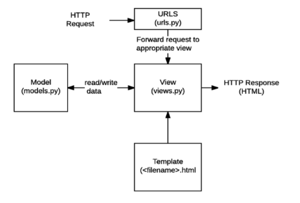

## Django

## 관련 문서 정리

| 개념              | 링크                                                         | 비고     |
| ----------------- | ------------------------------------------------------------ | -------- |
| render            | https://docs.djangoproject.com/ko/3.2/topics/http/shortcuts/#render | views    |
| request object    | https://docs.djangoproject.com/en/3.2/ref/request-response/  | views    |
| URL               | https://docs.djangoproject.com/ko/3.2/topics/http/urls/#path-converters | url      |
| template tag      | https://docs.djangoproject.com/en/3.2/ref/templates/builtins/ | template |
| HTTP              | https://developer.mozilla.org/ko/docs/Web/HTTP               | HTTP     |
| template settings | https://docs.djangoproject.com/en/4.0/ref/settings/#templates | settings |

- Python Web framework

> Static web page 정적 웹 페이지

- 서버에 미리 저장된 파일이 사용자에게 그대로 전달되는 웹 페이지
- 서버는 추가적인 처리 과정 없이 클라이언트에게 응답을 보냄

> Dynamic web page 동적 웹 페이지

- 서버는 추가적인 처리 과정 이후 클라이언트에게 응답을 보냄
- 방문자와 상호작용하기 때문에 페이지 내용은 그때그때 다름

> Framework

- 프로그래밍에서 특정 운영 체제를 위한 응용 프로그램 표준 구조를 구현하느 ㄴ클래스와 라이브러리 모임

- Web framework : 웹 페이지를 개발하는 과정에서 겪는 어려움을 줄이는 것이 주 목적으로 데이터베이스 연동, 템플릿 형태의 표준, 세션 관리, 코드 재사용 등의 기능을 포함

### 1. Framework Architecture

> MTV Pattern (MVC Design Pattern)

- model-template(view)-view(controller)
  - model - 응용프로그램의 데이터 구조를 정의하고 데이터베이스의 기록을 관리(추가,수정,삭제)
  - template - 파일의 구조나 레이아웃을 정의 / 실제 내용을 보여주는 데 사용
  - view - HTTP 요청을 수신하고 응답을 반환 / model을 통해 필요한 데이터에 접근 



- 사용자 인터페이스로부터 프로그램 로직을 분리하여 애플리케이션의 시각적 요소나 이면에서 실행되는 부분을 서로 영향없이 쉽게 고칠 수 있는 애플리케이션을 만들 수 있음


### 2. Django 시작하기(루틴임)

 1. 가상환경 생성 및 활성화

    - 독립적인 개발 환경 (협업할 때, 같은 환경으로 맞춰주기 위함)
    - 여러 버전의 django 사용 가능 

    ```bash
    $ python -m venv venv(이름) # 폴더 생기는거 확인
    $ source venv/Scripts/activate # 활성화
    $ pip list # 설치된 패키지가 2개밖에 없는지 확인
    
    $ disactivate # 가상환경 비활성화
    ```

 2. django 설치

    - LTS : Long Term Supoort (장기 지원 버전) 현재는 3.2.

    ```bash
    $ pip install django==3.2.12
    
    $ pip uninstall django # 삭제
    ```

 3. 프로젝트 생성

    ```bash
    $ django-admin startproject firstpjt .
    ```

 4. 서버 시작하기

    - 서버 종료: `ctrl+c`

    ```bash
    $ python manage.py runserver
    ```

 5. 앱 생성

    - 일반적으로 application명은 복수형으로 하는 것을 권장

    ```bash
    $ python manage.py startapp articles # 앱이름: articles
    ```

 6. 앱 등록

    - settings.py => INSTALLED_APPS 리스트에 추가 (!!반드시 생성 후 등록!!)


### 3. 프로젝트 구조

> init.py

- python에게 이 디렉토리를 하나의 python 패키지로 다루도록 지시

> asgi.py

- Asynchronous Server Gateway Interface
- Django 애플리케이션이 비동기식 웹 서버와 연결 및 소통하는 것을 도움
  - 동기식/비동기식

> settings.py

- 앱의 모든 설정을 포함

> urls.py

- 사이트의 url과 적절한 views의 연결을 지정

> wsgi.py

- Web Server Gateway Interface
- 앱이 웹서버와 연결 및 소통하는 것을 도움

> manage.py

```bash
# manage.py Usage
$ python manage.py <command> [options]
```


### 4. Application 구조

> admin.py

- 관리자용 페이지를 설정하는 곳

> apps.py

- 앱의 정보가 작성된 곳

> models.py

- 앱에서 사용하는 Model을 정의하는 곳

> tests.py

- 프로젝트의 테스트 코드를 작성하는 곳

> views.py

- view 함수들이 정의 되는 곳


### 5. Project & Application

> project

- Project는 Application의 집합
- 프로젝트에는 여러 앱이 포함될 수 있음

> Application

- 앱은 실제 요청을 처리하고 페이지를 보여주고 하는 등의 역할을 담당
- 하나의 프로젝트는 여러 앱을 가짐
- 일반적으로 앱은 하나의 역할 및 기능 단위로 작성


### 6. 요청과 응답

1. urls.py에 url추가
   - ex) 기본주소 + /index => views에 있는 index함수 호출
2.  views.py에 함수 구현
   - request는 파라미터로 무조건!! => 클라이언트가 요청한 모든 정보가 request객체로 전달
   - render(request, 'index.html') => 만들어서(render), index.html을 띄워줌
3. 띄워줄 index.html 만들기

```python
# urls.py
from articles import views # views의 함수를 써야하므로 import

urlpatterns = [
    # 여기에 추가
    path('index/', views.index), #서버에 접속해서 url에 /index를 추가하면 views.index로 연결
]

# views.py

def index(request): # request는 무조건 써야함 client가 요청한 모든 정보가 request객체로 전달
    return render(request, 'index.html') # index.html을 화면에 띄워줌
```

```html
<!-- articles/templates/index.html-->
<h1>만나서 반가워요!</h1>
```


## 7. Template

- 데이터 표현을 제어하는 도구이자 표현에 관련된 로직>

> Django Template Language (DTL)

- built-in template system
- 단순히 Python이 HTML이 포함 된 것이 아니며, 프로그래밍적 로직이 아니라 프레젠테이션을 표현하기 위한 것

> Variable / 변수 접근

- render()를 사용하여 views.py에서 정의한 변수를 template 파일로 넘겨 사용하는 것
- render()의 세번째 인자로 딕셔너리 형태로 넘겨줌

```python
# views.py
def greeting(request):
    foods = ['apple', 'banana', 'coconut', ]
    info = {
        'name': 'Alice',
    }
    context = {
        'foods': foods,
        'info': info,
    }
    return render(request, 'greeting.html', context)
```

```django
<p>안녕하세요 저는 {{ info.name }}입니다.</p>
<p>음식은 {{ foods.0 }}</p> # 인덱스 접근
```

> Filters / 내장함수

```django
<p>안녕하세요 저는 {{ info.name|lower }}입니다.</p>
<p>{{ foods|join:', ' }}</p>
```

> Tags / 조건 반목문

```django
<p>메뉴판</p>
<ul>
  
  <li>{{ food }}</li>
  
</ul>
```

> Comments / 주석

```django
#여러줄 주석

<p>1</p> 


# 한 줄 주석
{# as #} 
```


## 8. Template inheritance

- 템플릿 상속을 사용하면 사이트의 모든 공통 요소를 포함하고, 하위 템플릿이 재정의 할 수 있는 블록을 정의하는 기본 'skeleton' 템플릿을 만들 수 있음

> extends

```django

```

- 자식 템플릿이 부모 템플릿을 확장한다는 것을 알림
- 반드시 템플릿 최상단에 작성 되어야함

> block

```django
{% endblock}
```

- 하위 템플릿에서 재지정(overridden)할 수 있는 블록을 정의
- 하위 템플릿이 채울 수 있는 공간


> 상속하는 방법

1. settings.py에서 BASE_DIR / 'templates' 추가
   - BASE_DIR은 최상위 폴더

```python
TEMPLATES = [
    {    
        'DIRS': [BASE_DIR / 'templates', ],       
    },
]
```

2. base.html에 공통양식 적용
   - nav만 따로 _nav.html 만들고  이라고 써도 똑같음

```django
<!DOCTYPE html>
<html lang="en">
  <head>
    <meta charset="UTF-8" />
    <meta http-equiv="X-UA-Compatible" content="IE=edge" />
    <meta name="viewport" content="width=device-width, initial-scale=1.0" />
    <link
      href="https://cdn.jsdelivr.net/npm/bootstrap@5.0.2/dist/css/bootstrap.min.css"
      rel="stylesheet"
      integrity="sha384-EVSTQN3/azprG1Anm3QDgpJLIm9Nao0Yz1ztcQTwFspd3yD65VohhpuuCOmLASjC"
      crossorigin="anonymous"
    />

    <title>Document</title>
  </head>
  <body>
    <nav class="navbar navbar-light bg-light">
      <div class="container-fluid">
        <a class="navbar-brand" href="#">
          
          Bootstrap
        </a>
      </div>
    </nav>
     
    <script
      src="https://cdn.jsdelivr.net/npm/bootstrap@5.0.2/dist/js/bootstrap.bundle.min.js"
      integrity="sha384-MrcW6ZMFYlzcLA8Nl+NtUVF0sA7MsXsP1UyJoMp4YLEuNSfAP+JcXn/tWtIaxVXM"
      crossorigin="anonymous"
    ></script>
  </body>
</html>
```

3. 상속시킬 html에 적용

```django
 # 상속받을 html이름

 # 블록 이름:content 똑같이
<h1>hihi</h1>

```


### 9. THROW & CATCH

```python
# urls.py

urlpatterns = [
    path('throw/', views.throw),
    path('catch/', views.catch),   
]

# views.py

def throw(request):
    return render(request, 'throw.html') # 여기 html에서 입력 정보 받아야함


def catch(request):
    msg = request.GET.get('msg') # request 객체로 날라온 정보를 받음
    context = {
        'msg': msg
    }
    return render(request, 'catch.html', context)
```

```django
 throw.html 

<form action="/catch/" method="GET">
  <label for="msg">msg:</label>
  <input type="text" id="msg" name="msg" />
  <input type="submit" value="submit" />
</form>


 catch.html 

{{ msg }}
<a href="/throw/">다시 입력하기</a>
```


### 10. variable routing

```python
# urls.py

urlpatterns = [
    # variable routing => 뿌리에서 나뉘는 느낌
    path('blog/<int:id>/', views.blog),
]

# views.py

def blog(request, id):
    context = {
        'id': id
    }
    return render(request, 'blog.html', context)
```

```django
<h1>{{id}} 번째 글입니다</h1>
```


### 11. URL NAME

- 앱이 2개 이상으로 늘어나면 url을 각자 urls.py만들어서 관리

> pjt 파일 urls.py

```python
from django.contrib import admin
from django.urls import path, include

urlpatterns = [
    path('admin/', admin.site.urls),
    path('articles/', include('articles.urls')),
    path('pages/', include('pages.urls')),
]

```

> 각 app urls.py

```python
app_name = 'articles' # 앱 이름 지정

urlpatterns = [
    path('index/', views.index, name='index'),
]
```

```django
<a href=""></a>
```

