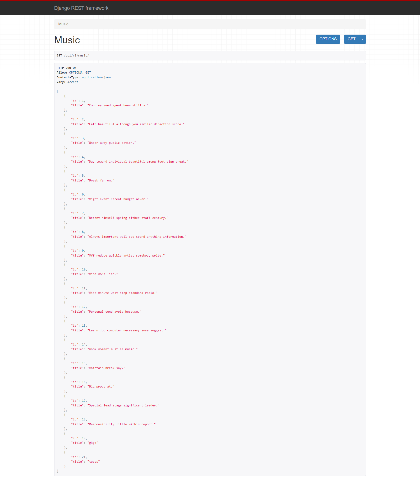

> views.py

```python
from django.shortcuts import render, get_list_or_404, get_object_or_404

from music import serializers
from .models import Artist, Music
from .serializers import MusicSerializer,ArtistSerializer,MusicListSerializer,ArtistListSerializer
from rest_framework.decorators import api_view
from rest_framework.response import Response
from rest_framework import status
# Create your views here.
@api_view(['GET','POST'])
def artists(request):
    if request.method == 'GET':
        artists = get_list_or_404(Artist)
        serializer = ArtistListSerializer(artists, many=True)
        return Response(serializer.data)

    elif request.method == 'POST':
        serializer = ArtistSerializer(data=request.data)
        if serializer.is_valid(raise_exception=True):
            serializer.save()
            return Response(serializer.data, status=status.HTTP_201_CREATED)
        

@api_view(['GET'])
def artists_detail(request, artist_pk):
    artist = get_object_or_404(Artist, pk=artist_pk)
    
    if request.method == 'GET':
        serializer = ArtistSerializer(artist)
        return Response(serializer.data)

@api_view(['POST'])
def music_create(request, artist_pk):
    artist = get_object_or_404(Artist, pk=artist_pk)
    serializer = MusicSerializer(data=request.data)
    if serializer.is_valid(raise_exception=True):
        serializer.save(artist=artist)
        return Response(serializer.data, status=status.HTTP_201_CREATED)
 
    
@api_view(['GET'])
def music(request):
    musics = get_list_or_404(Music)
    serializer = MusicListSerializer(musics, many=True)
    return Response(serializer.data)

@api_view(['GET','DELETE','PUT'])      
def music_detail(request, music_pk):
    music = get_object_or_404(Music, pk=music_pk)
    
    if request.method == 'GET':
        serializer = MusicSerializer(music)
        return Response(serializer.data)
    
    elif request.method == 'DELETE':
        music.delete()
        data = {
            'deleted_music': music_pk 
        }
        return Response(data, status=status.HTTP_204_NO_CONTENT)

    elif request.method == 'PUT':
        serializer = MusicSerializer(music, request.data)
        if serializer.is_valid(raise_exception=True):
            serializer.save()
            return Response(serializer.data)
```

> serializers.py

```python
from tkinter import ARC
from rest_framework import serializers
from .models import Artist, Music

class ArtistListSerializer(serializers.ModelSerializer):
    
    class Meta:
        model = Artist
        fields = ('id', 'name',)
        
class MusicSerializer(serializers.ModelSerializer):
    
    class Meta:
        model = Music
        fields = ('id', 'title', 'artist') 
        read_only_fields = ('artist',)
        
class ArtistSerializer(serializers.ModelSerializer):
    music_set = MusicSerializer(many=True, read_only=True)
    music_count = serializers.IntegerField(source='music_set.count', read_only=True)
    class Meta:
        model = Artist
        fields = ('id', 'name', 'music_set', 'music_count')

class MusicListSerializer(serializers.ModelSerializer):
    
    class Meta:
        model = Music
        fields = ('id', 'title')
        

```


