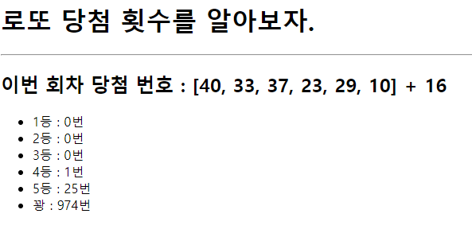

## 로또 당첨 횟수

> 결과 화면



> urls.py

```python
from django.contrib import admin
from django.urls import path
from articles import views

urlpatterns = [
    path('admin/', admin.site.urls),
    path('lotto/', views.lotto),   
]
```

> views.py

```python
import requests
from django.shortcuts import render

def lotto(request):
    r = requests.get(
        'https://www.dhlottery.co.kr/common.do?method=getLottoNumber&drwNo=1').json()
    real_ = []
    for k in r.keys():
        if 'drwtNo' in k:
            real_.append(r[k])
    bonus_ = r.get('bnusNo')

    rank = {(6, 0): '1등', (5, 1): '2등', (5, 0): '3등', (4, 0): '4등', (3, 0): '5등'}
    total = {'1등': 0, '2등': 0, '3등': 0, '4등': 0, '5등': 0, '꽝': 0}

    for _ in range(1000):
        my = random.sample(range(1, 46), 6)
        cnt = 0  # 번호 개수
        bns = 0  # 보너스
        for n in my:
            if n in real_:
                cnt += 1
            elif n == bonus_:
                bns += 1

        rnk = rank.get((cnt, bns), '꽝')
        total[rnk] += 1

    context = {
        'real_': real_,
        'bonus_': bonus_,
        'total': total,
    }
    return render(request, 'lotto.html', context)
```

> lotto.html

```django
<h1>로또 당첨 횟수를 알아보자.</h1>
<hr />
<h2>이번 회차 당첨 번호 : {{real_}} + {{bonus_}}</h2>
<ul>
  
  <li>{{ k }} : {{ v }}번</li>
  
</ul>
```

