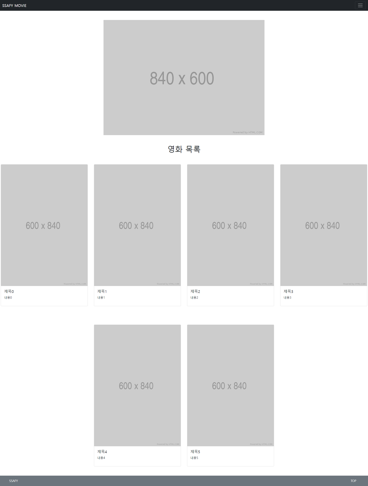
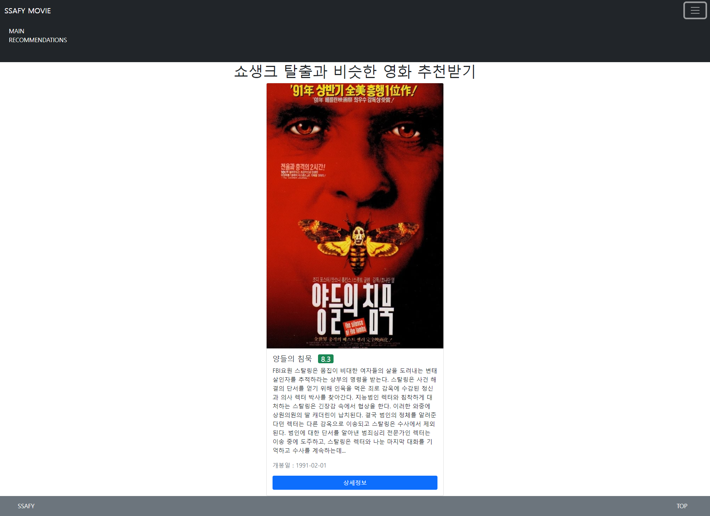

# PJT04

> 프레임워크를 활용한 웹 페이지 구현

## 1. 어려웠던 점

- 저번 프로젝트들과 다르게 뭔가 하나하나 구현하는데 시간이 오래걸렸다.
  - 부트스트랩을 오랜만에 하기도 하고 장고도 짧은 시간에 많은 걸 배운느낌
  - 그래도 작지만 처음부터 끝까지 완성된 것을 만들기 때문에 hws보다는 재밌는 것 같다
- 시간도 제일 부족했던 프로젝트였다

- 사소하지만 back to top 구현 방법이 생각이 안났다 => 구글링
  - body바로 아래 `<a id="top"></a>`를 만들어 놓고 footer에 링크를 걸어놓는 방식으로 해결했다
  - 생각보다 간단했..

```django
<a href="#top"><button type="button" class="btn btn-secondary text-white">TOP</button></a>
```

- 결국 시간 안에 명세서에 있는 모든 기능을 구현하지는 못했음 주말에 시간나면 완성해야겠다

## 2. 느낀 점

- 이제 장고를 배웠으니 html에서 반복 기능을 사용할 수 있다. card를 여러개 배치할 때 유용했는데 교수님이 만들어주신 코드를 가져다 썼다. 나 혼자 할 수 있을지는 의문이다.. 
- 각 card안에 modal 넣고 carousel 넣으니까 코드가 많이 길어졌는데 장고 없었으면 6배 늘어났을 생각 하니까 아찔하다
- 데이터베이스를 아직 다루지 않아서 그런지 장고가 프론트엔드 프레임워크 같다.

## 3. 배운 점

- poster_path라는 이미지 링크를 처음 이용해봤는데 뭔가 링크가 잘린 느낌이었고 이미지가 제대로 안가져와졌다.
  - https://developers.themoviedb.org/3/getting-started/images	
  - 결국 교수님께 질문.. api 관련 문서 찾을 생각을 못한게 좀 아쉽다

```django

```

> Main 페이지
>
> http://127.0.0.1:8000/movies/



> 영화 추천 페이지
>
> http://127.0.0.1:8000/movies/recommendations/


