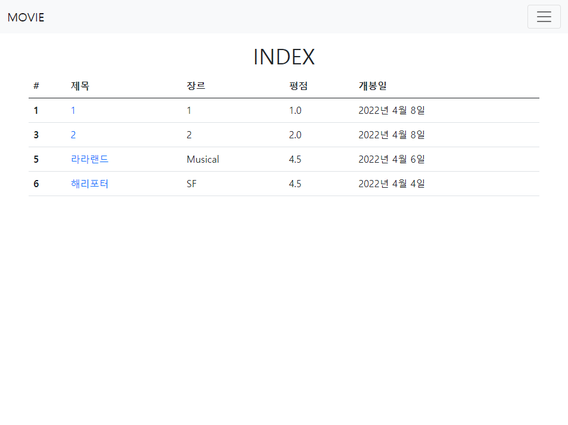
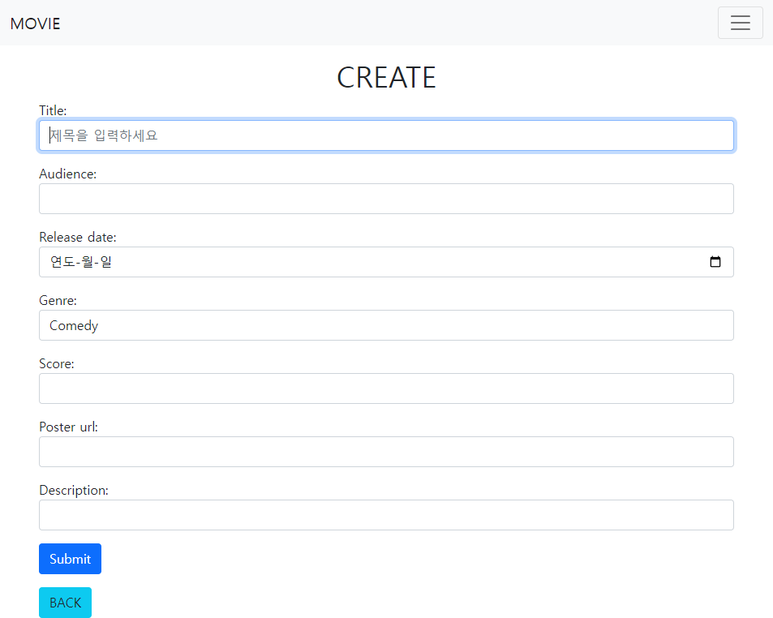
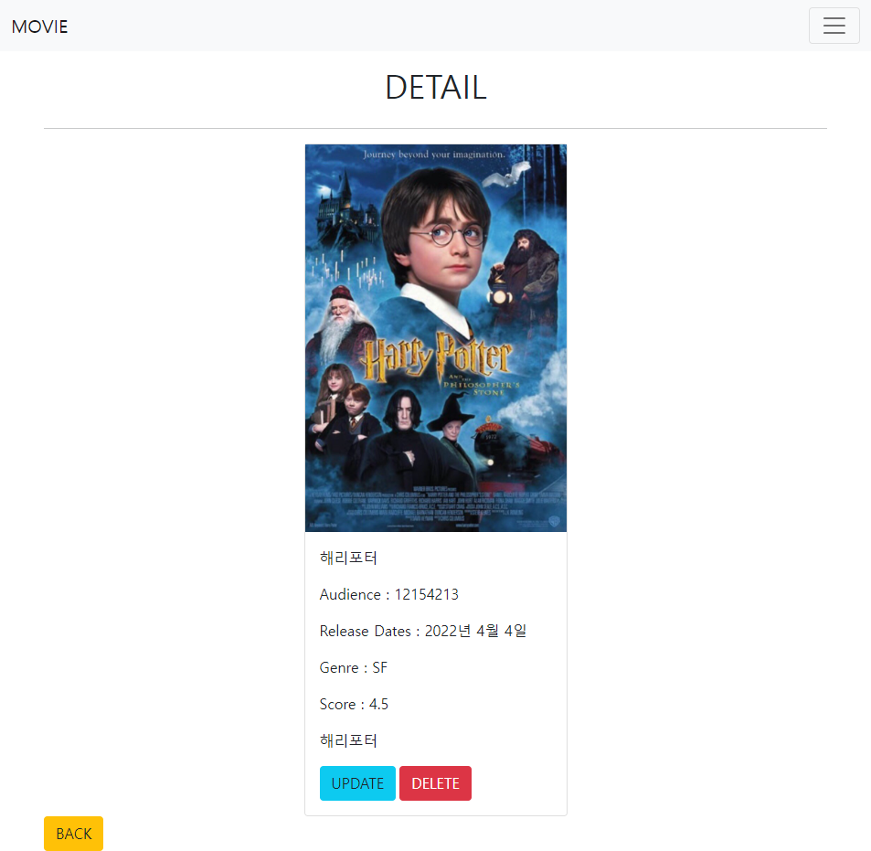
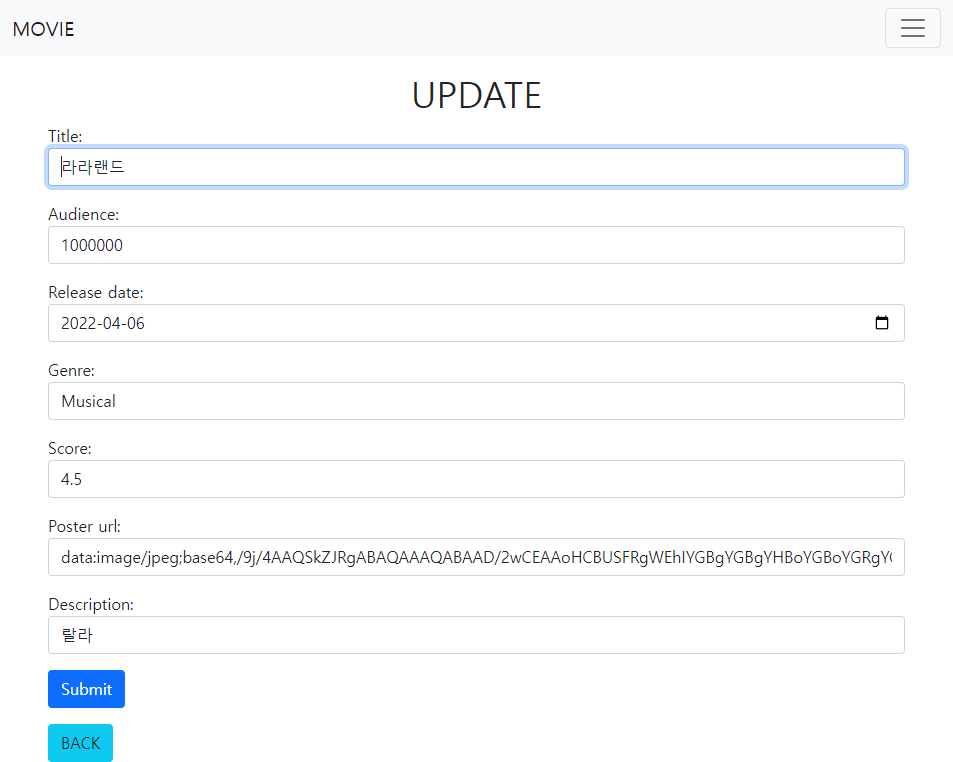

## PJT06

> DB를 활용한 웹 페이지 구현
>
> 참고자료s : 아 이것도 중간중간 참고했던 것들 다 까먹고 웹페이지 꺼버려서 기억안난다.
>
> 공식문서가 가장 좋다고 많이 들었는데 블로그가 내가 원하는 것만 딱 더 빠르게 도움될 줄 때도 많은 것 같다.
>
> [Widgets](https://docs.djangoproject.com/en/4.0/ref/forms/widgets/#django.forms.TextInput)
>
> [ModelForm-widget](https://docs.djangoproject.com/en/4.0/topics/forms/modelforms/#a-full-example)

<br>

### 1. 어려웠던 점 & 배운 점

1. 일단 시작하자마자 갑자기 자동 import기능이 생겨서 원하지않는 모듈이 import 되었다. 프로젝트 끝나고 찾아서 꺼야겠다.

2. widget 이용해서 html option 설정하는 게 어려웠다. 지금까지는 각 태그안에 입력해줬었는데 이제 html에 그냥 {{form.as_p}}로 넘어가니까 forms.py에서 설정해줘야 했고 수업을 들어서 알고는 있었는데 막상 직접하려니 어려웠다.

```python
title = forms.CharField(
        widget = forms.TextInput(
            attrs = {
                'class': 'form-control',
                'placeholder': '제목을 입력하세요',
                'autofocus': 'autofocus',
            }
        )
    )
```

이런 식으로 작성을 하면 되는데, 아직도 CharField안에 TextInput을 왜 지정해줘야 하는지 잘 모르겠다.

autofocus도 html에서는 그냥 한 단어로 쓰면 되는데 여기선 두번 써줘야한다 ㅋㅋ 이상함

SELECT 구현이 가장 어려웠고 밖에서 list만들어서 choices = GENRE_CHOICES 넘겨줬다. 그래도 하다 보니 익숙해짐

3. 버튼 부트스트랩으로 구현하는데 사소한게 해결 안돼서 시간 많이 씀
   - input submit 태그로만 되는줄알았는데 그냥 button에 type=submit으로 해도 된다. 진짜 알고보면 별거 아닌거에 시간 많이 쓴다. 많이 해보고 많이 아는 사람이 짱이다 그냥

```django
<form action="" method='POST'>
          
          <button type="submit" class="btn btn-danger">
            DELETE
          </button>
</form>
```

<br>

### 2. 느낀 점

1. 사실 장고 처음 배웠을 때, 그냥 아무생각 없이 따라했는데 ModelForm 배운걸로 작성하니까 html이랑 views함수가 많이 줄었다. 복잡한 홈페이지를 만든다면 중복 코드를 줄이는게 꽤 많은 도움이 될 것 같다 
2. `@require_safe`, `@require_POST` 데코레이터 쓰니까 좀 편한 것 같긴 하다. 근데 길지 않은 조건문으로도 충분히 구현할 수 있는데 꼭 필요한 기능인가 싶다.
3. 명세서 기능이랑 부트스트랩 구현하니까 오늘 배운 이미지 업로드 기능을 못해봤다. 어려워 보였는데 나중에 해봐야겠다. 그래도 저번에 못한 부트스트랩 이용해서 좀 깔끔하게 만들었다.
4. INDEX 페이지에서 만약에 2번 글 삭제하면 2번이 다시는 안나오는데 이걸 좀 갱신되게 만들고 싶었는데 못했다. 못한게 많,,

> INDEX



> CREATE



> DETAIL



> UPDATE

