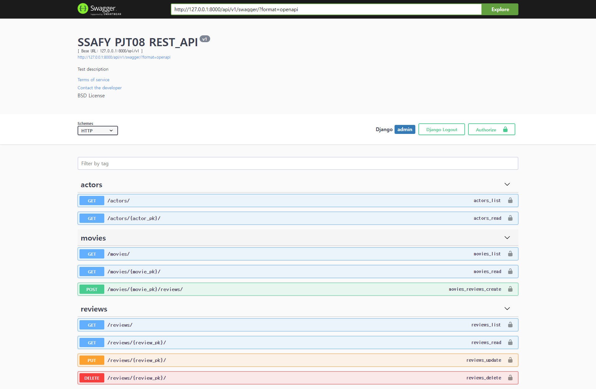

## PJT08

> DB 설계를 활용한 REST API 설계
>

<br>

### 1. 어려웠던 점 & 배운 점

- postman으로는 잘 실행되는데 브라우저에서 안뜨길래 한참 고민했는데, settings.py에 'rest_framework'앱등록을 안해놨었다. 기존에 과제할때는 등록이 되어있어서 간과하고 있었던 부분이었다.

- json파일로 주어진 데이터를 db에 반영하는 과정을 처음 해봤는데 M:N 테이블에 데이터가 안들어가서 한참 헤맸다. 결국 테이블을 따로 생성해주었다.

  ```python
  class Actor_Movies(models.Model):
      actor = models.ForeignKey(Actor, on_delete=models.CASCADE)
      movie = models.ForeignKey(Movie, on_delete=models.CASCADE)
  ```

- movie가 이미 model에 반영되어 있어서 pk값이 자동으로 떴는데 명세서에는 pk가 아닌 title이 있길래 고민했는데 `movie = MovieTitleSerializer(read_only=True)` 그냥 덮어씌워진다. 

<br>

### 2. 느낀 점

- 오랜만에 여유롭게 프로젝트를 끝낸 것 같다. 이번주에 계속 반복했던 내용이 다시 나와서 어렵지 않게 끝낼 수 있었다.
  - 템플릿을 만들 일이 없는 것도 큰 것 같다.



- 오늘 배운 swagger 도 추가했다. 정말 잘 찾고 잘 읽어서, 복사 붙여넣기만 잘해도 천재들이 만들어 놓은 뚝딱인 기능들이 많다.