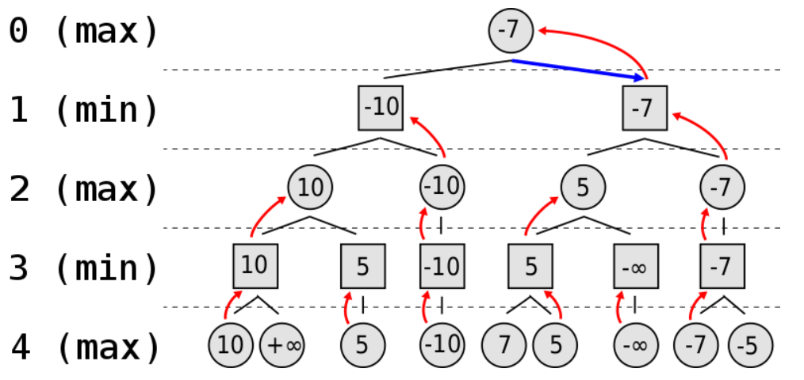

## Level3

- 8문제 정도 남았다. level3정도 되니까 혼자 생각해서 풀기엔 버거웠고 거의 대부분을 구글 해답에 의존해서 풀었다. 한번 다 풀고 다시 백지상태에서 혼자 끝까지 푸는 연습을 할 예정이다.
- level3는 level1 수준의 쉬운문제에 효율성을 추가하여 누적합, 투포인터, 이진탐색 등을 쓰지 않으면 통과되지 않는 문제들도 종종 있었다. 물론 문제 자체가 어려운 것도 많았다. 

### 불량 사용자

> 제일 싫어하는 상황이 나왔다. 거의 디버깅 불가능이다 이건
>
> | 테스트 1 〉  | 통과 (0.01ms, 10.2MB) |
> | ------------ | --------------------- |
> | 테스트 2 〉  | 통과 (0.06ms, 10.3MB) |
> | 테스트 3 〉  | 통과 (0.08ms, 10.3MB) |
> | 테스트 4 〉  | 통과 (0.03ms, 10.4MB) |
> | 테스트 5 〉  | 실패 (시간 초과)      |
> | 테스트 6 〉  | 통과 (4.05ms, 10.2MB) |
> | 테스트 7 〉  | 통과 (0.03ms, 10.2MB) |
> | 테스트 8 〉  | 통과 (0.06ms, 10.4MB) |
> | 테스트 9 〉  | 통과 (0.06ms, 10.3MB) |
> | 테스트 10 〉 | 통과 (0.03ms, 10.4MB) |
> | 테스트 11 〉 | 통과 (0.08ms, 10.3MB) |

```python
def same(user, ban):
    if len(user) == len(ban):
        for i in range(len(ban)):
            if ban[i] == user[i] or ban[i] =='*':
                continue
            else:
                return False
        else:
            return True
    else:
        return False
    
whole = []
def solution(user_id, banned_id):
    answer = 0
    possible = []
    for ban in banned_id:
        tmp = []
        for user in user_id:
            if same(user, ban):
                tmp.append(user)
        possible.append(tmp)
    # print(possible)
    N = len(possible)
    def f(i, N, arr):
        global whole
        if i == N:
            if set(arr) not in whole and len(set(arr)) == len(arr):
                whole.append(set(arr))
            return
        else:
            for j in range(len(possible[i])):
                f(i+1, N, arr+[possible[i][j]])
                
    f(0, N, [])
    # print(whole)
    return len(whole)
```


> 혹시나 하고 and로 연결되어 있는 조건문 앞 뒤 순서만 바꿨는데 해결됐다..
>
> | 테스트 1 〉  | 통과 (0.02ms, 10.3MB)    |
> | ------------ | ------------------------ |
> | 테스트 2 〉  | 통과 (0.06ms, 10.2MB)    |
> | 테스트 3 〉  | 통과 (0.06ms, 10.2MB)    |
> | 테스트 4 〉  | 통과 (0.05ms, 10.2MB)    |
> | 테스트 5 〉  | 통과 (8781.74ms, 10.1MB) |
> | 테스트 6 〉  | 통과 (5.14ms, 10.3MB)    |
> | 테스트 7 〉  | 통과 (0.04ms, 10.2MB)    |
> | 테스트 8 〉  | 통과 (0.07ms, 10.2MB)    |
> | 테스트 9 〉  | 통과 (0.08ms, 10.3MB)    |
> | 테스트 10 〉 | 통과 (0.03ms, 10.1MB)    |
> | 테스트 11 〉 | 통과 (0.08ms, 10.4MB)    |

```python
def same(user, ban):
    if len(user) == len(ban):
        for i in range(len(ban)):
            if ban[i] == user[i] or ban[i] =='*':
                continue
            else:
                return False
        else:
            return True
    else:
        return False
    
whole = []
def solution(user_id, banned_id):
    answer = 0
    possible = []
    for ban in banned_id:
        tmp = []
        for user in user_id:
            if same(user, ban):
                tmp.append(user)
        possible.append(tmp)
 
    N = len(possible)
    def f(i, N, arr):
        global whole
        if i == N:
            if len(set(arr)) == len(arr) and set(arr) not in whole :
                whole.append(set(arr))
            return
        else:
            for j in range(len(possible[i])):
                f(i+1, N, arr+[possible[i][j]])
                
    f(0, N, [])
    return len(whole)
```

<br>

### [다시풀기]보석쇼핑

> 1차시도, 시간초과
>
> | 테스트 1 〉  | 통과 (0.21ms, 10.2MB)    |
> | ------------ | ------------------------ |
> | 테스트 2 〉  | 통과 (5.36ms, 10.8MB)    |
> | 테스트 3 〉  | 통과 (30.66ms, 16.9MB)   |
> | 테스트 4 〉  | 통과 (655.02ms, 30.4MB)  |
> | 테스트 5 〉  | 통과 (69.49ms, 30.1MB)   |
> | 테스트 6 〉  | 통과 (0.04ms, 10.4MB)    |
> | 테스트 7 〉  | 통과 (0.06ms, 10.3MB)    |
> | 테스트 8 〉  | 통과 (1253.92ms, 63.7MB) |
> | 테스트 9 〉  | 통과 (487.88ms, 78.9MB)  |
> | 테스트 10 〉 | 통과 (5023.56ms, 96MB)   |
> | 테스트 11 〉 | 실패 (시간 초과)         |
> | 테스트 12 〉 | 통과 (1028.67ms, 205MB)  |
> | 테스트 13 〉 | 통과 (1777.15ms, 366MB)  |
> | 테스트 14 〉 | 실패 (시간 초과)         |
> | 테스트 15 〉 | 통과 (6665.49ms, 1.43GB) |

```python
from itertools import combinations
def solution(gems):
    every = set(gems)
    combi = list(combinations(range(len(gems)+1),2))
    combi = sorted(combi, key=lambda x: (x[1]-x[0], x[0]))
    
    for com in combi:
        if set(gems[com[0]:com[1]]) == every:
            return [com[0]+1, com[1]]
            
```

> 2차 시도, 최소 보석 수 이상부터 탐색을 해도 된다라고 생각했지만 또 시간초과
>
> | 테스트 1 〉  | 통과 (0.09ms, 10MB)      |
> | ------------ | ------------------------ |
> | 테스트 2 〉  | 통과 (2.68ms, 10.5MB)    |
> | 테스트 3 〉  | 통과 (41.30ms, 16MB)     |
> | 테스트 4 〉  | 통과 (28.49ms, 18.7MB)   |
> | 테스트 5 〉  | 통과 (79.79ms, 29MB)     |
> | 테스트 6 〉  | 통과 (0.02ms, 10.3MB)    |
> | 테스트 7 〉  | 통과 (0.05ms, 10.1MB)    |
> | 테스트 8 〉  | 통과 (960.44ms, 50.1MB)  |
> | 테스트 9 〉  | 통과 (426.15ms, 69.4MB)  |
> | 테스트 10 〉 | 통과 (2986.14ms, 45.8MB) |
> | 테스트 11 〉 | 실패 (시간 초과)         |
> | 테스트 12 〉 | 통과 (1320.06ms, 186MB)  |
> | 테스트 13 〉 | 통과 (1938.98ms, 336MB)  |
> | 테스트 14 〉 | 실패 (시간 초과)         |
> | 테스트 15 〉 | 통과 (7824.78ms, 1.34GB) |

```python
from itertools import combinations
def solution(gems):
    every = set(gems)
    L = len(every)
    combi = filter(lambda x: x[1]-x[0] >= L,list(combinations(range(len(gems)+1),2)))
    combi = sorted(combi, key=lambda x: (x[1]-x[0], x[0]))
    
    for com in combi:
        if set(gems[com[0]:com[1]]) == every:
            return [com[0]+1, com[1]]
```

> 3차 시도, 애초에 조합을 다 만드는데 시간이 소요되는거같아서 while로 방법을 바꾸니 시간이 줄었다 근데도 시간초과, 백트래킹처럼 가지치기를 안하면 안되는가보다.
>
> | 테스트 1 〉  | 통과 (0.02ms, 10.2MB)    |
> | ------------ | ------------------------ |
> | 테스트 2 〉  | 통과 (0.31ms, 9.98MB)    |
> | 테스트 3 〉  | 통과 (0.39ms, 10.1MB)    |
> | 테스트 4 〉  | 통과 (0.10ms, 10.2MB)    |
> | 테스트 5 〉  | 통과 (0.02ms, 9.94MB)    |
> | 테스트 6 〉  | 통과 (0.01ms, 9.94MB)    |
> | 테스트 7 〉  | 통과 (0.01ms, 10.1MB)    |
> | 테스트 8 〉  | 통과 (831.47ms, 10MB)    |
> | 테스트 9 〉  | 통과 (175.01ms, 10.2MB)  |
> | 테스트 10 〉 | 통과 (2562.53ms, 10.2MB) |
> | 테스트 11 〉 | 실패 (시간 초과)         |
> | 테스트 12 〉 | 통과 (309.42ms, 10.1MB)  |
> | 테스트 13 〉 | 통과 (241.88ms, 10.2MB)  |
> | 테스트 14 〉 | 실패 (시간 초과)         |
> | 테스트 15 〉 | 통과 (393.33ms, 10.3MB)  |

```python
from itertools import combinations
def solution(gems):
    every = set(gems)
    L = len(every)
    i = 0
    while 1:
        if set(gems[i:i+L]) == every:
            return [i+1, i+L]
        if i+L == len(gems):
            i = -1
            L += 1
        i += 1
```

> 결국 [참고](https://dev-note-97.tistory.com/70)
>
> 투포인터 알고리즘이라고 한다. 나처럼 다 순회하는게 아니라 지렁이가 움직이는거처럼 앞 뒤를 조절하며 확인한다.
>
> 시간 차이가 말도 안된다..
>
> | 테스트 1 〉  | 통과 (0.02ms, 10.1MB) |
> | ------------ | --------------------- |
> | 테스트 2 〉  | 통과 (0.06ms, 10.1MB) |
> | 테스트 3 〉  | 통과 (0.29ms, 10.2MB) |
> | 테스트 4 〉  | 통과 (0.30ms, 10.1MB) |
> | 테스트 5 〉  | 통과 (0.61ms, 9.98MB) |
> | 테스트 6 〉  | 통과 (0.01ms, 10.1MB) |
> | 테스트 7 〉  | 통과 (0.01ms, 10.1MB) |
> | 테스트 8 〉  | 통과 (0.35ms, 10.2MB) |
> | 테스트 9 〉  | 통과 (0.87ms, 10.1MB) |
> | 테스트 10 〉 | 통과 (0.57ms, 10.1MB) |
> | 테스트 11 〉 | 통과 (0.81ms, 10.3MB) |
> | 테스트 12 〉 | 통과 (1.57ms, 10.1MB) |
> | 테스트 13 〉 | 통과 (1.29ms, 10.3MB) |
> | 테스트 14 〉 | 통과 (1.72ms, 10.2MB) |
> | 테스트 15 〉 | 통과 (4.51ms, 10.4MB) |

```python
def solution(gems):
    answer = [] 
    shortest = len(gems)+1 # 현재 최단 구간 길이

    start_p = 0 # 구간의 시작점
    end_p = 0 # 구간의 끝 점 (보석을 체크하는 기준점)

    check_len = len(set(gems)) # 보석의 총 종류 수
    contained = {} # 현재 구간에 포함된 보석들(종류: 갯수)

    while end_p < len(gems): # 구간의 끝 점이 gems의 길이보다 작을 동안

        if gems[end_p] not in contained: # 현재 끝 점의 보석이 contained에 없다면(이 종류가 처음 발견되었다면)
            contained[gems[end_p]] = 1 # dictionary에 추가
        else:
            contained[gems[end_p]] += 1 # 이미 있으면 dictionary에 +1
            
        end_p += 1 # 끝 점 증가

        if len(contained) == check_len: # 현재 구간 내 보석의 종류의 갯수가 전체 종류의 갯수와 같다면 (현재 구간내 모든 종류가 다 있다면)
            while start_p < end_p: # start_p 가 end_p 보다 같을 때까지 증가
                if contained[gems[start_p]] > 1: # start_p에 해당하는 보석이 구간 내에 하나 이상 있다면
                    contained[gems[start_p]] -= 1 # 구간 내 보석 하나 감소(start_p 의 보석 뺄거니까)
                    start_p += 1 # start_p 증가
                    
                elif shortest > end_p - start_p: # 기존의 구간 최단거리보다 현재의 구간거리가 더 짧다면
                    shortest = end_p - start_p
                    answer = [start_p+1, end_p] # answer와 최단거리 갱신
                    break
                    
                else:
                    break

    return answer
```

<br>

### [다시풀기]징검다리 건너기

> 역시나 효율성
>
> ```
> 테스트 1 〉통과 (0.01ms, 10.3MB)
> 테스트 2 〉통과 (0.02ms, 10MB)
> 테스트 3 〉통과 (0.07ms, 10MB)
> 테스트 4 〉통과 (0.28ms, 10.1MB)
> 테스트 5 〉통과 (0.27ms, 10.1MB)
> 테스트 6 〉통과 (108.09ms, 10.2MB)
> 테스트 7 〉통과 (374.66ms, 10.2MB)
> 테스트 8 〉통과 (512.34ms, 10.3MB)
> 테스트 9 〉통과 (792.17ms, 10.1MB)
> 테스트 10 〉통과 (0.59ms, 10.1MB)
> 테스트 11 〉통과 (0.10ms, 10.1MB)
> 테스트 12 〉통과 (0.58ms, 10.2MB)
> 테스트 13 〉통과 (3.30ms, 10.4MB)
> 테스트 14 〉통과 (111.41ms, 10.1MB)
> 테스트 15 〉통과 (347.70ms, 10.2MB)
> 테스트 16 〉통과 (481.34ms, 10.2MB)
> 테스트 17 〉통과 (813.48ms, 10.2MB)
> 테스트 18 〉통과 (0.25ms, 10MB)
> 테스트 19 〉통과 (2.26ms, 10.2MB)
> 테스트 20 〉통과 (6.99ms, 10.1MB)
> 테스트 21 〉통과 (96.60ms, 10.1MB)
> 테스트 22 〉통과 (265.24ms, 10.2MB)
> 테스트 23 〉통과 (502.82ms, 10.1MB)
> 테스트 24 〉통과 (763.99ms, 10.2MB)
> 테스트 25 〉통과 (0.04ms, 9.95MB)
> 테스트 1 〉실패 (시간 초과)
> 테스트 2 〉실패 (시간 초과)
> 테스트 3 〉실패 (시간 초과)
> 테스트 4 〉실패 (시간 초과)
> 테스트 5 〉실패 (시간 초과)
> 테스트 6 〉실패 (시간 초과)
> 테스트 7 〉실패 (시간 초과)
> 테스트 8 〉실패 (시간 초과)
> 테스트 9 〉실패 (시간 초과)
> 테스트 10 〉실패 (시간 초과)
> 테스트 11 〉실패 (시간 초과)
> 테스트 12 〉실패 (시간 초과)
> 테스트 13 〉실패 (시간 초과)
> 테스트 14 〉실패 (시간 초과)
> ```

```python
def solution(stones, k):
    answer = 0
    
    while 1 :
        for i in range(len(stones)):
            if stones[i:i+k] == [0]*k:
                return answer
        else:
            stones = list(map(lambda x: max(x-1,0), stones))
            answer += 1   
```

> 2차 시도 나름 빨라졌지만 효율성 실패
>
> ```
> 테스트 1 〉통과 (0.00ms, 10MB)
> 테스트 2 〉통과 (0.01ms, 10.2MB)
> 테스트 3 〉통과 (0.01ms, 10.1MB)
> 테스트 4 〉통과 (0.02ms, 10MB)
> 테스트 5 〉통과 (0.03ms, 10.2MB)
> 테스트 6 〉통과 (0.19ms, 10MB)
> 테스트 7 〉통과 (0.56ms, 10.1MB)
> 테스트 8 〉통과 (1.48ms, 10.3MB)
> 테스트 9 〉통과 (1.72ms, 10.1MB)
> 테스트 10 〉통과 (0.03ms, 10.1MB)
> 테스트 11 〉통과 (0.01ms, 10.2MB)
> 테스트 12 〉통과 (0.02ms, 10.1MB)
> 테스트 13 〉통과 (0.03ms, 9.96MB)
> 테스트 14 〉통과 (0.24ms, 10.2MB)
> 테스트 15 〉통과 (0.53ms, 10.3MB)
> 테스트 16 〉통과 (0.93ms, 10.1MB)
> 테스트 17 〉통과 (1.56ms, 10.2MB)
> 테스트 18 〉통과 (0.01ms, 10.1MB)
> 테스트 19 〉통과 (0.03ms, 10.3MB)
> 테스트 20 〉통과 (0.03ms, 10.3MB)
> 테스트 21 〉통과 (0.19ms, 10.1MB)
> 테스트 22 〉통과 (0.53ms, 10.3MB)
> 테스트 23 〉통과 (0.91ms, 10.1MB)
> 테스트 24 〉통과 (1.58ms, 10.3MB)
> 테스트 25 〉통과 (0.01ms, 10.3MB)
> 테스트 1 〉실패 (시간 초과)
> 테스트 2 〉실패 (시간 초과)
> 테스트 3 〉실패 (시간 초과)
> 테스트 4 〉실패 (시간 초과)
> 테스트 5 〉실패 (시간 초과)
> 테스트 6 〉
> 테스트 7 〉실패 (시간 초과)
> 테스트 8 〉실패 (시간 초과)
> 테스트 9 〉실패 (시간 초과)
> 테스트 10 〉실패 (시간 초과)
> 테스트 11 〉실패 (시간 초과)
> 테스트 12 〉실패 (시간 초과)
> 테스트 13 〉실패 (시간 초과)
> 테스트 14 〉실패 (시간 초과)
> ```

```python
def solution(stones, k):
    minV = 2000000000
    
    for i in range(len(stones)-k+1):
        if max(stones[i:i+k]) < minV:
            minV = max(stones[i:i+k])
            
    return minV
```

> 슬슬 완전탐색으로는 문제가 하나도 안풀리는거같다
>
> [이진 탐색](https://whwl.tistory.com/269) 
>
> 위에 내풀이는 리스트 한번만 돌면되고 이진 탐색은 mid계속 바꿔가면서 순회하는데 왜 내 풀이 효율성이 더 안좋은지 모르겠다. 
>
> ```
> 테스트 1 〉통과 (0.01ms, 10.3MB)
> 테스트 2 〉통과 (0.01ms, 10.1MB)
> 테스트 3 〉통과 (0.04ms, 10.3MB)
> 테스트 4 〉통과 (0.04ms, 10MB)
> 테스트 5 〉통과 (0.03ms, 10MB)
> 테스트 6 〉통과 (0.63ms, 10.1MB)
> 테스트 7 〉통과 (0.50ms, 10.3MB)
> 테스트 8 〉통과 (0.66ms, 10.3MB)
> 테스트 9 〉통과 (1.19ms, 10.1MB)
> 테스트 10 〉통과 (0.02ms, 10.3MB)
> 테스트 11 〉통과 (0.02ms, 10.3MB)
> 테스트 12 〉통과 (0.03ms, 10.1MB)
> 테스트 13 〉통과 (0.04ms, 10.1MB)
> 테스트 14 〉통과 (0.33ms, 10.3MB)
> 테스트 15 〉통과 (0.50ms, 10.1MB)
> 테스트 16 〉통과 (0.41ms, 10.1MB)
> 테스트 17 〉통과 (0.67ms, 10.3MB)
> 테스트 18 〉통과 (0.02ms, 10.3MB)
> 테스트 19 〉통과 (0.03ms, 10.3MB)
> 테스트 20 〉통과 (0.06ms, 10.1MB)
> 테스트 21 〉통과 (0.30ms, 10.2MB)
> 테스트 22 〉통과 (0.56ms, 10MB)
> 테스트 23 〉통과 (0.49ms, 10.2MB)
> 테스트 24 〉통과 (1.35ms, 10.2MB)
> 테스트 25 〉통과 (0.03ms, 10.1MB)
> 테스트 1 〉통과 (236.66ms, 18.6MB)
> 테스트 2 〉통과 (320.14ms, 18.6MB)
> 테스트 3 〉통과 (384.57ms, 18.4MB)
> 테스트 4 〉통과 (161.11ms, 18.6MB)
> 테스트 5 〉통과 (206.12ms, 18.5MB)
> 테스트 6 〉통과 (194.81ms, 18.6MB)
> 테스트 7 〉통과 (369.26ms, 18.5MB)
> 테스트 8 〉통과 (408.27ms, 18.5MB)
> 테스트 9 〉통과 (361.63ms, 18.6MB)
> 테스트 10 〉통과 (413.99ms, 18.6MB)
> 테스트 11 〉통과 (384.24ms, 18.6MB)
> 테스트 12 〉통과 (363.22ms, 18.6MB)
> 테스트 13 〉통과 (242.25ms, 18.6MB)
> 테스트 14 〉통과 (216.54ms, 18.5MB)
> ```

```python
def solution(stones, k):
    start = 1
    end = 200000000
    mid = (start + end) // 2
    
    while start <= end:
        cnt = 0
        mid = (start + end) // 2
        for stone in stones:
            if stone - mid <= 0:
                cnt += 1
                if cnt >= k:
                    end = mid - 1
                    break
            else:
                cnt = 0
        else:
            start = mid + 1
    return start   
```

<br>

### [1차] 추석 트래픽

> 어려운 문제가 아니었는데 괜히 쫄아서 구글링했다. level3와서는 왜 구글없이는 못풀지
>
> [참고](https://velog.io/@mrbartrns/%ED%8C%8C%EC%9D%B4%EC%8D%AC-1%EC%B0%A8%EC%B6%94%EC%84%9D-%ED%8A%B8%EB%9E%98%ED%94%BD-%ED%94%84%EB%A1%9C%EA%B7%B8%EB%9E%98%EB%A8%B8%EC%8A%A4-%EB%A0%88%EB%B2%A83)

```python
def get_time(time):
    hour, minute, sec = time.split(':')
    sec, mili = map(int, sec.split('.'))
    return (int(hour)*3600 + int(minute)*60 + sec)*1000 + mili
    
def start_time(time, duration):
    duration = int(float(duration[:-1])*1000)
    return get_time(time) - duration

def solution(lines):
    answer = 0
    ends = []
    starts =[]
    for line in lines:
        t = line.split()
        ends.append(get_time(t[1])) 
        starts.append(start_time(t[1], t[2]))
    
    for i in range(len(lines)):
        cnt = 1
        
        for j in range(i+1, len(lines)):
            if ends[i] > starts[j]-999:
                cnt += 1
                
        answer = max(cnt, answer)
        
    return answer
```

<br>

### [1차] 셔틀버스

> 생각보다 고려해야할 경우의 수가 많아서 문제풀면서 처음으로 직접 테스트케이스 추가하면서 디버깅했다.
>
> 추가한 TC
>
> ```
> 테스트 7
> 입력값 〉2, 10, 2, ["08:59", "08:59", "08:59", "09:00", "23:59"]
> 기댓값 〉"08:59"
> 실행 결과 〉테스트를 통과하였습니다.
> 테스트 8
> 입력값 〉1, 1, 1, ["09:00", "23:59"]
> 기댓값 〉"08:59"
> 실행 결과 〉테스트를 통과하였습니다.
> ```

```python
def get_time(t):
    q, r = divmod(t,60)  
    if q < 10:
        q = f'0{q}'
    else:
        q = str(q)
    if r < 10:
        r = f'0{r}'
    else:
        r = str(r)
    return f'{q}:{r}'
    
    
def solution(n, t, m, timetable):
    answer = ''
    cnt = 0
    timetable = sorted(list(map(lambda x: int(x.split(':')[0])*60 + int(x.split(':')[1]), timetable)))
    
    i = 0
    s = 540
    
    for j in range(n):
        res = m
        if j == n-1 and res == 1:
            return min(get_time(timetable[i]-1), get_time(s))
        for k in range(i, min(i+m,len(timetable))):
            if timetable[k] > s:
                i = k
                break
            res -= 1
            if j == n-1 and res == 1:
                if k+1 < len(timetable):
                    return min(get_time(timetable[k+1]-1),get_time(s))
                return get_time(s)  
        else:
            i = k+1
        s += t
    
    return get_time(s-t)                 
```

<br>

### 표 편집

> [Linked List](https://kjhoon0330.tistory.com/entry/%ED%94%84%EB%A1%9C%EA%B7%B8%EB%9E%98%EB%A8%B8%EC%8A%A4-%ED%91%9C-%ED%8E%B8%EC%A7%91-Python)

```python
def solution(n,k,cmd):
    cur = k
    table = { i:[i-1,i+1] for i in range(n)}
    table[0] = [None, 1]
    table[n-1] = [n-2, None]
    
    answer = ['O'] * n
    stack = []
    for c in cmd:
        if c == 'C':
            answer[cur] = 'X'
            prev, nxt = table[cur]
            stack.append([prev,cur,nxt])
            if nxt == None:
                cur = table[cur][0]
            else:
                cur = table[cur][1]
            if prev == None:
                table[nxt][0] = None
            elif nxt == None:
                table[prev][1] = None
            else:
                table[prev][1] = nxt
                table[nxt][0] = prev
                
        elif c == 'Z':
            prev, now, nxt = stack.pop()
            answer[now] = 'O'
            if prev == None:
                table[nxt][0] = now
            elif nxt == None:
                table[prev][1] = now
            else:
                table[prev][1] = now
                table[nxt][0] = now
                
        else:
            c1, c2 = c.split()
            c2 = int(c2)
            if c1 == 'D':
                for _ in range(c2):
                    cur = table[cur][1]
            else:
                for _ in range(c2):
                    cur = table[cur][0]
 
    return ''.join(answer)
```

<br>

### 광고삽입

> 1차 시도, 시간초과

```python
def sec(time):
    hour, minute, sec = map(int,time.split(':'))
    return hour*3600+ minute*60 + sec

def clock(s):
    hour, r = divmod(s,3600)
    minute, sec = divmod(r,60)
    hour = f'0{hour}' if hour < 10 else str(hour)
    minute = f'0{minute}' if minute < 10 else str(minute)
    sec = f'0{sec}' if sec < 10 else str(sec)
    return f'{hour}:{minute}:{sec}'

def solution(play_time, adv_time, logs):
    answer = ''
    adv = sec(adv_time)
    play = sec(play_time)
    d = []
    for log in logs:
        start, end = map(lambda x : sec(x), log.split('-'))
        
        d.append([start, 1])
        d.append([end, -1])
    d=sorted(d)
    for i in range(len(d)):
        if i == 0:
            continue
        else:
            d[i][1] = d[i-1][1] + d[i][1]
    
    d = [[0,0]] + d
    # print(d)
    cumul = []
    s = 0
    for i in range(1,len(d)):
        s += (d[i][0]-d[i-1][0])*d[i-1][1]
        cumul.append(s)
    # print(cumul)
    max_p = 0
    max_t = 0
    for s in range(play-adv+1):
        e = s+adv
        for j in range(len(d)):
            if s < d[j][0]:
                ns = cumul[j-2] + (s-d[j-1][0])*d[j-1][1]
                break
        for j in range(len(d)):
            if e < d[j][0]:
                ne = cumul[j-2] + (e-d[j-1][0])*d[j-1][1]
                break
        else:
            ne = cumul[len(d)-2] + (e-d[len(d)-1][0])*d[len(d)-1][1]
                
        if max_p < ne-ns:
            max_p = ne-ns
            max_t = s
        
    return clock(max_t)
```

> [+1-1](https://dev-note-97.tistory.com/156)

```python
def sec(time):
    hour, minute, sec = map(int,time.split(':'))
    
    return hour*3600+ minute*60 + sec

def clock(s):
    hour, r = divmod(s,3600)
    minute, sec = divmod(r,60)
    hour = f'0{hour}' if hour < 10 else str(hour)
    minute = f'0{minute}' if minute < 10 else str(minute)
    sec = f'0{sec}' if sec < 10 else str(sec)
    return f'{hour}:{minute}:{sec}'

def solution(play_time, adv_time, logs):
    answer = ''
    adv = sec(adv_time)
    play = sec(play_time)
    times = [0 for _ in range(play+1)]
    for log in logs:
        start, end = map(lambda x : sec(x), log.split('-'))
        times[start] += 1
        times[end] -= 1
    
    # 초당 시청자수 누적합(두번해야지 누적합이 구해짐)
    for i in range(1, len(times)):
        times[i] = times[i] + times[i-1]
    for i in range(1, len(times)):
        times[i] = times[i] + times[i-1]
    
    max_t = 0
    max_p = 0
    for i in range(adv-1, len(times)):
        if i >= adv:
            if max_p < times[i] - times[i-adv]:
                max_p = times[i] - times[i-adv]
                max_t = i-adv+1
        else:
            if max_p < times[i] :
                max_p = times[i] 
                max_t = i-adv+1
        
    return clock(max_t)
```


<br>

### [다시풀기]매칭점수

> 1차 시도

```python
def solution(word, pages):
    urls = []
    for page in pages:
        url = ''
        for i in range(len(page)):
            if page[i:i+8] == 'content=':
                j = i+8
                while page[j] != '>':
                    url += page[j]
                    j += 1
                urls.append(url[:-1])
                break
 
    bases = []
    links = []
    for page in pages:
        page = page.lower()
        word = word.lower()
        cnt = 0
        for i in range(len(page)):
            if page[i:i+len(word)] == word and not page[i-1].isalpha() and not page[i+len(word)].isalpha():
                cnt += 1
        bases.append(cnt)    
        links.append(page.count('</a>'))
        
    scores = [x for x in bases]  
    for j in range(len(pages)):  
        for i in range(len(urls)):
            if i != j and urls[i] in pages[j]:
                scores[i] += bases[j] / links[j]
                
    idx = -1
    maxV = 0
    for k in range(len(scores)):
        if scores[k] > maxV:
            maxV = scores[k]
            idx = k
            
    return idx
```

> [정규표현식](https://velog.io/@ckstn0778/%ED%94%84%EB%A1%9C%EA%B7%B8%EB%9E%98%EB%A8%B8%EC%8A%A4-42893%EB%B2%88-%EB%A7%A4%EC%B9%AD-%EC%A0%90%EC%88%98-X-1-Python)
>
> \S+ : 공백이 아닌 문자가 연속으로 등장하는 것과 매칭
>
> ()로 묶인게 하나의 매칭이 됨

```python
url = re.search('<meta property="og:url" content="(\S+)"',page)
print(url.groups())
print(url.group(0))
print(url.group(1))


('https://careers.kakao.com/interview/list',) # groups()
<meta property="og:url" content="https://careers.kakao.com/interview/list" # group(0)
https://careers.kakao.com/interview/list # group(1)
```

```python
import re
def solution(word, pages):
    webpage = []
    webpageName = []
    webpageGraph = {}
    
    for page in pages:
        url = re.search('<meta property="og:url" content="(\S+)"',page).group(1)
        basicScore = 0
        for f in re.findall('[a-z]+', page.lower()):
            if f == word.lower():
                basicScore += 1
        exiosLink = re.findall('<a href="(https://[\S]+)"',page)
        
        for link in exiosLink:
            if link not in webpageGraph.keys():
                webpageGraph[link] = [url]
            else:
                webpageGraph[link].append(url)
                
        webpageName.append(url)
        webpage.append([url, basicScore, len(exiosLink)])
    
    maxV = 0
    result = 0
    for i in range(len(webpage)):
        url = webpage[i][0]
        score = webpage[i][1]
        
        if url in webpageGraph.keys():
            for link in webpageGraph[url]:
                a, b = webpage[webpageName.index(link)][1:3]
                score += (a / b)
                
        if maxV < score:
            maxV = score
            result = i
    
    return result
```

<br>

### 자물쇠와 열쇠

> 1차 시도, 디버깅할 엄두도 안난다. 너무 생각없이 코드 짠거같다.

```python
def up(arr):
    return arr[1:3] + [[0]*len(arr[0])]
def down(arr):
    return [[0]*len(arr[0])] + arr[:2]  
def left(arr):
    result = [[0]*len(arr) for _ in range(len(arr))]
    for i in range(len(arr)):
        for j in range(len(arr[0])):
            if j == len(arr[0])-1:
                result[i][j] = 0
            else:
                result[i][j] = arr[i][j+1]
    return result
def right(arr):
    result = [[0]*len(arr) for _ in range(len(arr))]
    for i in range(len(arr)):
        for j in range(len(arr[0])-1, -1, -1):
            if j == 0:
                result[i][j] = 0
            else:
                result[i][j] = arr[i][j-1]
    return result
def rotate(arr):
    n = len(arr)
    m = len(arr[0])

    result = [[0]* n for _ in range(m)]

    for i in range(n):
        for j in range(m):
            result[j][n-i-1] = arr[i][j]
    return result

def find_key(lock,n,m,cnt):
    lst = []
    for i in range(n-m+1):
        for j in range(n-m+1):
            tmp = lock[i:i+m][j:j+m]
            ccnt = 0
            for k in range(m):
                for l in range(m):
                    if tmp[k][l] == 1:
                        ccnt += 1
            if cnt == ccnt:
                lst.append(tmp)
    if lst:
        return lst
    else:
        return False

def solution(key, lock):
    m = len(key)
    n = len(lock)
    
    cnt = 0
    for i in range(n):
        for j in range(n):
            if lock[i][j] == 0:
                lock[i][j] = 1
                cnt += 1
            else:
                lock[i][j] = 0
                
    small = find_key(lock,n,m,cnt)
    if small == False:
        return False
    
    for i in range(4):
        rotated = rotate(key) if i == 0 else rotate(rotated)
        if rotated in small:
            return True
        for j in range(m-1):
            changed = up(rotated) if j == 0 else up(changed)
            if changed in small:
                return True
            for k in range(m-1):
                c = right(changed) if k == 0 else right(c)
                if c in small:
                    return True 
            for k in range(m-1):
                c = left(changed) if k == 0 else left(c)
                if c in small:
                    return True
        for j in range(m-1):
            changed = down(rotated) if j == 0 else down(changed)
            if changed in small:
                return True
            for k in range(m-1):
                c = right(changed) if k == 0 else right(c)
                if c in small:
                    return True
            for k in range(m-1):
                c = left(changed) if k == 0 else left(c)
                if c in small:
                    return True
        for j in range(m-1):
            changed = left(rotated) if j == 0 else left(changed)
            if changed in small:
                return True
            for k in range(m-1):
                c = up(changed) if k == 0 else up(c)
                if c in small:
                    return True
            for k in range(m-1):
                c = down(changed) if k == 0 else down(c)
                if c in small:
                    return True
        for j in range(m-1):
            changed = right(rotated) if j == 0 else right(changed)
            if changed in small:
                return True
            for k in range(m-1):
                c = up(changed) if k == 0 else up(c)
                if c in small:
                    return True
            for k in range(m-1):
                c = down(changed) if k == 0 else down(c)
                if c in small:
                    return True
    return False
```

> [배열 확장](https://velog.io/@tjdud0123/%EC%9E%90%EB%AC%BC%EC%87%A0%EC%99%80-%EC%97%B4%EC%87%A0-2020-%EC%B9%B4%EC%B9%B4%EC%98%A4-%EA%B3%B5%EC%B1%84-python)
>
> 2m+n크기의 배열을 만들고 중앙에 자물쇠 배치 0,0부터 끝까지 순회하면서 맞으면 true, 동서남북으로 실행
>
> - 90도 회전할때 list(zip(*arr[::-1])) 하면 된다.. 

```python
def attach(i,j,m,arr,key):
    for k in range(i, i+m):
        for l in range(j, j+m):
            if key[k-i][l-j] == 1:
                arr[k][l] += 1
def detach(i,j,m,arr,key):
    for k in range(i, i+m):
        for l in range(j, j+m):
            if key[k-i][l-j] == 1:
                arr[k][l] -= 1
def rotate(arr):
    return list(zip(*arr[::-1]))
def check(m,n,arr):
    for i in range(m,m+n):
        for j in range(m,m+n):
            if arr[i][j] != 1:
                return False
    return True

def solution(key, lock):
    m, n = len(key), len(lock)
    arr = [[0]*(2*m+n) for _ in range(2*m+n)]
    
    for i in range(m, m+n):
        for j in range(m, m+n):
            arr[i][j] = lock[i-m][j-m]
    
    for k in range(4):
        key = rotate(key)
        for i in range(m+n+1):
            for j in range(m+n+1):
                attach(i,j,m,arr,key)
                if check(m,n,arr) == True:
                    return True
                detach(i,j,m,arr,key)
    return False 
```

<br>

### 외벽 점검

> [참고](https://velog.io/@tjdud0123/%EC%99%B8%EB%B2%BD-%EC%A0%90%EA%B2%80-2020-%EC%B9%B4%EC%B9%B4%EC%98%A4-%EA%B3%B5%EC%B1%84-python), 비교적 오래 걸림

```python
from itertools import permutations
def solution(n, weak, dist):
    L = len(weak)
    cand = []
    weaks = weak + [w+n for w in weak]
    
    for i, start in enumerate(weak):
        for friends in permutations(dist):
            cnt = 1
            position = start
            for friend in friends:
                position += friend
                if position < weaks[i+L-1]:
                    cnt += 1
                    position = [w for w in weaks[i+1:i+L] if w > position][0]
                else:
                    cand.append(cnt)
                    break
    return min(cand) if cand else -1
```

> [프로그래머스 다른 사람의 풀이](https://programmers.co.kr/learn/courses/30/lessons/60062/solution_groups?language=python3)
>
> 가장 많이 움직일 수 있는 사람 순으로 모든 시작점을 돌면서 돌아본다. 만약에 부족하다면 남은 부분을 deque에 넣어놓고 다음 사람 돌아보고 반복

```python
from collections import deque

def solution(n, weak, dist):
    dist.sort(reverse=True)
    q = deque([weak])
    visited = set()
    visited.add(tuple(weak))
    for i in range(len(dist)):
        d = dist[i]
        for _ in range(len(q)):
            current = q.popleft()
            for p in current:
                l = p
                r = (p + d) % n
                if l < r:
                    temp = tuple(filter(lambda x: x < l or x > r, current))
                else:
                    temp = tuple(filter(lambda x: x < l and x > r, current))
                
                if len(temp) == 0:
                    return (i + 1)
                elif temp not in visited:
                    visited.add(temp)
                    q.append(list(temp))
    return -1
```

<br>

### 파괴되지 않은 건물

> 혹시나 하고 배열 다 순회하면서 갱신했지만 역시나 
>
> [2차원 누적합](https://kimjingo.tistory.com/155) 

```python
def solution(board, skill):
    N, M = len(board), len(board[0])
    cumul = [[0]*(M+1) for _ in range(N+1)]
    
    for sk in skill:
        cumul[sk[1]][sk[2]] -= sk[5] if sk[0] == 1 else -sk[5]
        cumul[sk[1]][sk[4]+1] += sk[5] if sk[0] == 1 else -sk[5]
        cumul[sk[3]+1][sk[2]] += sk[5] if sk[0] == 1 else -sk[5]
        cumul[sk[3]+1][sk[4]+1] -= sk[5] if sk[0] == 1 else -sk[5]
    
    for i in range(N):
        for j in range(M-1):
            cumul[i][j+1] += cumul[i][j]
    
    for j in range(M):
        for i in range(N-1):
            cumul[i+1][j] += cumul[i][j]
    cnt = 0
    for i in range(N):
        for j in range(M):
            if board[i][j] + cumul[i][j] > 0:
                cnt += 1
    return cnt
```

<br>

### 경주로 건설

- 단순 bfs로 풀었을 때 반례

|      |      | 23                     | 21   |
| ---- | ---- | ---------------------- | ---- |
| 26   | 27   | 28(여기서 이게 선택됨) |      |
|      |      | 34(여기서 역전)        |      |

|      |      | 23                  | 21   |
| ---- | ---- | ------------------- | ---- |
| 26   | 27   | 29(이게 버려지는데) |      |
|      |      | 30(사실 이게 최선)  |      |

> 비용 차이가 500 이상이면 다다음칸에서 역전이 일어날수 없어서 고려할 필요없지만 차이가 400이하라면 일단 큐에 넣고 다시 평가해야한다.

```python
from collections import deque
def solution(board):
    n = len(board)
    points = deque() # i,j,direct,cost
    points.append((0,0,-1,0))
    v = [[-1]*n for _ in range(n)]
    
    answer = -1
    while points:
        i,j,d,c = points.popleft()
        if (i,j) == (n-1,n-1) and (answer == -1 or answer > c):
            answer = c
        
        neighbors = [(i,j-1), (i,j+1), (i-1,j), (i+1,j)]
        for direction, (ni,nj) in enumerate(neighbors):
            if ni <= -1 or ni >= n or nj <= -1 or nj >= n:
                continue

            if board[ni][nj]:
                continue

            cost = c + (100 if d==direction or d==-1 else 600)
            if v[ni][nj] != -1 and v[ni][nj] < cost-400:
                continue
            
            points.append((ni,nj,direction,cost))
            v[ni][nj] = cost
    
    return answer
```

<br>

### 기둥과 보 설치

> 오랜만에 혼자 힘으로 풀었다, 설치는 쉬웠는데 삭제가 좀 어려웠다. 
>
> 삭제는 어떤 기둥이나 보를 삭제했을 때, 영향을 받을 수 있는 기둥과 보(최대6개)가 다 안정적인지 확인해주는 함수를 따로 만들어서 확인했다.

```python
def bo_safe(x,y,cols,rows):
    if (x,y) not in rows:
        return True
    if (x-1,y) in rows and (x+1,y) in rows:
        return True
    if (x,y-1) in cols or (x+1,y-1) in cols:
        return True
    return False

def gi_safe(x,y,cols,rows):
    if (x,y) not in cols:
        return True
    if y == 0 or (x,y-1) in cols or (x-1,y) in rows or (x,y) in rows:
        return True
    return False

def solution(n, build_frame):
    answer = set()
    cols = set()
    rows = set()
    for x,y,a,b in build_frame:
        if b == 1:
            if a == 0:
                if y == 0 or (x,y-1) in cols or (x-1,y) in rows or (x,y) in rows:
                    cols.add((x,y))
                    answer.add((x,y,a))
            elif a == 1:
                if ((x-1,y) in rows and (x+1,y) in rows) or ((x,y-1) in cols or (x+1,y-1) in cols):
                    rows.add((x,y))
                    answer.add((x,y,a))
        elif b == 0:
            if (x,y,a) in answer:
                if a == 0: 
                    cols.remove((x,y))    
                    answer.remove((x,y,a))
                    if gi_safe(x,y+1,cols,rows) and gi_safe(x,y-1,cols,rows) and bo_safe(x-1,y+1,cols,rows) and bo_safe(x,y+1,cols,rows) and bo_safe(x-1,y,cols,rows) and bo_safe(x,y,cols,rows):
                        continue
                    else:
                        cols.add((x,y))    
                        answer.add((x,y,a))
                elif a == 1:
                    rows.remove((x,y))
                    answer.remove((x,y,a))
                    if gi_safe(x,y,cols,rows) and gi_safe(x+1,y,cols,rows) and bo_safe(x-1,y,cols,rows) and bo_safe(x+1,y,cols,rows) and gi_safe(x,y-1,cols,rows) and gi_safe(x+1,y-1,cols,rows):
                        continue
                    else:
                        rows.add((x,y))
                        answer.add((x,y,a))
                    
    answer = sorted(answer, key = lambda x: (x[0],x[1],x[2]))   
                
    return answer
```

<br>

### 블록 이동하기

> [참고](https://velog.io/@tjdud0123/%EB%B8%94%EB%A1%9D-%EC%9D%B4%EB%8F%99%ED%95%98%EA%B8%B0-2020-%EC%B9%B4%EC%B9%B4%EC%98%A4-%EA%B3%B5%EC%B1%84-python)

```python
from collections import deque
def possible(cur1, cur2, arr):
    cand = []
    for di,dj in [[0,1],[0,-1],[1,0],[-1,0]]:
        nxt1 = (cur1[0]+di, cur1[1]+dj)
        nxt2 = (cur2[0]+di, cur2[1]+dj)
        if arr[nxt1[0]][nxt1[1]] == 0 and arr[nxt2[0]][nxt2[1]] == 0: 
            cand.append((nxt1,nxt2))
            
    if cur1[0] == cur2[0]: # 가로
        for d in [-1,1]:
            if arr[cur1[0]+d][cur1[1]] == 0 and arr[cur2[0]+d][cur2[1]] == 0:
                cand.append((cur1,(cur1[0]+d, cur1[1])))
                cand.append((cur2,(cur2[0]+d, cur2[1])))
    else: #세로
        for d in [-1,1]:
            if arr[cur1[0]][cur1[1]+d] == 0 and arr[cur2[0]][cur2[1]+d] == 0:
                cand.append(((cur1[0],cur1[1]+d),cur1))
                cand.append(((cur2[0],cur2[1]+d),cur2))
        
    return cand
    
def solution(board):
    n = len(board)
    arr = [[1]*(n+2) for _ in range(n+2)]
    for i in range(n):
        for j in range(n):
            arr[i+1][j+1]=board[i][j]
    
    q = deque([((1,1),(1,2),0)])
    confirm = set([((1,1),(1,2))])
    
    while q:
        cur1, cur2, cnt = q.popleft()
        if cur1 == (n,n) or cur2 == (n,n):
            return cnt
        for nxt in possible(cur1,cur2,arr):           
            if nxt not in confirm:
                confirm.add(nxt)
                q.append([*nxt,cnt+1])
```

<br>

### 사라지는 발판

> [minimax](https://going-to-end.tistory.com/entry/Minimax-algorithm-%EB%AF%B8%EB%8B%88%EB%A7%A5%EC%8A%A4-%EC%95%8C%EA%B3%A0%EB%A6%AC%EC%A6%98), 진짜 웰논이란 말이 괜히 있는 게 아닌 것 같다. 알면 빨리 풀고 모르면 그냥 못풀 확률이 높다. 
>
> 1:1 경기를 할 때 질 것 이라 예상된다면 최대한 늦추고, 이길 것이라 예상된다면 최대한 빠른 것을 택하는 알고리즘. (순서는 상대방과 번갈아 가면서 진행될 때)



- 0,2,4가 내 차례 1,3이 상대방 차례 => 상대방은 점수를 낮추려고하고 나는 높이려고 함
- 내가 (10, 무한대)를 선택했다면 상대방은 그 중에서 낮은 수인 10을 선택하고, 다음차례에 상대방이 선택한 (10,5) 중에서 나는 높은 숫자인 10을 선택하는 것이 반복

> [pseudo code](https://blog.encrypted.gg/1032)
>
> [사라지는 발판 풀이](https://github.com/encrypted-def/kakao-blind-recruitment/blob/master/2022-blind/Q7.py), 그냥 외워야 한다

```python
dx = [0, 0, -1, 1]
dy = [-1, 1, 0, 0]
n, m = 0, 0

def OOB(x, y):
    return x < 0 or x >= n or y < 0 or y >= m

vis = [[0]*5 for _ in range(5)]
block = [[0]*5 for _ in range(5)]

# 현재 상태에서 둘 다 최적의 플레이를 할 때 남은 이동 횟수
# 반환 값이 짝수 : 플레이어가 패배함을 의미, 홀수 : 플레이어가 승리함을 의미
# curx, cury : 현재 플레이어의 좌표, opx, opy : 상대 플레이어의 좌표
def solve(curx, cury, opx, opy):
    global vis, block
    # 플레이어가 밟고 있는 발판이 사라졌다면
    if vis[curx][cury]: return 0
    ret = 0
    # 플레이어를 네 방향으로 이동시켜 다음 단계로 진행할 예정
    for dir in range(4):
        nx = curx + dx[dir]
        ny = cury + dy[dir]
        if OOB(nx,ny) or vis[nx][ny] or block[nx][ny] == 0: continue
        vis[curx][cury] = 1
        
        # 플레이어를 dir 방향으로 이동시켰을 때 턴의 수
        # 다음 함수를 호출할 때 opx, opy, nx, ny 순으로 호출해야 함에 주의
        val = solve(opx, opy, nx, ny)+1
        
        # 방문 표시 해제
        vis[curx][cury] = 0    
        
        # 1. 현재 저장된 턴은 패배인데 새로 계산된 턴은 승리인 경우
        if ret % 2 == 0 and val % 2 == 1: ret = val # 바로 갱신
        # 2. 현재 저장된 턴과 새로 계산된 턴이 모두 패배인 경우
        elif ret % 2 == 0 and val % 2 == 0: ret = max(ret, val) # 최대한 늦게 지는걸 선택
        # 3. 현재 저장된 턴과 새로 계산된 턴이 모두 승리인 경우
        elif ret % 2 == 1 and val % 2 == 1: ret = min(ret, val) # 최대한 빨리 이기는걸 선택
    return ret

def solution(board, aloc, bloc):
    global n,m
    n = len(board)
    m = len(board[0])
    for i in range(n):
        for j in range(m):
            block[i][j] = board[i][j]
    return solve(aloc[0], aloc[1], bloc[0], bloc[1])
```

<br>

### 양과 늑대

> [풀이1](https://kjhoon0330.tistory.com/entry/%ED%94%84%EB%A1%9C%EA%B7%B8%EB%9E%98%EB%A8%B8%EC%8A%A4-%EC%96%91%EA%B3%BC-%EB%8A%91%EB%8C%80-Python)

```python
answer = 1
def get_can_go(i,prev,graph):
    can_go = [x for x in prev if x!=i]
    for j in range(len(graph)):
        if graph[i][j] == 1:
            can_go.append(j)
    return can_go

def f(i,s,w,prev,graph,info):
    global answer
    can_go = get_can_go(i,prev,graph)
    
    if s == w or len(can_go) == 0:
        if answer < s:
            answer = s
        return
    
    for edge in can_go:
        if info[edge] == 1:
            f(edge,s,w+1,can_go,graph,info)
        else:
            f(edge,s+1,w,can_go,graph,info)
            
def solution(info, edges):
    graph = [[0]*len(info) for _ in range(len(info))]
    
    for i,j in edges:
        graph[i][j] = 1
    
    f(0,1,0,[0],graph, info)
    
    return answer
```

> [풀이2](https://kimjingo.tistory.com/154)

```python
from collections import deque, defaultdict
from copy import deepcopy

is_wolf = []
num2edges = defaultdict(list)
max_sheep = 0

def f(cur, used, nsheep, nwolf, can_go):
    global max_sheep
    
    if used[cur]:
        return
    used[cur] = True
    
    if is_wolf[cur]:
        nwolf += 1
    else:
        nsheep += 1
        max_sheep = max(max_sheep, nsheep)
    
    if nsheep <= nwolf:
        return
    
    can_go.extend(num2edges[cur])
    for nxt in can_go:
        f(nxt, deepcopy(used), nsheep, nwolf, can_go=[x for x in can_go if x != nxt and not used[x]])

def solution(info, edges):
    global is_wolf, numb2edges, max_sheep
    is_wolf = info
    used = [False]*len(info)
    
    for start, to in edges:
        num2edges[start].append(to)
        
    f(0,used,0,0,[])
    
    return max_sheep
```

