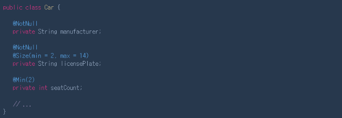
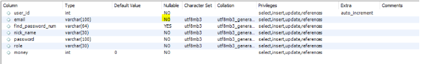
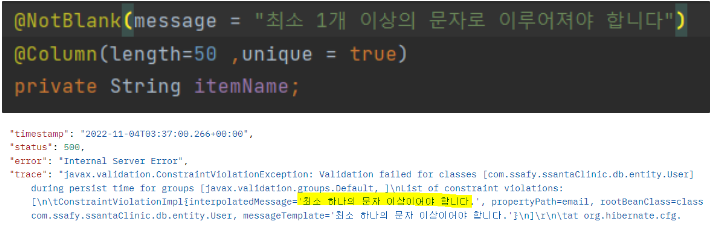

## NotEmpty, NotNull, Notblank

### 1. nullable = false VS NotNull

- 둘다 모두 DDL 생성 시 not null이라는 조건이 붙은 채로 생성됨
- NotNull은 데이터베이스에 SQL 쿼리를 보내기 전에 예외가 발생한다 ⇒ 유효성 검사
- nullable=false는 null을 넣은 엔티티가 생성되고 Repository에 전달도 되고, 이 값이 DB에 넘어간 뒤에 예외가 발생해 위험한 오류를 맞을 수 있다.
- 결과적으로 NotNull을 더 추천함.

 

### 💡 NotNull & NotEmpty & NotBlank

### NotNull(DDL에 not null O)

null이 들어갈 경우 예외를 발생시킨다

### NotEmpty(문자열에만 적용 가능, DDL에 not null X)

**문자열**에 null이나 “”(빈문자열)이 들어가면 예외를 발생시킨다. NotNull의 **문자열 버전** 상위호환

### NotBlank(문자열에만 적용 가능, DDL에 not null X)

**문자열**에 null, “”(붙어있는 빈문자열),”    “(띄어져있는 빈문자열)가 들어가면 예외를 발생시킨다. NotEmpty의 상위호환

 

###  💡 **공식페이지에서의 활용**

NotBlank나 NotEmpty를 쓰지 않고

NotNull과 Size를 통해 검증한다.

하지만 이러면 “             “ 와 같은 값을 막기가 어려운데..

결론) 일단 NotBlank를 써보려고함

NotBlank써도 MySQL에는 Nullable = No라고 되어있음

### 💡 **message option**

- message option을 사용하면 제한조건이 지켜지지 않았을 때 메세지 출력

