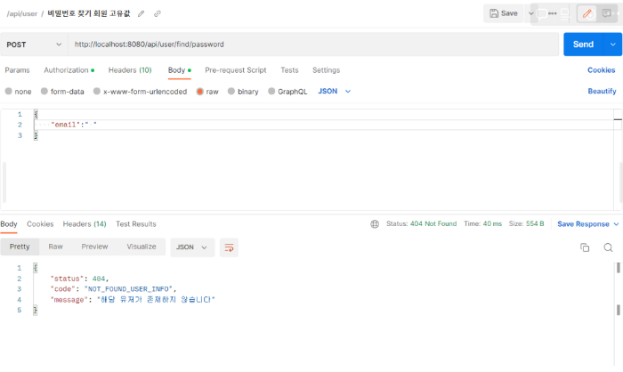
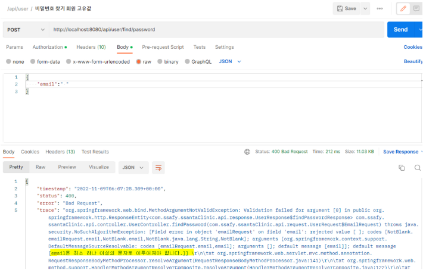

### @valid

> 사용하기 전
>
> 요청 데이터에 대한 유효성 검증이 안되고 service 단으로 넘어가서 error 발생

> 사용 후
>
> 요청 데이터에 대해서 유효성 검증을 한 뒤 바로 알맞은 error 발생

- 추가적으로 데이터에 대한 제한 조건을 entity에 추가해야하는지, requestDto에 추가해야하는지 고민했는데 가독성 측면이나 각각의 requestDto에 대한 제한조건을 다르게 추가해야하는 경우를 대비해 requestDto에 추가했음