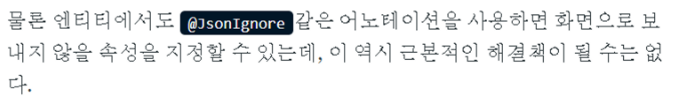
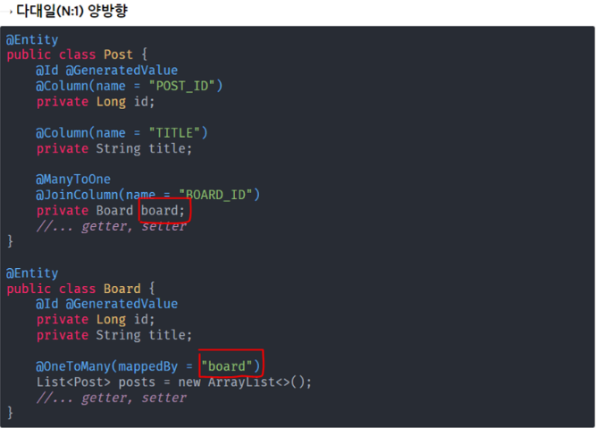
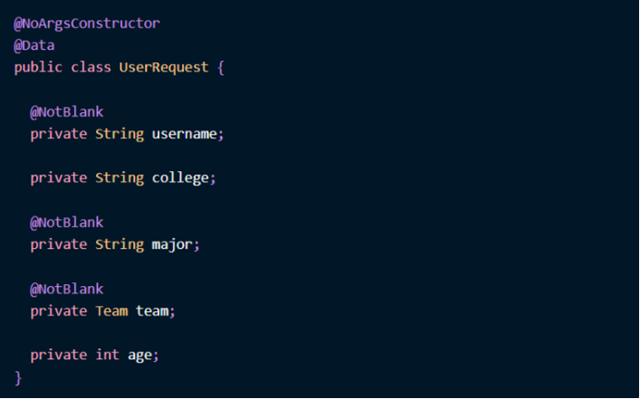

## responseDto를 쓰는 이유

🚨 **먼저 Entity에 Setter를 지양해야함**

- 어디서든 실수로라도 쉽게 속성이 변경될 수가 있다.
  - Entity는 도메인의 핵심 로직과 속성을 가지고 있기 때문에 controller와 같은 비즈니스 로직과 크게 상관없는 곳에서 실수로 변경되면 안된다.
  - 또한 엔티티를 UI계층에 노출하는 것은 테이블 설계를 화면에 공개하는 것이나 다름없기 때문에 보안상으로도 바람직하지 못하다.
  - 엔티티 내부 구현을 캡슐화하고 UI계층에 노출시키지 않아야함 ⇒ 데이터 전달 역할로 DTO가 필요하다.

### [DTO가 필요한 이유](https://tecoble.techcourse.co.kr/post/2020-08-31-dto-vs-entity/)

 👉 1. 필요한 모든 값들을 하나의 DTO에 담아서 보내줄 수 있다. FRONT에서 편함

- 화면에 필요한 데이터를 선별할 수 있다.

  - 어플리케이션이 확장되면 엔티티의 크기는 점차 커진다. 요청하는 화면에 필요하지 않은 속성까지 보낸다면 속도가 느려진다.

  

  - JsonIgnore를 사용하면 Entity가 사용되는 다양한 API에 따른 필요한 속성들을 동적으로 선택할 수 없다.
  - **개인적인생각**) password같은 경우는 응답할 일이 없으므로 JsonIgnore를 써도 되지 않을까 싶음.

👉 2. **순환참조**를 예방할 수 있다.

- 순환참조란?

  - JPA로 개발할 때 양방향 참조된 엔티티를 컨트롤러에서 응답으로 return하게 되면, 엔티티가 참조하고 있는 개체는 **지연 로딩**되고, 로딩된 객체는 또다시 본인이 참조하고 있는 객체를 호출하게 된다. 이렇게 서로를 참조하는 객체를 계속 호출 ⇒ 무한 루프
  - 근본적인 원인은 양방향 참조이다. 하지만 양방향 참조가 부득이한 상황이라면 순환참조를 막긴 해야할 것 ⇒ DTO를 쓰는 이유

- 양방향 참조란?

  - 엄밀하게는 양방향 관계는 없다. 두 객체가 단방향 참조를 각각 가지는 것

  

  - 연관관계의 주인을 mappedBy로 지정
    - 연관관계의 주인이 아니면 조회만 가능

- **실무에서는 일대다(1:N, OneToMany)단뱡향은 거의 쓰지 않는다.**

- **ManyToMany도 안쓴다.**

 👉 3. Validtion 코드와 모델링 코드를 분리할 수 있다.

- Entity에 Column, JoinColumn, ManyToOne, OneToOne 등의 모델링을 위한 코드가 추가된다.
- 여기에 NotNull, NotEmpty, NotBlank 과 같은 validation코드가 들어간다면 클래스가 더 복잡해지고 **가독성이 저하**된다. ⇒ validation코드는 dto로 ⇒ **개인적인 생각**) responseDto를 여러개 만들고 모든 Dto에 username이 들어가고 동일하게 NotBlank를 써야한다면 귀찮긴 하다..

