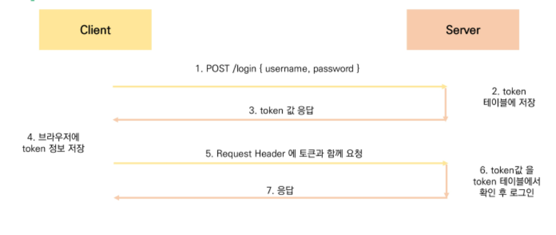

## CORS & AUTH

### 0. Server & Client

> Server

- 클라이언트에게 '정보', '서비스'를 제공하는 컴퓨터 시스템
- 정보 & 서비스
  - Django를 통해 응답한 template
  - DRF를 통해 응답한 JSON

> Client

- 서버에게 그 서버가 맡는 **서비스를 요청**하고, 서비스 요청을 위해 필요한 인자를 **서버가 요구하는 방식에 맞게 제공**하며, 서버로부터 반환되는 응답을 **사용자에게 적절한 방식으로 표현**하는 기능을 가진 시스템

<br>

### 1. CORS

> Same-origin policy (SOP)
>
> 동일 출처 정책

- 특정 출처에서 불러온 문서나 스크립트가 다른 출처에서 가져온 리소스와 상호작용 하는 것을 제한하는 보안 방식
- 잠재적으로 해로울 수 있는 문서를 분리함으로써 공격받을 수 있는 경로를 줄임

> Origin, 출처

- 두 URL의 Protocol, Port, Host가 모두 같아야 동일한 출처라 할 수 있음

| URL                                              | 결과 | 이유                              |
| ------------------------------------------------ | ---- | --------------------------------- |
| http://store.company.com/dir2/other.html         | 성공 | 경로만 다름                       |
| http://store.company.com/dir2/inner/another.html | 성공 | 경로만 다름                       |
| https://store.company.com/secure.html            | 실패 | 프로토콜 다름                     |
| http://store.company.com:81/dir2/etc.html        | 실패 | 포트 다름(https://는 80이 기본값) |
| http://news.company.com/dir2/other.html          | 실패 | 호스트 다름                       |

#### 1.1. Cross-Origin Resource Sharing (CORS)

- 교차 출처 리소스 공유
- 추가 HTTP header를 사용하여, 특정 출처에서 실행중인 웹 애플리케이션이 다른 출처의 자원에 접근 할 수 있는 권한을 부여하도록 알려주는 체제
- 보안 상의 이유로 브라우저는 교차 출처 HTTP 요청을 제한 (SOP)

> CORS Policy

- 교차 출처 리소스 공유 정책
- 다른 출처에서 온 리소스를 공유하는 것에 대한 정책

> How CORS?

- CORS 표준에 의해 추가된 HTTP Header를 통해 이를 통제
- CORS HTTP 응답 헤더 예시
  - Access-Control-Allow-Origin
    - Access-Control-Allow-Origin: * => 모든 도메인에서 접근할 수 있음을 의미
  - Access-Control-Allow-Credentials

#### 1.2. `django-cors-headers` 라이브러리

- 응답에 CORS header를 추가해주는 라이브러리
- 다른 출처에서 보내는 Django 애플리케이션에 대한 브라우저 내 요청을 허용함

```shell
$ pip install django-cors-headers
```

> settings.py

```python
INSTALLED_APPS = [
    ...
    'corsheaders',
    ...
]

MIDDLEWARE = [
    ...
    # CommonMiddleware보다 위에 위치
    'corsheaders.middleware.CorsMiddleware',
    ...
    'django.middleware.common.CommonMiddleware',
    ...
]

# 교차 출처 자원 공유를 허용할 Domain 등록
CORS_ALLOWED_ORIGINS = [
    'http://localhost:8080',
]
```

<br>

### 2. Authentication & Authorization

> Authentication

- 인증, 입증
- 자신이라고 주장하는 사용자가 누구인지 확인하는 행위

> Authorization

- 권한 부여, 허가
- 사용자에게 특정 리소스 또는 기능에 대한 액세스 권한을 부여하는 과정(절차)

#### 2.1. DRF Authentication

> Token Based (Basic Token)



#### 2.2.`dj-rest-auth` & `django-allauth` 라이브러리

```shell
$ pip install django-allauth
$ pip install dj-rest-auth
```

> settings.py

```python
INSTALLED_APPS = [
    ...
    'rest_framework',
    # token authentication
    'rest_framework.authtoken',
    
    # DRF auth 담당
    'dj_rest_auth',
    'dj_rest_auth.registration',
    
    # django allauth
    'allauth',
    'allauth.account',
    ...
    # allauth 사용을 위해 필요
    'django.contrib.sites',
    ...
]

# django.contrib.sites 에서 등록 필요
SITE_ID = 1

# drf 설정
REST_FRAMEWORK = {
    # 기본 인증방식 설정
    'DEFAULT_AUTHENTICATIONS_CLASSES': [
        'rest_framework.authentication.TokenAuthentication',
    ],
    
    # 기본 권한 설정
    'DEFAULT_PERMISSION_CLASSES': [
        # 'rest_framework.permissions.AllowAny', # => 기본적으로 모두에게 허용
        'rest_framework.permissions.IsAuthenticated', # => 기본적으로 인증받아야 사용
    ]
}
```

> urls.py

```python
urlpatterns = [
    # 패턴은 자유롭게 설정가능. 포워딩만 dj_rest_auth로
    path('api/v1/accounts/', include('dj_rest_auth.urls')),
    path('api/v1/accounts/signup/', include('dj_rest_auth.registration.urls')),
]
```

