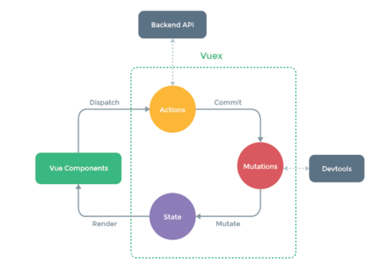
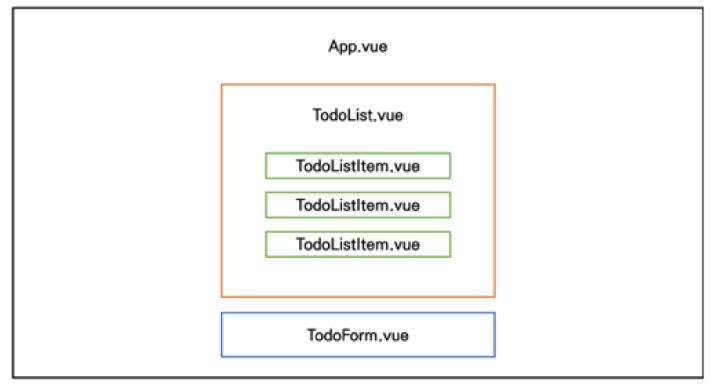
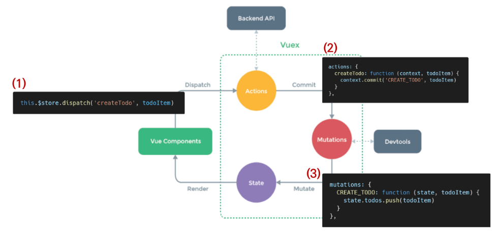

## Vuex

- 상태 관리 패턴 + 라이브러리

- 상태를 전역 저장소로 관리할 수 있도록 지원하는 라이브러리
  - 중앙 집중식 저장소 역할

### 1. Vuex Core Concepts



> state

- 중앙에서 관리하는 모든 상태 정보
- 각 애플리케이션마다 하나의 저장소만 갖게 됨을 의미
- state가 변화하면 해당 state를 공유하는 여러 컴포넌트의 DOM은 알아서 렌더링

> mutations

- 실제로 state를 변경하는 유일한 방법
- 첫번째 인자는 항상 state
- Actions에서 commit() 메서드에 의해 호출됨

> actions

- state를 변경하는 대신 mutations를 commit() 메서드로 호출해서 실행
- context 객체 인자를 받음
  - context를 통해 store/index.jg 파일 내에 있는 모든 요소 속성 접근&메서드 호출 가능
- 컴포넌트에서 dispatch() 메서드에 의해 호출
- actions를 통해 state를 조작할 수 있지만, state는 오로지 mutations를 통해서만 조작해야함

> getters

- state를 변경하지 않고 활용하여 계산을 수행(computed 속성과 유사)
- computed 속성과 마찬가지로 캐시되고, 종속성이 변경된 경우에만 재계산됨

<br>

### 2. Vuex Todo App



#### 2.0. Init Project

```shell
$ vue create todo-vuex-app
$ cd todo-vuex-app
$ vue add vuex # Yes
```

#### 2.1. CRUD Logic(Create랑 다 같은 로직)

> TodoForm.vue

```javascript
this.$store.dispatch('createTodo', todoItem)

//만약 아래와 같이 작성했다면 @click="createTodo(todo)"로 인자 넘겨줘야함
import {mapActions} from 'vuex'

methods: {
    mapActions([
        'createTodo',
    ])
}
```

> index.js

```javascript
export default new Vuex.Store({
    state: {
    todos: [],
},
mutations: {
    CREATE_TODO: function (state, todoItem) {
        state.todos.push(todoItem)
    }
},
actions: {
    createdTodo: function ({ commit }, todoItem) {
        commit('CREATE_TODO', todoItem)
    }
}
})
```



#### 2.2. 취소선 긋기

> TodoListItem.vue

- scoped: 해당 컴포넌트에만 반영하는 style

```vue
<template>
	<div>
    	<span
         :class="{'is-completed': todo.isCompleted}"
              >
    	</span>
    </div>
</template>

<style scoped>
    .is-completed {
        text-decoration: line-through;
    }
</style>
```

#### 2.3. Getters, 완료된 todo 개수 계산

> index.js

```javascript
getters: {
    completedTodosCount: function (state) {
        return state.todos.filter(todo => {
            return todo.isCompleted === true
        }).length
    }
}
```

> App.vue

```javascript
computed: {
    completedTodosCount: function() {
        return this.$store.getters.completedTodosCount
    },
}

////////// 위 아래는 같음
import {mapGetters} from 'vuex'

computed: {
    ...mapGetters([
        'completedTodosCount',
        'uncomletedTodosCount',
        'allTodosCount',
    ])
}
```

#### 2.4. Component Binding Helper

- mapState

> TodoList.vue

```javascript
import {mapState} from 'vuex'

computed: mapState([
    'todos',
])

/////////////////////// 위아래는 같은 함수
computed: {
    todos: function () {
        return this.$store.state.todos
    }
}
```

#### 2.5. LocalStorage

- 새로 고침하면 작성해놓았던 todo-list 날라감
  - 페이지가 새로고침 되어도 Vuex state 유지시키기 위해

```shell
$ npm i vuex-persistedstate
```

> index.js

```javascript
import createPersistedState from 'vuex-persistedstate'

export default new Vuex.Store({
    plugins: [
        createPersistedState(),
    ],
})
```

