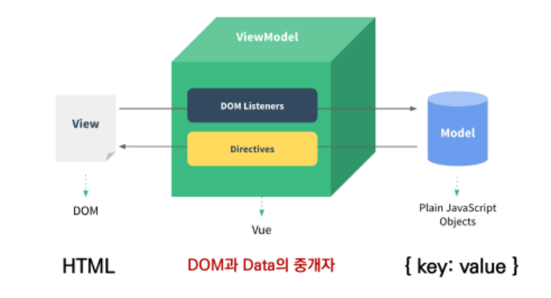
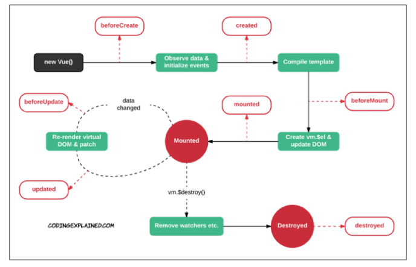

## Vue

> 사용자 인터페이스를 만들기 위한 진보적인 자바스크립트 프레임워크
>
> 현대적인 tool과 다양한 라이브러리를 통해 Single Page Application을 완벽하게 지원

### 0. SSR & CSR

> Server Side Rendering & Client Side Rendering

- 두 방식의 차이는 최종 HTML 생성 주체가 누구인가에 따라 결정
- 실제 브라우저에 그려질 HTML을 서버가 만든다면 SSR / 클라이언트가 만든다면 CSR

### 1. MVVM Pattern

- 애플리케이션 로직을 UI로부터 분리하기 위해 설계된 디자인 패턴



#### 1.1. Model

- Vue에서 Model은 JavaScript Object(dictionary)다
- Model은 Vue Instance 내부에서 data라는 이름으로 존재
  - data가 바뀌변 View(DOM)가 반응

#### 1.2. View

- Vue에서 View는 DOM(HTML)이다
- Data의 변화에 따라서 바뀌는 대상

#### 1.3. ViewModel

- Vue에서 ViewModel은 모든 Vue Instance이다
- View와 Model 사이에서 Data와 DOM에 관련된 모든 일을 처리
- ViewModel을 활용해 Data를 얼마만큼 잘 처리해서 보여줄 것인지(DOM)을 고민하는 것

<br>

### 2. Quick Start of Vue.js

> [Vue](https://kr.vuejs.org/v2/guide/index.html)

0. CDN 넣고
1. Data 로직 작성
2. DOM 작성

```html
<body>
  <!-- 2. 선언적 렌더링 -->
  <h2>선언적 렌더링</h2>
  <div id="app1">
    {{ message }}
  </div>
    
<script src="https://cdn.jsdelivr.net/npm/vue/dist/vue.js"></script>

  <script>
    // 2. 선언적 렌더링
    const app1 = new Vue({
      el: '#app1',
      data: {
        message: 'hi Vue'
      }
    })
  </script>
</body>
```

<br>

### 3. Basic syntax of Vue.js

#### 3.1. Vue instance

- 모든 Vue 앱은 Vue 함수로 새 인스턴스를 만드는 것부터 시작
- `el`: Vue 인스턴스에 연결(마운트)할 기존 DOM 요소가 필요
- `data`: Vue 인스턴스의 데이터 객체
  - Vue 객체 내 다른 함수에서 this 키워드를 통해 접근 가능
- `methods`: Vue 인스턴스에 추가할 메서드
  - 화살표 함수를 사용하면 안 됨

#### 3.2. Template Syntax

##### 3.2.1. Interpolation (보간법)

```html
1. Text
<span>메시지 : {{msg}}</span>
2. Raw HTML
<span v-html="rawHtml"></span>
3. Attributes
<div v-bind:id="dynamicId"></div>
4. JS 표현식
{{ number+1 }}
{{ message.split('').reverse().join('') }}
```

##### 3.2.2. Directive 

- v-접두사가 있는 특수 속성
- 속성 값은 단일 JS표현식

> v-text
>
> message값이 보여짐

```html
<p v-text='message'></p>

data : {
	message:'Hello',
}
```

> v-show
>
> true이면 보여짐

```html
<p v-show='isTrue'>true</p>
<p v-show='isFalse'>false</p>

data : {
	isTrue: true,
	isFalse: false,
}
```

> v-if, else-if, else
>
> 조건부 렌더링, true일 때만 렌더링

```html
<div v-if="myType === 'A'">
    A
</div>
<div v-else-if="myType === 'B'">
    B
</div>
<div v-else-if="myType === 'C'">
    C
</div>
<div v-else>
    Not A/B/C
</div>

data: {
	myType: 'A'
}
```

> v-show 와 v-if

- v-show (Expensive initial load, cheap toggle)
- v-if (Cheap initial load, expensive toggle)

> v-for

- 반드시 key 속성을 각 요소에 작성
- v-if와 함께 사용하는 경우 v-for 우선순위가 더 높음, 가능하면 동시에 사용 X

```html
<div v-for="(fruit, index) in fruits" :key="`fruit-${index}`">
    {{ fruit }}
</div>

data: {
	fruits: ['apple', 'banana'],
}    
```

> v-on

- addeventListner랑 같음
- 약어 @ 
  - v-on:click => @click
  - preventDefault() => @submit.prevent

```html
<button @click="doAlert">Button</button>

methods: {
	doAlert: function() {
		alert('hello!!!')
 }
}
```

> v-bind

- HTML 요소의 속성에 Vue의 상태 데이터를 값으로 할당
- 약어 :
  - v-bind:href => :href

```html
<style>
    .active {
      color: red;
    }
</style>


<div :class="{active:isRed}">클래스 바인딩</div>

data : {
	imageSrc: 'https://picsum.photos/200/300/',
	isRed: true,
}
```

> v-model

- HTML form 요소의 값과 data를 양방향 바인딩

```html
<h3>{{myMessage2}}</h3>
<input v-model="myMessage2" type="text">

<input type="checkbox" id="checkbox" v-model="checked">
<label for="checkbox">{{checked}}</label>


data : {
	myMessage2: '',
	checked: true,
}
```

##### 3.2.3. Options

> computed

- 데이터를 기반으로 하는 계산된 속성(캐싱됨)
  - methods는 호출하면 렌더링 할 때마다 함수 실행, computed가 시간적으로 빠름
- 반드시 반환 값이 있어야함

```html
<p>{{doubleNum}}</p>

data: {
	num: 2,
},
computed : {
	doubleNum() {
		return this.num * 2
}
}
```

<br>

### 4. Lifcycle Hooks



- created를 사용해 애플리케이션 초기 데이터를 API 요청을 통해 불러올 수 있음

```html
<body>
  <div id="app">
    
    <button @click="getImg">눌러</button>
  </div>
  
  <script src="https://cdn.jsdelivr.net/npm/axios/dist/axios.min.js"></script>
  <script src="https://cdn.jsdelivr.net/npm/vue/dist/vue.js"></script>
  <script>
    const API_URL = 'https://dog.ceo/api/breeds/image/random'
    const app = new Vue({
      el: '#app',
      data: {
        imgSrc: '',
      },
      methods: {
        getImg: function () {
          axios.get(API_URL)
            .then(response => {
              this.imgSrc = response.data.message
            })
        }
      },
      // Vue인스턴스가 생성되면
      // getImg() 함수를 호출해 처음부터 이미지 데이터를 불러옴
      created: function () {
        this.getImg()
      }
    })
  </script>
</body>
```

