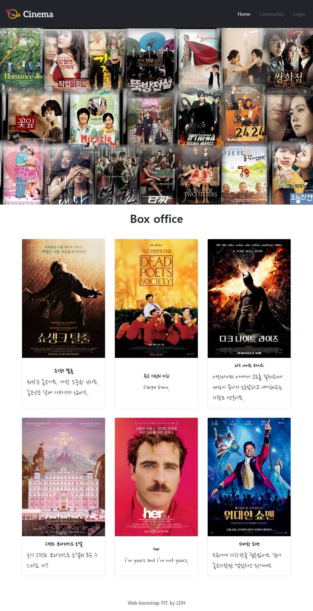
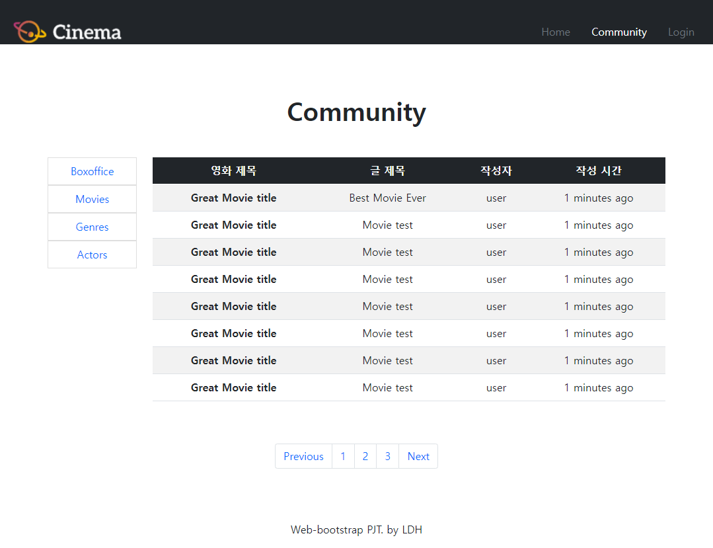

## pjt03 

> 반응형 웹 페이지 구성 (2022.02.11)

> 어려웠던 부분 & 학습한 내용
>
> Viewport의 가로 크기가 768px 미만일 경우에는 네비게이션 리스트(Home, Community,  Login)가 햄버거 버튼으로 교체되며, 클릭했을 시 세부 항목을 볼 수 있습니다. 

- 처음에 breakpoint와 col이용하려고 했는데 마음처럼 쉽게 안돼서 다른 방법을 찾았다.
- 찾아보니 breakpoint와 hidden 이라는 클래스가 있어서 창너비에 따라 사라졌다가 생겼다가 할 수 있었다.
- community 구현할 때도 이용했음

>  느낀 점

- 처음에 할 때 정교하게 만들어야 한다. 나중에 nav같은 경우 각 html에 다 복붙한 상태에서 고치려면 하나하나 다 고쳐야함..
  - 찾아바꾸기도 잘못해서 멀쩡한거 바꿀까봐 못하겠음
- 코드가 길어지니까 아무리 접었다가 폈다가 해도 한번에 코드 위치 찾기가 쉽지 않다. 눈아픔..
- Bootstrap을 제대로 이용하려면 안에 class 어떻게 구현되어 있는지 다 알아야 할 것 같다
  - 그냥 그림이랑 설명만 보고 하면 나도 모르는 margin이 들어가있고 해서 나중에 잘못 고치다가 한번에 다 틀어지는 일이 일어날듯 
- Bootstrap 이용하면 편하긴 한데, 그래도 하나하나 색, 여백 지정해주는거 귀찮다.. 노잼
- 만들고 나면 뿌듯하긴 한데 새로운 홈페이지 찾아서 클론코딩 하고싶다는 생각은 안든다 ㅋㅋ;

> 맘대로 구현한 것 => 명세서 무시

- 네비게이션 바 bootstrap에서 기본 틀만 가지고 와서 썼는데 나중에 active 지정해주려니까 쉽지 않아서 text-white 랑 secondary이용해서 흉내만 냄 ㅋㅋㅋㅋㅋ
- 기본 글꼴 너무 별로여서 구글 폰트[Nanum Brush Script] 받아서 썼다 훨씬 괜찮은 듯
  - https://fonts.google.com/specimen/Nanum+Brush+Script?subset=korean