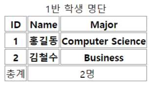
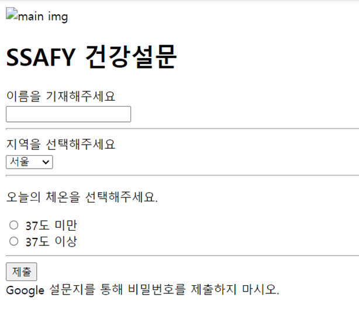

## Web (HTML&CSS)

> HTML (Hyper Text Markup Language)
>
> 웹페이지를 구조화하기 위한 언어

- Hyper Text 
  - 참조(하이퍼링크)를 통해 사용자가 한 문서에서 다른 문서로 즉시 접근할 수 있는 텍스트
- Markup Language
  - 태그 등을 이용하여 문서나 데이터의 구조를 명시하는 언어

> html

- 문서의 최상위(root) 요소
  - `<title>`, `<meta>`, `<link>`,`<script>`,`<style>`

> head

- 문서 메타데이터 요소
- 문서 제목, 인코딩, 스타일, 외부파일 로딩

> body

- 문서 본문 요소

> 요소(element)

- HTML 요소는 시작태그와 종료 태그 그리고 태그 사이에 위치한 내용으로 구성
- 내용이 없는 태그들
  - `br`, `hr` ,`img`, `input`, `link`, `meta`

> 시맨틱 태그

- `header` : 문서 전체나 섹션의 헤더(머리말 부분)
- `nav` : 내비게이션
- `aside` : 사이드에 위치한 공간, 메인 콘텐츠와 관련성이 적은 콘텐츠
- `section` : 문서의 일반적인 구분, 컨텐츠의 그룹을 표현
- `article` : 문서, 페이지, 사이트 안에서 독립적으로 구분되는 영역
- `footer` : 문서 전체나 섹션의 푸터(마지막 부분) 

> 테이블



```html
<!DOCTYPE html>
<html>
  <head>
    <title>테이블 실습</title>
    <style>
      td,
      th {
        text-align: center;
        border: 1px solid gray;
      }
    </style>
  </head>
  <body>
    <table>
      <!-- thead > tr > th-->
      <thead>
        <tr>
          <th>ID</th>
          <th>Name</th>
          <th>Major</th>
        </tr>
      </thead>
      <!-- tbody > tr > td -->
      <!-- tbody>(tr>th*3)*2 -->
      <tbody>
        <tr>
          <th>1</th>
          <th>홍길동</th>
          <th>Computer Science</th>
        </tr>
        <tr>
          <th>2</th>
          <th>김철수</th>
          <th>Business</th>
        </tr>
      </tbody>
      <tfoot>
        <tr>
          <td>총계</td>
          <td colspan="2">2명</td>
        </tr>
      </tfoot>
      <caption>
        1반 학생 명단
      </caption>
    </table>
  </body>
</html>
```

> form

- 기본 속성
  - action : form을 처리할 서버의 URL
  - method : form을 제출할 때 사용할 HTTP 메서드 (get or post)
  - enctype : method가 post인 경우 데이터의 유형 

> input

- 기본 속성
  - name : form control에 적용되는 이름 (이름/값 페어로 전송됨)
  - value : form control에 적용되는 값 (이름/값 페어로 전송됨)


```html
<!-- emmet -->
<!-- ! tab -->
<!DOCTYPE html>
<html lang="en">
  <head>
    <meta charset="UTF-8" />
    <meta http-equiv="X-UA-Compatible" content="IE=edge" />
    <meta name="viewport" content="width=device-width, initial-scale=1.0" />
    <title>Form 실습</title>
  </head>
  <body>
    <h1>Form 활용 실습</h1>
    <div>
      <label for="username">아이디</label>
      <input type="text" id="username" autofocus />
    </div>
    <div>
      <label for="password">비밀번호</label>
      <input type="password" id="password" disabled />
    </div>
    <div>
      <label for="agreement">개인정보수집동의</label>
      <input type="checkbox" name="" id="agreement" />
    </div>
  </body>
</html>
```

> 설문지 만들기



```html
<!DOCTYPE html>
<html lang="en">
  <head>
    <meta charset="UTF-8" />
    <meta http-equiv="X-UA-Compatible" content="IE=edge" />
    <meta name="viewport" content="width=device-width, initial-scale=1.0" />
    <title>Document</title>
  </head>
  <body>
    <header>
      
      <h1>SSAFY 건강설문</h1>
    </header>
    <section>
      <div>
        <label for="name">이름을 기재해주세요</label><br />
        <input type="text" id="name" />
        <hr />
      </div>
      <div>
        <label for="location">지역을 선택해주세요</label><br />
        <select name="location" id="location">
          <option value="seoul">서울</option>
          <option value="kangwon">강원도</option>
          <option value="jeonla">전라도</option>
          <option value="kyeongsang">경상도</option>
          <option value="etc">그 외</option>
        </select>
        <hr />
      </div>
      <div>
        <p>오늘의 체온을 선택해주세요.</p>
        <input id="under37" type="radio" name="temp" value="under37" />
        <label for="under37">37도 미만</label><br />
        <input id="over37" type="radio" name="temp" value="over37" />
        <label for="over37">37도 이상</label>
        <hr />
      </div>
    </section>
    <footer>
      <input type="button" value="제출" /><br />
      Google 설문지를 통해 비밀번호를 제출하지 마시오.
    </footer>
  </body>
</html>
```

