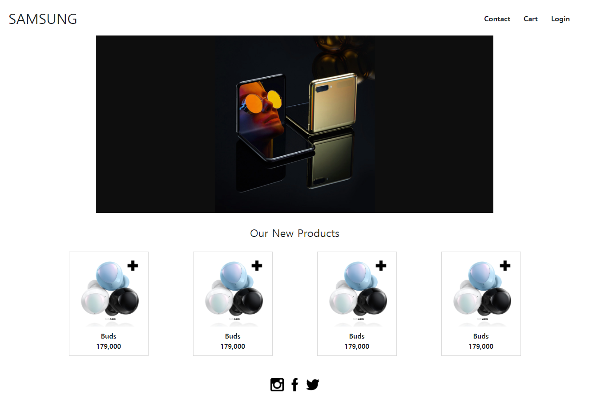
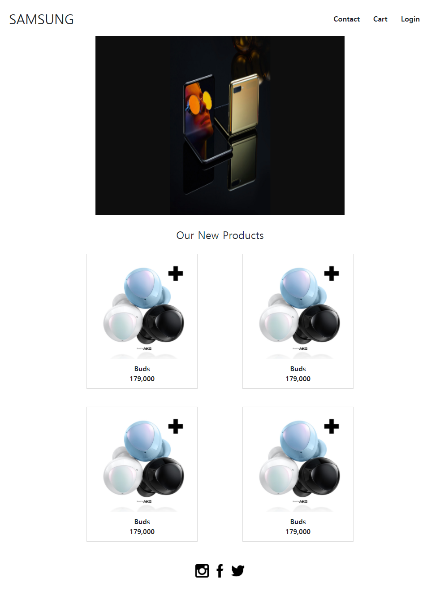
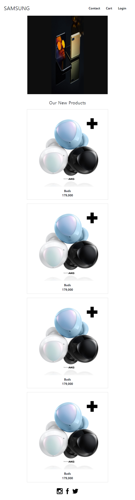

## Web 실습

>Bootstrap


```html
<!DOCTYPE html>
<html lang="ko">
  <head>
    <meta charset="UTF-8" />
    <meta name="viewport" content="width=device-width, initial-scale=1.0" />
    <link rel="stylesheet" href="style.css" />
    <link
      href="https://cdn.jsdelivr.net/npm/bootstrap@5.0.2/dist/css/bootstrap.min.css"
      rel="stylesheet"
      integrity="sha384-EVSTQN3/azprG1Anm3QDgpJLIm9Nao0Yz1ztcQTwFspd3yD65VohhpuuCOmLASjC"
      crossorigin="anonymous"
    />
    <title>Document</title>
  </head>
  <body>
    <!-- 1. Nav -->
    <nav class="navbar fixed-top bg-dark px-3">
      <a href="#">
        
      </a>
      <ul class="d-flex justify-content-end list-unstyled mb-0">
        <li>
          <a href="#" class="text-white mx-3 text-decoration-none">Home</a>
        </li>
        <li>
          <a href="#" class="text-white mx-3 text-decoration-none">Community</a>
        </li>
        <li>
          <a href="#" class="text-white mx-3 text-decoration-none">Login</a>
        </li>
      </ul>
    </nav>

    <!-- 2. Header -->
    <header
      class="d-flex flex-column justify-content-center align-items-center"
    >
      <div class="text-white display-1 fw-bold">Cinema</div>
      <div class="text-white display-1 fw-bold">Community</div>
      <a class="text-white text-decoration-none btn btn-primary mt-4" href="#"
        >Let's Go</a
      >
    </header>

    <!-- 3. Section -->
    <section>
      <h2 class="d-flex align-items-center justify-content-center my-5 fw-bold">
        Used Skills
      </h2>
      <article class="d-flex align-items-center justify-content-around">
        <div>
          
          <p class="d-flex align-items-center justify-content-center fw-bold">
            Web
          </p>
        </div>
        <div>
          
          <p class="d-flex align-items-center justify-content-center fw-bold">
            HTML5
          </p>
        </div>
        <div>
          
          <p class="d-flex align-items-center justify-content-center fw-bold">
            CSS3
          </p>
        </div>
      </article>
    </section>

    <!-- 4. Footer -->
    <!-- reboot에 mb-3 있어서 my-auto  -->
    <footer
      class="fixed-bottom bg-primary d-flex justify-content-center text-white"
    >
      <p class="my-auto">HTML & CSS project. Created by donghwan</p>
    </footer>
  </body>
</html>

```


> 반응형 웹

- width: 992px 이상



- width: 768px-992px



- width: 768px이하



```html
<!DOCTYPE html>
<html lang="en">
  <head>
    <meta charset="UTF-8" />
    <meta name="viewport" content="width=device-width, initial-scale=1.0" />
    <link rel="stylesheet" href="shop.css" />
    <link
      href="https://cdn.jsdelivr.net/npm/bootstrap@5.0.2/dist/css/bootstrap.min.css"
      rel="stylesheet"
      integrity="sha384-EVSTQN3/azprG1Anm3QDgpJLIm9Nao0Yz1ztcQTwFspd3yD65VohhpuuCOmLASjC"
      crossorigin="anonymous"
    />
    <title>Title</title>
  </head>

  <body>
    <!-- nav -->
    <nav class="nav">
      <h2>SAMSUNG</h2>
      <ul class="nav-menu-list">
        <li class="nav-menu">Contact</li>
        <li class="nav-menu">Cart</li>
        <li class="nav-menu">Login</li>
      </ul>
    </nav>

    <div class="container">
      <!-- section -->
      <section class="section">
        
      </section>

      <!-- article -->
      <article class="article">
        <h4>Our New Products</h4>
        <div class="lg">
          <div class="md">
            <div class="sm">
              <a href="#"
                ></a>
              <div class="label">
                Buds <br />
                179,000
              </div>
            </div>
            <div class="sm">
              <a href="#"
                ></a>
              <div class="label">
                Buds <br />
                179,000
              </div>
            </div>
          </div>
          <div class="md">
            <div class="sm">
              <a href="#"
                ></a>
              <div class="label">
                Buds <br />
                179,000
              </div>
            </div>
            <div class="sm">
              <a href="#"
                ></a>
              <div class="label">
                Buds <br />
                179,000
              </div>
            </div>
          </div>
        </div>
      </article>

      <!-- footer -->
      <footer class="footer">
        <a href="https://www.instagram.com/?hl=ko">
          
        </a>
        <a href="https://ko-kr.facebook.com/">
          
        </a>
        <a href="https://twitter.com/?lang=ko">
          
        </a>
      </footer>
    </div>
  </body>
</html>

```

```css
/* 아래에 코드를 작성하시오. */
/* nav */
.nav {
  position: fixed;
  top: 0;
  left: 0;
  right: 0;
  width: 100%;
  display: flex;
  justify-content: space-between;
  align-items: center;
  padding: 0px 10px;
  background-color: white;
}

.nav > h2 {
  margin-top: 20px;
  margin-left: 20px;
}
.nav-menu-list {
  list-style: none;
  display: flex;
  margin-top: 30px;
  font-weight: bold;
  margin-right: 20px;
}

.nav-menu {
  margin: 0 15px;
}

/* section */

.section {
  text-align: center;
}
.section > img {
  width: 80%;
  height: 400px;
  margin-top: 80px;
}

/* article */

.article {
  margin-top: 30px;
  text-align: center;
}

.buds {
  width: 100%;
  height: 100%;
}

.sm {
  display: flex;
  flex-direction: column;
  margin: 20px 50px;
  border: 1px solid gainsboro;
}

@media (min-width: 992px) {
  .lg {
    display: flex;
    justify-content: center;
  }
}

@media (min-width: 768px) {
  .md {
    display: flex;
    justify-content: center;
  }
}

.label {
  font-size: 15px;
  font-weight: bold;
  padding: 10px 0px;
}

/* footer */

.footer {
  display: flex;
  justify-content: center;
  margin: 30px 0px;
}
.sns-icon {
  width: 30px;
  height: 30px;
  margin: 0px 5px;
}

```


