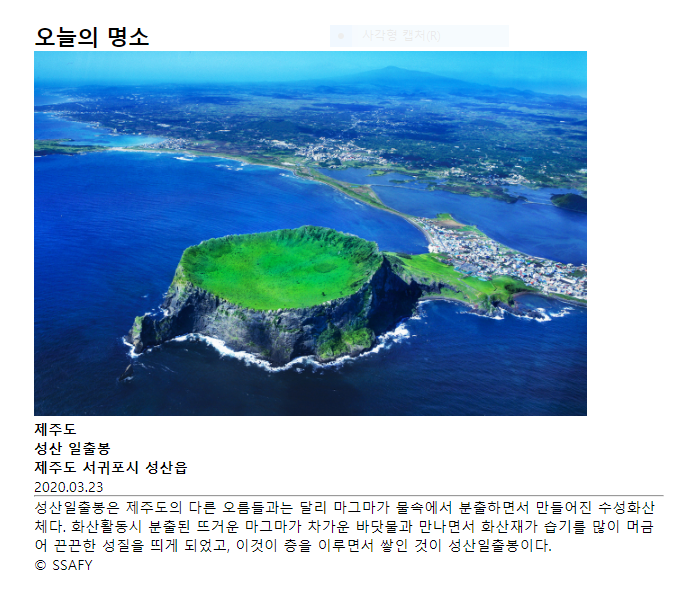
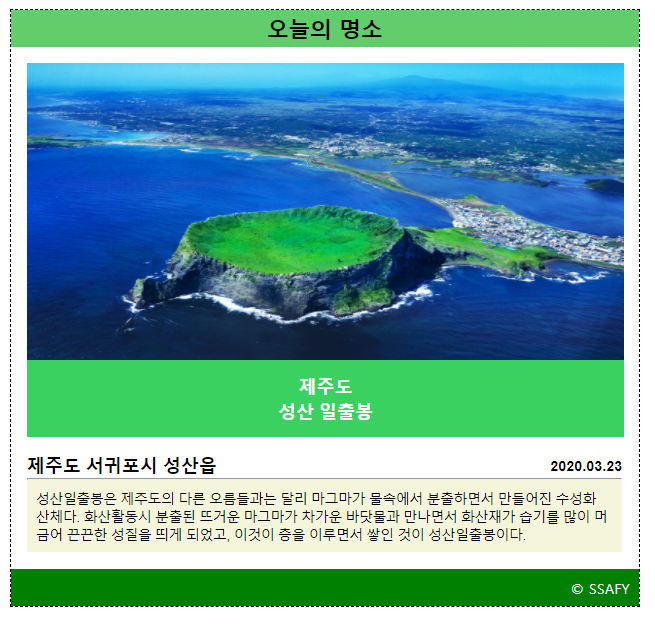
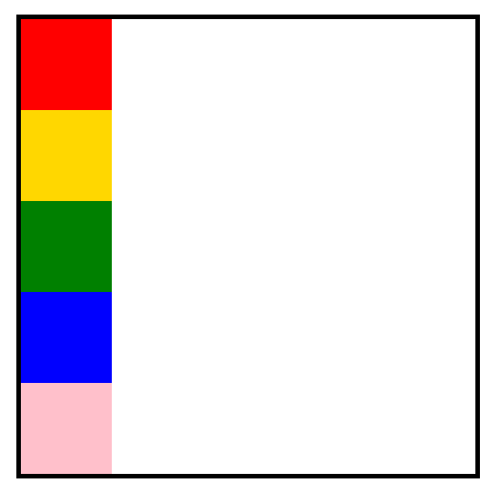
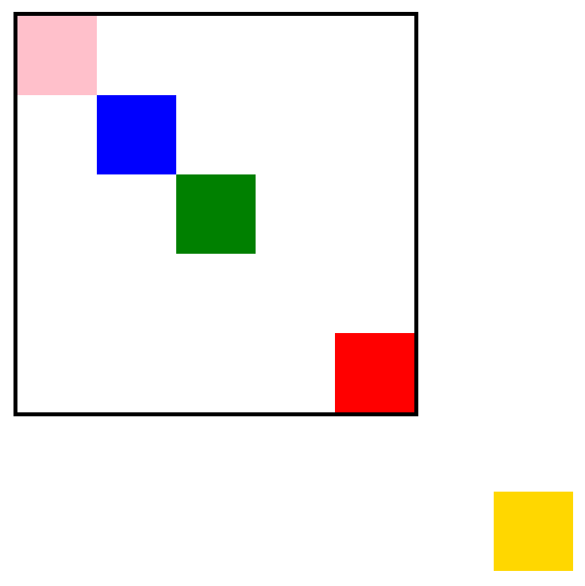

## CSS 실습

> CSS styling

1. 글 두 개를 양 쪽 끝으로 정렬하고 싶을 때

```css
/*위 아래로 정렬 되어 있는 것을 flex로 양 옆 정렬 변환 => space-between으로 양 끝으로 정렬*/
.card-body-title{
    display: flex; 
	justify-content : space-between;
}
```

2) margin이 없는데도 이미지 사이에 틈이 생길 때

```css
/* 1. 인라인 요소(이미지)를 블록 요소로 만들기 
<= 수직 정렬 때문에 틈이 생기는 것이다 (base-line 때문에) */
img{
    display: block;
}

/* 2.인라인 요소의 기준선을 bottom에 맞추기 */
img{
    vertical-align: bottom;
}

/* 3. 이미지에 margin-bottom 음수값을 지정 */
img{
    margin-bottom:-3px;
}
```


> 변경 전



> 변경 후



```html
<!DOCTYPE html>
<html lang="en">
<head>
  <meta charset="UTF-8">
  <meta name="viewport" content="width=device-width, initial-scale=1.0">
  <link rel="stylesheet" href="card.css">
  <title>Layout</title>
</head>
<body>
  <div class="container">
    <div class="card">
      <div class="card-nav">
        <h2>오늘의 명소</h2>
      </div>
      <div class="card-header">
        
        <div class="card-img-description">
          <h4>제주도</h4>
          <h4>성산 일출봉</h4>
        </div>
      </div>
      <div class="card-body">
        <div class="card-body-title">
          <h4>제주도 서귀포시 성산읍</h4>
          <p>2020.03.23</p>
        </div>
        <hr />
        <div class="card-body-content">
          <p>
            성산일출봉은 제주도의 다른 오름들과는 달리 마그마가 물속에서 분출하면서 만들어진 수성화산체다.
            화산활동시 분출된 뜨거운 마그마가 차가운 바닷물과 만나면서 화산재가 습기를 많이 머금어 끈끈한 성질을 띄게 되었고,
            이것이 층을 이루면서 쌓인 것이 성산일출봉이다.
          </p>
        </div>
      </div>
      <div class="card-footer">
        <div>&copy; SSAFY</div>
      </div>
    </div>
  </div>
</body>
</html>
```

```css
* {
  box-sizing: border-box;
  margin: 0;
  padding: 0;
}

.container {
  width: 700px;
  margin: 200px auto;
  border: black 1px dashed;
}

/*문제 조건*/
h4 {
  font-size: 20px;
  font-weight: bold;
}

h4,
p {
  font-family: Arial;
}

/*상하좌우 여백 18px*/
.card-header,
.card-body {
  margin: 18px;
}

/*card-nav*/
.card-nav {
  background-color: rgba(21, 180, 34, 0.671);
  text-align: center;
  padding: 5px 0px;
}

.card-nav > h2 {
  font-weight: bold;
}

/*card-header*/
.card-header {
  text-align: center;
}

.card-img {
  height: 330px;
  width: 664px;
  display: block;
}

.card-img-description {
  background-color: rgb(58, 209, 96);
  color: white;
  padding: 15px 0px;
  width: 664px;
}

/*card-body*/
.card-body-title {
  display: flex;
  justify-content: space-between;
  align-items: center;
}

.card-body-title > p {
  font-weight: bold;
}
.card-body-content {
  background-color: beige;
  padding: 10px 15px 10px 10px;
  font-size: 15px;
}

/*card-footer*/
.card-footer {
  background-color: green;
  padding: 10px;
  color: white;
  text-align: end;
}
```


> BOX Model

> 변경전



> 변경 후



```html
<!DOCTYPE html>
<html lang="ko">
  <head>
    <meta charset="UTF-8" />
    <meta name="viewport" content="width=device-width, initial-scale=1.0" />
    <title>BOX Model Practice</title>
    <link rel="stylesheet" href="box_model.css" />
  </head>
  <body>
    <div class="big-box">
      <div class="small-box" id="red"></div>
      <div class="small-box" id="gold"></div>
      <div class="small-box" id="green"></div>
      <div class="small-box" id="blue"></div>
      <div class="small-box" id="pink"></div>
    </div>
  </body>
</html>
```

```css
.big-box {
  position: relative;
  margin: 100px auto 500px;
  border: 5px solid black;
  width: 500px;
  height: 500px;
}

.small-box {
  width: 100px;
  height: 100px;
}

#red {
  background-color: red;
  /* 큰 사각형 내부의 우측 하단 모서리에 빨간 사각형 위치시키기 */
  left: 400px;
  top: 400px;
  position: relative;
}

#gold {
  background-color: gold;
  /* 브라우저의 하단에서 50px, 우측에서 50px 위치에 고정하기 */
  position: relative;
  left: 600px;
  top: 500px;
}

#green {
  background-color: green;
  /* 큰 사각형의 가운데 위치시키기 */
  position: relative;
  left: 200px;
}

#blue {
  background-color: blue;
  /* 큰 사각형 좌측 상단 모서리에서 100px, 100px 띄우기 */
  position: relative;
  bottom: 200px;
  left: 100px;
}

#pink {
  background-color: pink;
  /* 큰 사각형 내부의 좌측 상단 모서리로 옮기기*/
  position: absolute;
  bottom: 400px;
}
```

