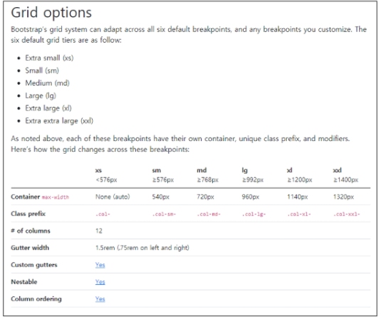

## Web2

> float

- 박스를 왼쪽 혹은 오른쪽으로 이동시켜 텍스트를 포함 인라인 요소들이 주변을 wrapping 하도록함
- 요소가 Normal flow를 벗어나도록 함

> flex

- 사용해야하는 이유 	
  - 수직 정렬
  - 아이템의 너비와 높이 혹은 간격을 동일하게 배치

- 아이템들을 포함하고 있는 컨테이너에 display : flex;

- Flex 속성
  - flex-direction : row, column, row-reverse, column-reverse 
  - flex-wrap : 
    - wrap : 한 줄에 배치 
    - nowrap (기본 값): 넘치면 그 다음 줄로 배치
  - justify-content : (Main 축을 기준으로 아이템 정렬)
    - flex-start : 아이템들을 axis 시작점으로
    - flex-end : 아이템들을 axis 끝 쪽으로
    - flex-center : 아이템들을 axis 중앙으로
    - space-between : 아이템 사이의 간견을 균일하게 분배
    - space-around : 아이템을 둘러싼 영역을 균일하게 분배
    - space-evenly : 전체 영역에서 아이템 간 간격을 균일하게 분배
  - align-content : (Cross 축을 기준으로 공간 배분)
    - 위와 옵션 같음	
  - align-items : (Cross 축을 기준으로 아이템 정렬)
    - 위와 옵션 같음
    - stretch : 컨테이너를 가득 채움
  - align-self : (개별 아이템을 Cross축 기준으로 정렬)
  - flex-flow : flex-dirction과 flex-wrap에 대한 설정값을 차례로 작성 shorthand임

> Bootstrap
>
> 프론트엔드 오픈 소스 툴킷
>
> https://getbootstrap.com/docs/5.0/getting-started/download/

- spacing

| class name | rem  |  px  |
| :--------: | :--: | :--: |
|    m-1     | 0.25 |  4   |
|    m-2     | 0.5  |  8   |
|    m-3     |  1   |  16  |
|    m-4     | 1.5  |  24  |
|    m-5     |  3   |  48  |

- 알파벳 의미

|  m   |     margin     |
| :--: | :------------: |
|  p   |    padding     |
|  t   |      top       |
|  b   |     bottom     |
|  s   |      left      |
|  e   |     right      |
|  x   |  left, right   |
|  y   |  top, bottom   |
|  0   |   0rem / 0px   |
|  1   | 0.25 rem / 4px |
|  2   | 0.5 rem / 8px  |
|  3   |  1 rem / 16px  |
|  4   | 1.5 rem / 24px |
|  5   |  3 rem / 48px  |

> Grid system
>
> 12개의 column & 6개의 grid breakpoints

- Column : 실제 컨텐츠를 포함하는 부분
- Gutter :  칼럼과 칼럼 사이의 공간
- Container : Column들을 담고 있는 공간

